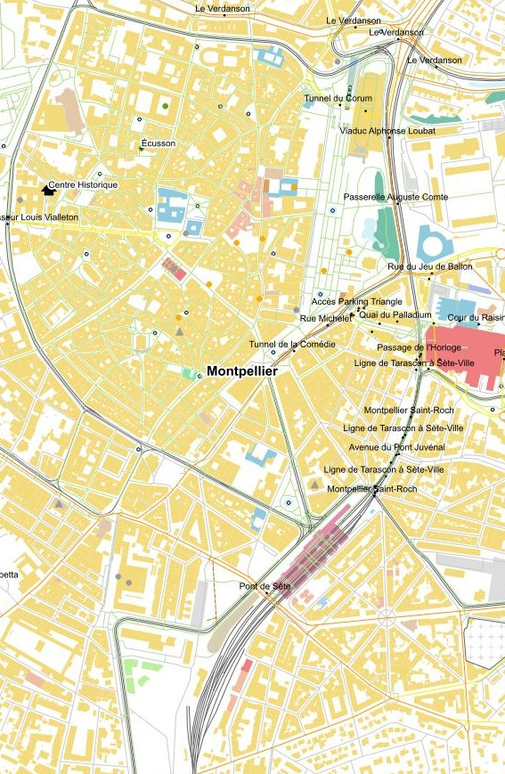
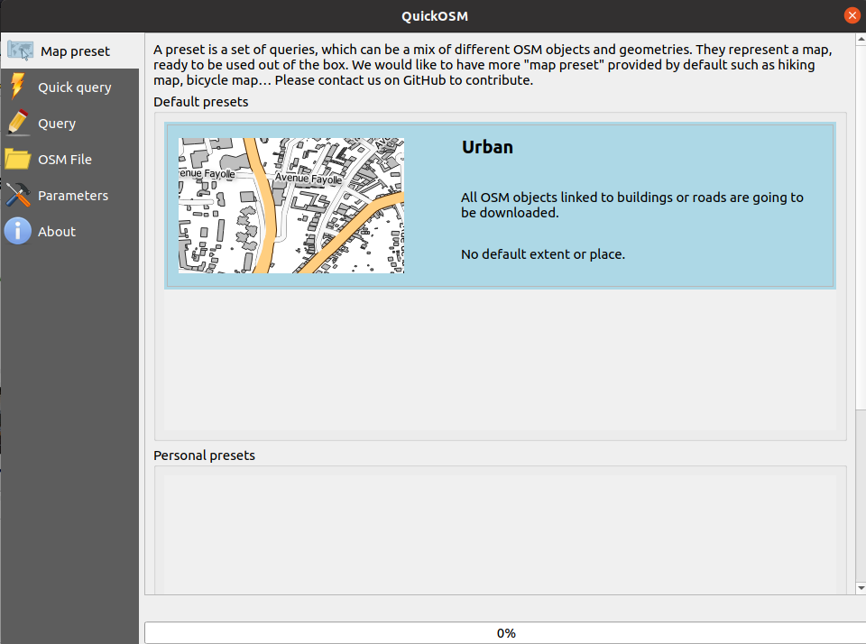
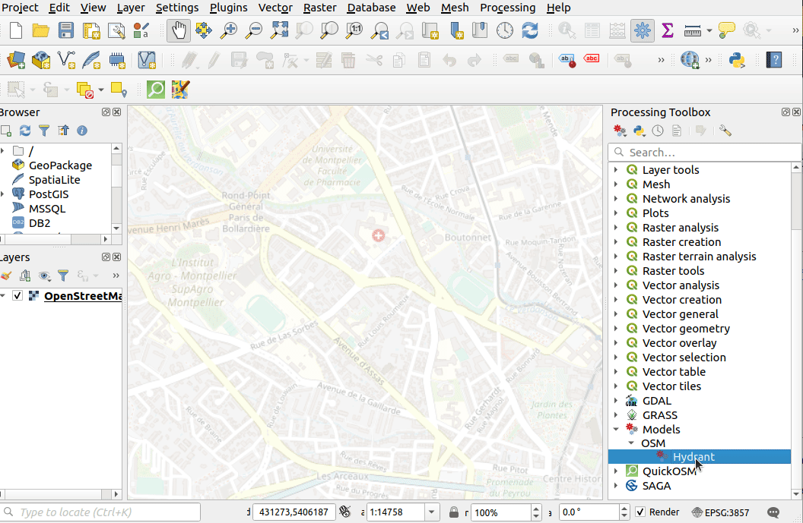
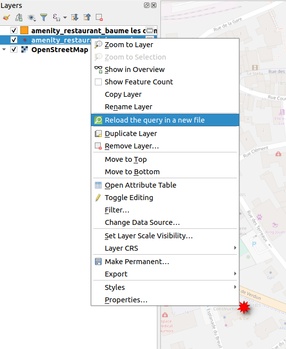
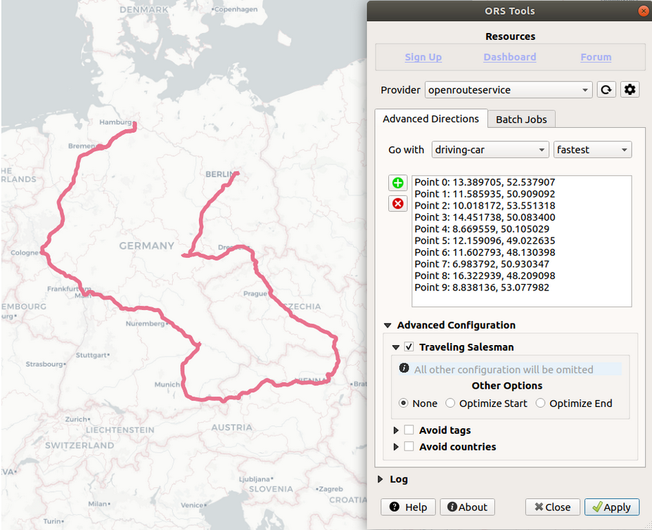
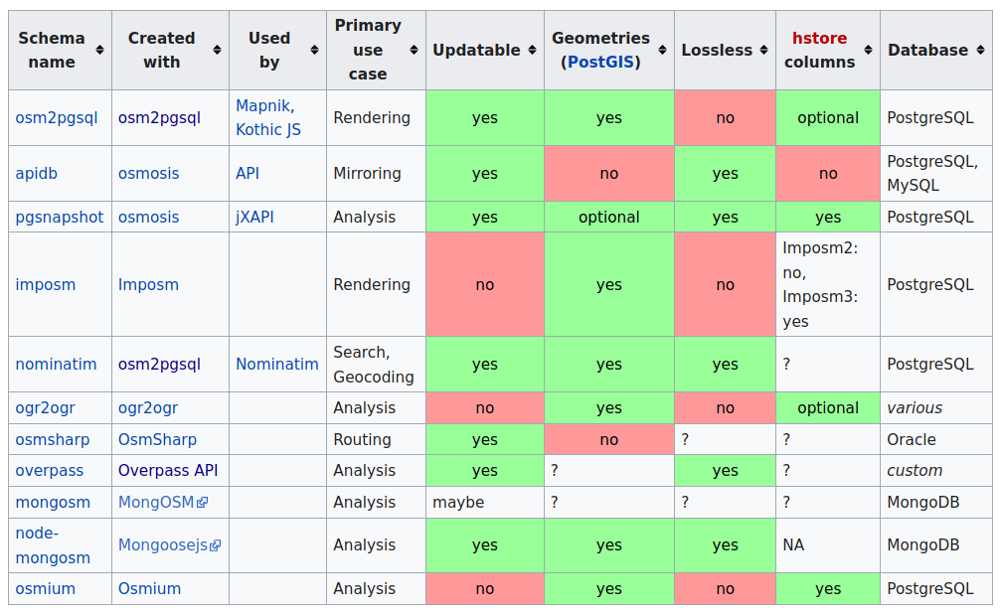
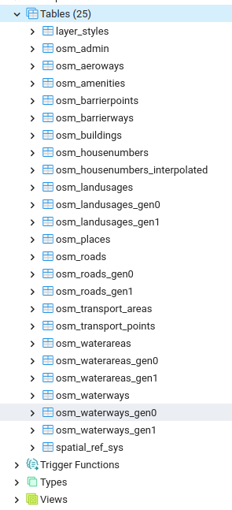

# How to use OSM data in QGIS ?
<!-- _class: lead gaia-->
 

  

Vector, raster, database, docker, Overpass, tiles and so on …

Which one should I use ?

 

*Etienne Trimaille*

# 3Liz

* French company 🇫🇷
* **Open Source** forever
* Core contributors in QGIS, server side mainly
* ♥ QGIS Desktop ♥ QGIS Server ♥ PostGIS ♥
* Opensource solution for publishing QGIS Project on the web, 
  **Lizmap Web Client** 🦎
* Development, server hosting, consulting, QGIS support, training

# QGIS, the powerful desktop app

<!-- _class: lead gaia-->

*OSM vector data, styled like in Google Maps*

# OpenStreetMap

<!-- _class: lead gaia-->

* Vector database
* Open Database License (ODBL)
* Worldwide coverage
* All kind of features from landuse, to opening hours and accessibility

# OSM data model

* Different primitive objects

| OSM      	| GIS     	|
|----------	|---------	|
| Node     	| Point   	|
| Way      	| Line    	|
| Relation 	| Polygon 	|

* A OSM way can either be a GIS line or GIS polygon according to its OSM tags (key/values)
* A OSM relation can be point, line, multilinestrings, multipolygons, mixed geometry ...

# OSM data model

Another difference ➡ **attributes**

* In GIS, the **layer** has one or many **fields**, defining all features in this specific layer

* In OSM, the **layer** does **not** exist. Each feature is individual and has its own fields. 

#
<!-- _class: lead gaia-->

Therefore

OSM data in QGIS will be differrent from raw OSM data

#
<!-- _class: lead gaia-->

## Moreover, there a are a few questions

# Do you need …

* to have up to date OSM data ?
* to work with small extent or a big extent ?
  * By the way, what small extent and big extent ? (for online API)
* to have OSM metadata such as contributor, changeset, timestamp ?
* data designed for display or analysis or routing or geocoding or … ?
* all OSM keys and values ?

#
<!-- _class: lead gaia-->

## There isn't a single answer

#
<!-- _class: lead gaia-->

## Let's see what is possible

# With QGIS only

* Add the default mapnik style as a raster, from the *QGIS Browser*

# With QGIS only

* Some online tools are already transforming the data into GIS formats (SHP, Geopackage, ...)
* https://download.geofabrik.de/
* https://www.data.data-wax.com/ France and other countries, QGIS style, GitHub (➡ this screenshot)
* ...

# With QGIS only

* Load OSM XML or PBF files
  * Thanks to OGR in background
* Different websites to download these files:
  * https://download.geofabrik.de/
  * http://download.openstreetmap.fr/extracts/
  * ...

# With QGIS only

* It starts to be an issue if you want some specific fields
* This is called an **HStore** field

# Use Processing Explode HStore

# Or use QGIS Expression

for selection, labelling ...

# Using QGIS Plugins

A few plugins in the QGIS plugin manager among the 973 plugins available 😎

# QuickMapServices plugin

*OpenTopoMap* in the background, based on OSM, designed for hiking 🏔

# QuickMapServices plugin

In *QuickMapServices*, go in *Settings* ➡ *More services* ➡ *Get contributed pack* to enable a **lot** of basemaps 🚀.

# QuickOSM plugin

* Download the data on the fly
* Making requests to the Overpass API, similar to Overpass-Turbo
  * Server API to retrieve raw OSM data based on queries (OQL)
* QuickOSM 2.0.0 has been released
* Targeting both 
  * **non OSM contributors**
  * and OSM OverpassAPI **experts**
* It's removing the HStore field `other_tags` by exploding it 
* As it's an API, limited amount of data
* Let's make an overview of this new version

# Quick Query

* Search in your native language
  * 🇬🇧 `Bakery`
  * 🇩🇪 `Bäckerei`
  * 🇫🇷 `Boulangerie`
  * ➡ `shop=bakery` in OSM
* Multi key/value support with `AND`/`OR` operator

* *Thanks to the JOSM and Vespucci community to share these presets on GitHub*

# Quick Query

*French people love 🥖 and 🧀*

# Map presets

* Download many layers, many OSM objects, with a QGIS symbology at the **same** time with 2 clicks

# Map presets

<!-- _class: lead gaia-->

*Bicycle map*, *landuse*, ... map presets

# QuickOSM in Processing

* Available in Processing *Toolbox* and *Modeler*
* Example : downloading fire hydrants, reprojecting in meters projection, buffering and QGIS Style

# QuickOSM in Processing

# Local OSM file

* Having a PBF/OSM file on your computer ?
* You can still filter it

# Some quick tips in QuickSOM

<!-- _class: lead gaia-->

# Reload the query to get latest update from OSM

<!-- _class: lead gaia-->

# Query many named places with `;`

<!-- _class: lead gaia-->

# Default QGIS Actions available

<!-- _class: lead gaia-->

# QuickOSM 2.0.0

<!-- _class: lead gaia-->

Full changelog
https://github.com/3liz/QuickOSM/releases/tag/2.0.0

* *Add history of queries*
* *Add option to get the metadata of OSM data such as author, timestamp etc*
* *Boost of performance using HStore processing algorithm to parse the downloaded OSM file, which is coded in C++*
* ...

# Geocoding

* New in QGIS 3.20 🌟
* No more plugin required
* https://nominatim.qgis.org
* Processing algorithm for batch geocoding

# Geocoding

* New in QGIS 3.20 🌟
* No more plugin required
* https://nominatim.qgis.org
* Integrated in the locator bar (without plugin)

# Routing

* ORS Tools
* API based on OpenStreetMap data
* isochrones and matrix calculations

# Importing OSM in a database ?

https://wiki.openstreetmap.org/wiki/Databases_and_data_access_APIs#Database_Schemas

* Mainly **osm2pgsql**, used for rendering, very old project and used
* Imposm, version **3** is updatable. Each layer has a **mapping** configuration

# Database with docker

* 🐘 and 🐳
* https://github.com/kartoza/docker-osm
* Docker-compose project :
  * PostgreSQL container
  * Imposm container
  * OSMUpdate container : to download OSM diff files
* Workflow
  * Drop a PBF file in the folder
  * Drop the area of interest for clipping (recommended) in the folder
  * Copy `.example.env` to `.env` for local settings
  * `make run`

# et voila !

Possible to customize the configuration :
  * Different **mapping**
  * Generalization for different scales
  * Updated every two minutes by default
  * SQL Triggers, views
  * Styles included in the QGIS `layer_styles` table

# Vector tiles

* Vector tile support, new in QGIS 3.14 🌟
* MapTiler / OpenMapTiles https://openmaptiles.org/
* Presentation from Adam Laza in a few minutes

# Questions

<!-- _class: lead gaia-->

This was just a *subset* of capabilities.
There are still other plugins, other ways etc.

 

*Etienne*
🐦 @etrimaille
