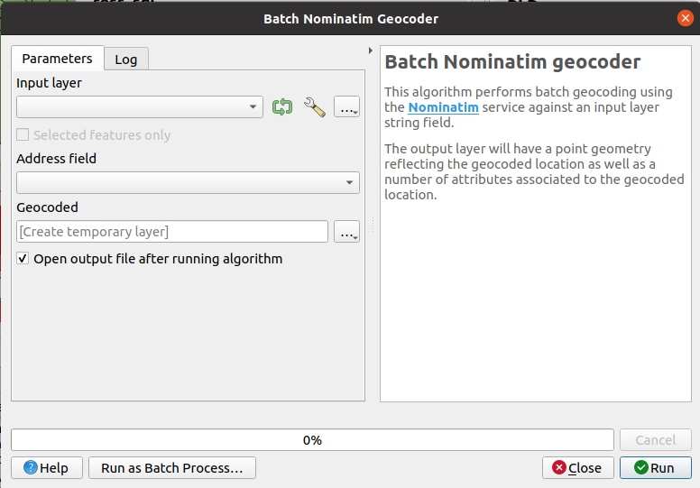
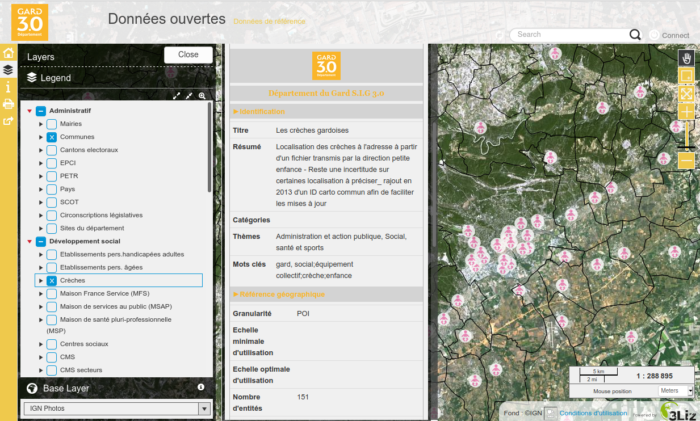

# How to use OSM data in QGIS ?
<!-- _class: lead gaia-->
<br/>

  

Vector, raster, database, docker, Overpass and so on …

Which one should I use ?

<br/>

*Etienne Trimaille*


# 3Liz

* French company 🇫🇷
* **Open Source** forever
* Contributors in QGIS, server mainly
* ♥ QGIS Desktop ♥ QGIS Server ♥ PostGIS
* Opensource solution for publishing QGIS Project on the web, **Lizmap** 🦎
* Development, server hosting, consulting, support, training


# QGIS, the powerful desktop app

OSM vector data, styled like in Google Maps


# OSM

* Opensource vector database
* Worldwide coverage


# OSM data model


* Different primitive objects

| OSM      	| GIS     	|
|----------	|---------	|
| Node     	| Point   	|
| Way      	| Line    	|
| Relation 	| Polygon 	|

* A OSM way can either be a GIS line, GIS polygon according to its OSM tags (key/values)
* A OSM relation can be point, line, multilinestrings, multipolygons, mixed geometry ...

# OSM data model

Another difference ➡ **attributes**

* In GIS, the **layer** has one or many **fields**, defining all features in this layer

* In OSM, the **layer** does **not** exist. Each feature is individual and has its own fields. 

#

OSM data in QGIS will obviously differrent from raw OSM data.

#
<!-- _class: lead gaia-->

## Moreover, there a are a few questions

# Do you need …

* to have up to date OSM data ?
* to work a small extent or a big extent ?
* to have OSM metadata such contributor, changeset, timestamp ?
* data designed for display or analysis or routing or geocoding or … ?
* all OSM keys and values ?

# With QGIS only

* Add the default mapnik style as a raster


# With QGIS only

* Load OSM XML or PBF files
* Thanks to OGR in background

* It starts to be an issue with you want some specific fields

# QGIS Plugins

A few plugins in the QGIS plugin manager among the 973 plugins available


# QuickMapServices


*OpenTopoMap* in the background, based on OSM, designed for hiking 🏔

# QuickOSM

* Download the data on the fly


# Geocoding

* New in QGIS 3.20 🌟
* No more plugin required
* https://nominatim.qgis.org
* Processing algorithm for batch geocoding


# Geocoding

* New in QGIS 3.20 🌟
* No more plugin required
* https://nominatim.qgis.org
* Integrated in the locator bar (without plugin)


# Database

https://wiki.openstreetmap.org/wiki/Databases_and_data_access_APIs#Database_Schemas

# Docker 🐋

https://github.com/kartoza/docker-osm

# Vector tiles

* QGIS 3.14 : vector tile support
* OpenMapTiles https://openmaptiles.org/
* MapTiler

# Questions

This was just a *subset* of capabilities.
There are still other plugins other techniques etc.

# What is Metadata ?

 Help people to understand your data

* **Identification**: Title, abstract, categories, themes, keywords, data last update,
* **Spatial properties**: spatial level, optimal scales,
* **Publication**: date, frequency, license, confidentiality
* **Computed**: feature count, geometry type, projection name & code, extent
* **Contact(s)**: owner, publisher, custodian, etc.
* **Link(s)** to resources, web pages, documents


# Pg 🐘 Metadata

Designed for people using **PostgreSQL** to store their layers data.

* **Centralized**: data & metadata in the **same database**
* **Accessible**: a PostgreSQL connection to share the metadata
* **PostgreSQL** rich features:
  * **SQL powered**: relations, constraints, views, functions, triggers
  * **Rights** & access control: readers VS editors
* **See & Edit** with your preferred SQL client:
  * Libreoffice, PgAdmin, psql, DBeaver,
  * **QGIS** with its powerful forms !
* **Backup & restore** metadata with your data


# As the GIS administrator
<!-- _class: lead gaia-->

# Create the pgmetadata schema

The plugin is using a **schema** `pgmetadata` in PostgreSQL.

A **QGIS processing algorithm** allows to create it in your database and fill it with the needed **tables, views and data** (glossary and translations)


# A QGIS project builder

A QGIS processing algorithm to create a full featured **QGIS administration project** with rich forms:


# Prepare editing

Create the needed contextual data in the dedicated **tables**:
* User-defined **themes**
* **Contacts**: name, organisation, unit, email
* The existing **glossary** can be changed
* **Translations** can be added if missing


# Edit your datasets with QGIS

Choose the `schema` and `table`, then edit:

* the main **fields**: title, abstract, keywords, etc.
* the **contacts** and their roles
* the **dataset** related links


# Admin helpers

Some data are **calculated** from the table content:
* valid **unique id** for the dataset `e0940d27-0059-4156-85e7-ef6b3cb57230`
* layer extent, feature count, geometry type, projection id & name.
* creation and update dates, etc.

Some useful **views**:

* **Orphan PostgreSQL tables**: no metadata exists in the dataset table for this tables
* **Orphan metadata**: a line exists in your dataset table, but no table corresponds in your database
* **Flat representation of the datasets**: lists the datasets with contacts and links aggregated


# As the GIS user in

<!-- _class: lead gaia-->


# QGIS locator & Metadata panel

`CTRL+K`, type `meta`, find the table, add the layer & view metadata


# Export

The user can export each dataset metadata to:

* HTML
* PDF
* DCAT https://www.w3.org/TR/vocab-dcat-2/
  ```xml
  <dcat:dataset>
    <dcat:Dataset>
      <dct:identifier>e0940d27-0059-4156-85e7-ef6b3cb57230</dct:identifier>
      <dct:title>Trees (demo)</dct:title>
      <dct:description>Trees around the botanical garden in Montpellier.
  Source: OpenStreetMap</dct:description>
      <dct:language>en</dct:language>
      <dct:license>Open Data Commons Open Database License</dct:license>
      <dct:rights>Open</dct:rights>
      <dct:accrualPeriodicity>Yearly</dct:accrualPeriodicity>
      <dct:spatial>{&quot;type&quot;:&quot;Polygon&quot;,&quot;coordinates&quot;:[]]}</dct:spatial>
      <dct:created rdf:datatype="http://www.w3.org/2001/XMLSchema#dateTime">2021-09-28T08:55:44.606067</dct:created>
      <dct:issued rdf:datatype="http://www.w3.org/2001/XMLSchema#dateTime">2021-09-28T08:55:44.606067</dct:issued>
      <dct:modified rdf:datatype="http://www.w3.org/2001/XMLSchema#dateTime">2021-09-28T08:55:44.606067</dct:modified>
      <dcat:contactPoint>
        <vcard:Organization>
          <vcard:fn>Jane Doe - ACME (SIG)</vcard:fn>
          <vcard:hasEmail rdf:resource="jane.doe@acme.corp">jane.doe@acme.corp</vcard:hasEmail>
        </vcard:Organization>
      </dcat:contactPoint>
  ```

# More ?
<!-- _class: lead gaia-->


# Advanced features

* Easily change the **templates** for the HTML content (visible in the panel): they are stored inside the `html_template` table
* Generate a dataset **HTML card** with **SQL**
  ```sql
  SELECT pgmetadata.get_dataset_item_html_content('demo', 'trees', 'fr');
  ```
* Generate a DCAT representation with SQL for one or many tables
  ```sql
  SELECT *
  FROM pgmetadata.get_datasets_as_dcat_xml('fr')
  WHERE True
  ```
* QGIS configuration file variables when **deploying QGIS in you organisation** (hide admin tools, auto-activate plugin)

  ```ini
  [pgmetadata]
  auto_open_dock=true
  end_user_only=true
  connection_names=Connection 1;Connection 2;Connection 3

  [Plugins]
  pg_metadata=true
  ```

# Share

(web) Applications can use the **SQL functions** to show the localized metadata in **HTML format** or **publish the full catalog** in **DCAT** (and be harvested by Third party Metadata portals).

Example of **Lizmap Web Client PgMetadata module**: https://github.com/3liz/lizmap-pgmetadata-module/




# Documentation

* For the administrator
* For the end user
* For the system administrator
* Changelogs, videos, road map, database structure, etc.

https://docs.3liz.org/qgis-pgmetadata-plugin/


# Conclusion
<!-- _class: lead gaia-->


# Why another metadata tool ?

Many open-source tools already exist to store and share metadata.
Why **PgMetadata** ?

* See the previous slide about **PostgreSQL** 🐘
* Keep the metadata **as close as possible to the data**
* Not a new application, but a set of tools for **QGIS** and your **existing PostgreSQL database**:
  * the GIS administrator already uses PostgreSQL and can understand easily how PgMetadata works,
  * the GIS users do not need to learn to use a new application
* **GIS user oriented**: as a user, search & get the metadata **from QGIS** *VERSUS* browse a web page and download the data
* It is **NOT designed to replace the existing metadata web portals**, but to be used as a **complementary** tool !


# Road map

More **locales** (today in English, French & German)

New features:

* Support **raster** tables
* **Auto-fill** the dataset table from a selection of PostgreSQL tables/views
* **Import/Export** the QGIS native layer metadata properties
* Import metadata from **DCAT**


# Resources

* Documentation: https://docs.3liz.org/qgis-pgmetadata-plugin/
* Database structure: https://docs.3liz.org/qgis-pgmetadata-plugin/database/
* Source code: https://github.com/3liz/qgis-pgmetadata-plugin/
* Translations: https://www.transifex.com/3liz-1/pgmetadata/
* Twitter: [@3liz_news](https://twitter.com/3Liz_news)
* Email: info@3liz.com

New version **1.1.0** released **today** : views support, German translations, new items in the glossary, enhanced locator search, etc.

# Thanks

 Thanks to the French **Gard province** for funding this extension

PgMetadata already has external **contributors**: thanks **@effjot** & **@tschuettenberg** for testing and helping !


# Thank you for your attention


