# QGIS, ses formulaires et expressions pour faire un outil de saisie au poil

*Comment exploiter QGIS pour créer une application de saisie et d'exploitation de données professionnelle ?*


Michaël DOUCHIN - 3LIZ


# Les points abordés

* **Import** d'une donnée "tableur" dans un Geopackage et affichage dans QGIS
* Création et correction de données via des **expressions**
* Mettre les données en **relation**
* Créer un **formulaire de saisie** avancé
* Visualiser les données problématiques ou importantes dans la **table attributaire**

On privilégiera dans cette présentation l'utilisation d'**expressions** dans QGIS pour la majorité des traitements:
-> pas d'utilisation de requêtes SQL en base de données ou d'algorithmes complexes.

# L'exemple choisi

* On fait des **observations faunistiques** sur le terrain: **Moqueur Gorge Blanche** à la Martinique
* La saisie est historiquement faite **dans un tableur** (MS Excel ou LibreOffice Calc)
* Une observation est
  * un **point** avec une longitude et une latitude,
  * faite à une **date**,
  * par des **observateurs**
  * On doit respecter une certaine **nomenclature**


# Les données source

Un fichier au format LibreOffice Calc `observations_source.ods`

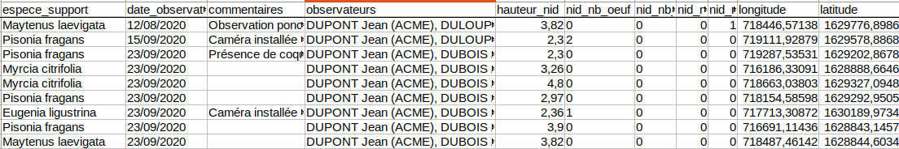

# Importer la donnée source

* On ajoute la donnée dans QGIS, par glisser-déplacer du fichier LibreOffice dans QGIS
* On ouvre les propriétés de la couche `observations_source` et visualise les champs dans l'onglet **Champs**

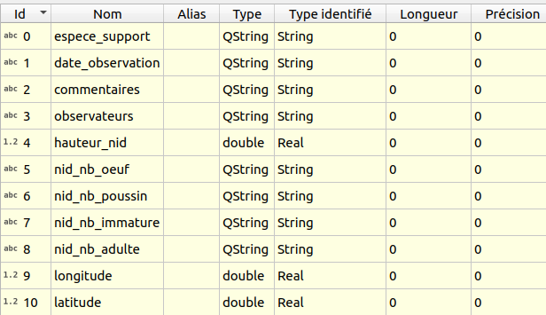

# Étudier la donnée source

On visualise la table attributaire qui reprend bien ce qu'on avait dans LibreOffice:
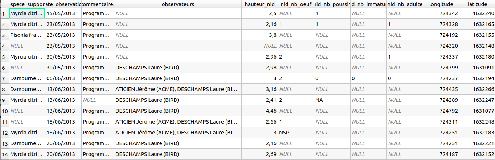

# Sauvegarder cette donnée en GeoPackage

On sauvegarde dans un **GeoPackage** `donnees_suivi_moqueur.gpkg` dans le **répertoire du projet**, table `observations`, de type `Point` même si la table initiale n'est pas spatiale
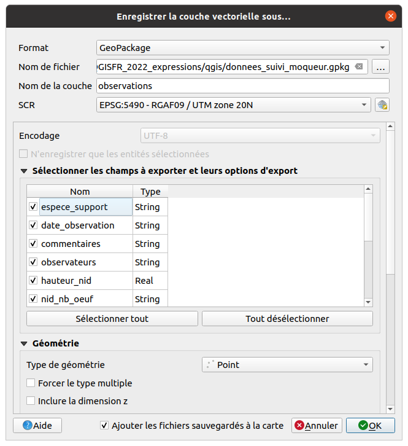

# Ouverture de la couche du GeoPackage dans QGIS

On a **importé** le fichier tableur LibreOffice dans un **Geopackage** comme une couche de **Points**.

* Via l'**explorateur** de QGIS, on cherche le **Dossier du projet**,
* On double-clique sur le fichier `donnees_suivi_moqueur.gpkg`
* ajoute la nouvelle table `observations` au projet
* On configure la **projection**, dans notre cas `EPSG:5490`, UTM Zone 20N (Martinique)
* On modifie la **symbologie** (gros points bleus avec bordure blanche)

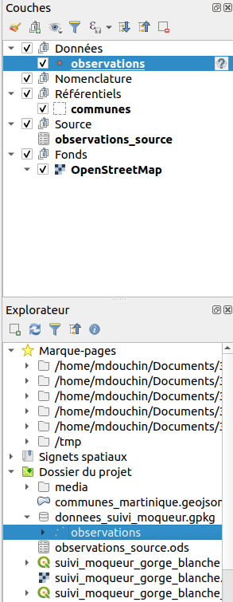

# Modifier la géométrie via une expression

On va définir les points via **la longitude et latitude** et une
* On passe cette couche en édition
* On utilise la calculatrice de champs et on modifie la géométrie via une expression `make_point("longitude", "latitude")`

 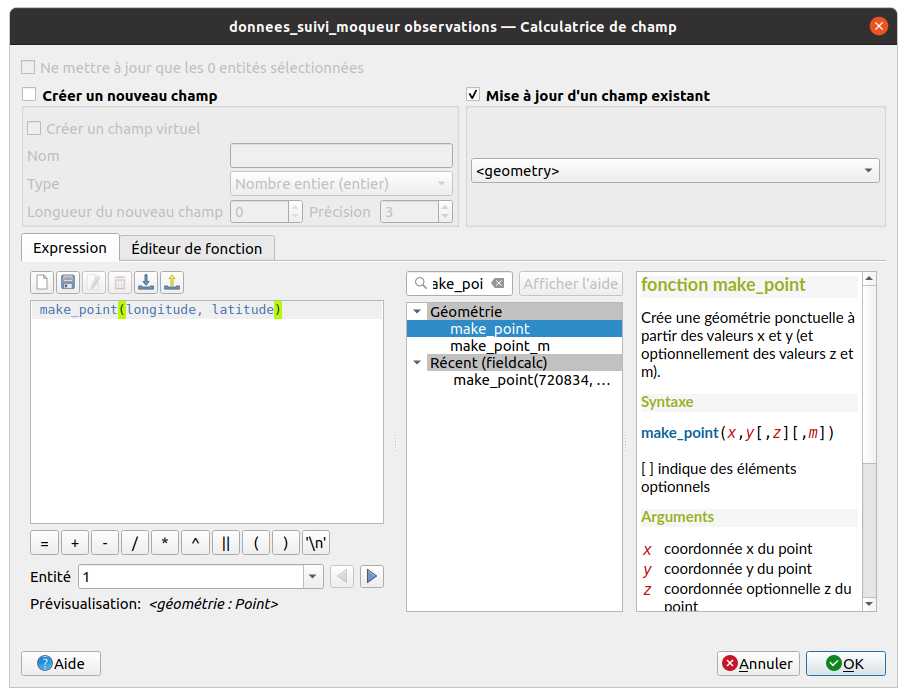

# On visualise alors les points sur la carte

Les géométries sont bien créées et correspondent aux coordonnées. On **sauvegarde** les données via la disquette de la **barre de numérisation** !


# On nettoie les valeurs des champs avec des entiers 1/3

Les valeurs **non entières** `NAN`, `NSP`, `Inconnu`, `RAS` ne doivent pas apparaître dans les champs qui attendent des **entiers**

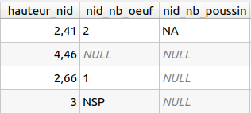
On peut appliquer une expression avec la **calculatrice de champ** sur tous les champs qui doivent contenir des entiers: `nid_nb_oeuf`, `nid_nb_poussin`, `nid_nb_immature`, `nid_nb_adulte`

```sql
-- Une condition avec une expression régulière pour ne conserver que les entiers
CASE
	WHEN regexp_match(trim("nid_nb_oeuf"), '^\\d+$')
		THEN to_int(trim("nid_nb_oeuf"))
	ELSE NULL
END
```

# On nettoie les valeurs des champs avec des entiers 2/3

Pour  `nid_nb_oeuf`, `nid_nb_poussin`, `nid_nb_immature`, `nid_nb_adulte`


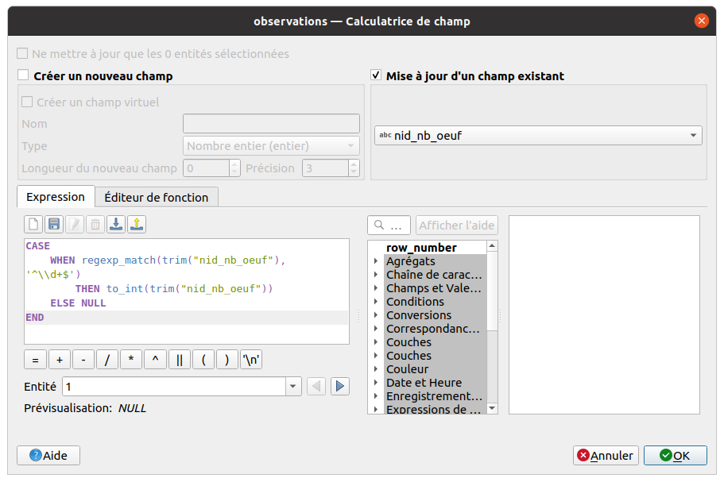

# On nettoie les valeurs des champs avec des entiers 3/3

On doit utiliser le **Gestionnaire de bases de données** pour changer le type des champs `nid_nb_xxxx` de **Texte** à **Entier**

* On crée une **connexion** vers le GeoPackage
* Sur la table `observations`, on ouvre le menu **Table** > **Modifier une table**, et on choisit le type `SMALLINT` ou `INTEGER`

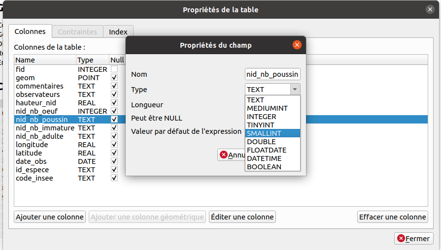

# On transforme un champ texte en Date 1/2

Exemple du champ `date_observation` de type texte, qui contient par exemple un texte `26/06/2013`:
* On crée un nouveau champ `date_obs` de type `Date` via la **calculatrice de champ** avec:
  ```sql
  to_date("date_observation", 'dd/MM/yyyy')
  -- on aura donc: 2013-06-26
  ```
 * On obtient
  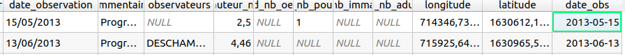
* On supprime le champ `date_observation`
* On enregistre


# On transforme un champ texte en Date 2/2

* On pourra donc faire des **calculs de date**, par exemple l'âge en jours de l'observation, via
  ```sql
  to_int(
    day(age(now(), "date_obs"))
  )
  ```
  qui renverra par exemple `128` jours
* Ou tester si la date donnée est bien supérieure à la date du jour
  ```sql
  "date_obs" >= now()
  ```
  qui renverra `Vrai` ou `Faux`

# On veut créer une table de nomenclature pour les espèces

On souhaite faire une nouvelle table non spatiale dans le Geopackage:

* table `especes`: pour stocker la liste des espèces support (arbres ou arbustes)

Dans la table source, on a pour l'instant un nom d'espèce dans le champ `espece_support`:

  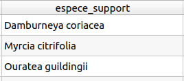
On pourra ensuite créer des **relations** entre les **observations** et les **espèces**


# Créer une table avec les espèces uniques 1/2

* Utiliser l'algorithme `Ajouter un champ d'index de valeur unique` qui va produire une **nouvelle table** contenant les valeurs distinctes du champ `espece_support`. Ouvrir la table via l'**explorateur**


# Créer une table avec les espèces uniques 2/2

* La table `especes` a bien été créée dans le GeoPackage `donnees_suivi_moqueur.gpkg`. On l'ouvre dans le projet
* Elle contient les champs `fid`, `id_espece` et `espece_support`
* On va conserver uniquement le `fid` et le champ `espece_support`, qu'on renomme en `nom_scientifique`, en modifiant la table depuis les propriétés de la couche, onglet `Champs`
* On ajoute un identifiant unique `uid` de type `Texte` avec la caculatrice de champ et l'expression `regexp_replace(uuid(), '[{}]', '')`

  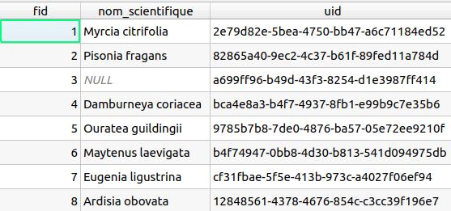

# Ajouter une clé étrangère dans la table observations avec l'id de l'espèce

Avec la calculatrice de champs, pour la couche `observations`, on ajoute un champ `id_espece` de type `Texte` et on va le **remplir à l'aide d'une expression** basée sur:
* la méthode `get_feature` qui permet de récupérer une ligne d'une autre couche, ici `especes` en faisant la correspondance entre les valeurs (comme pour une jointure)
* la méthode `attributes` qui permet de récupérer les valeurs des champs pour cette ligne, ici pour récupérer l'`uid`créé précédemment

  ```sql
  attributes(
      get_feature(
          'especes',
          'nom_scientifique',
          "espece_support"
      )
  )['uid']
  ```

# Ajouter une clé étrangère dans la table observations avec l'id de l'espèce

* On a bien l'`uid` de l'espèce ajouté dans le champ `id_espece`
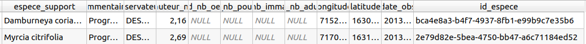

* On peut supprimer le champ `espece_support` qui ne servira plus

# Récupérer automatiquement la commune de chaque observation

Les **expressions** permettent de gérer les données en relation, par exemple via la méthode `aggregate`: on va récupérer le **code INSEE** de la commune de chaque observation, par **intersection** entre leurs géométries

* on crée un nouveau champ `code_insee` de type `Texte`avec l'expression

  ```sql
  aggregate(
    layer:='communes',
    aggregate:='max', expression:="code_commune",
    filter:=intersects($geometry, geometry(@parent))
  )
  ```
* On obtient bien le nouveau champ `code_insee` dans la table
  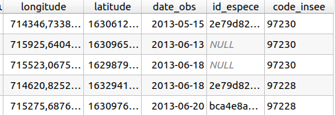

# Créer des relations entre les observations, les communes et les espèces

Dans les **propriétés du projet QGIS**, onglet **Relations**, créer

* Une relation entre les `observations` et les `communes`
* Une relation entre les `observations` et les `especes`


# Visualiser via la table attributaire les données en relation

* Ouvrir la **table attributaire** des `especes`
* Passer en **vue "Formulaire"** via le petit bouton en bas à droite du tableau
* Sélectionner une **commune** et voir les données d'observations liées

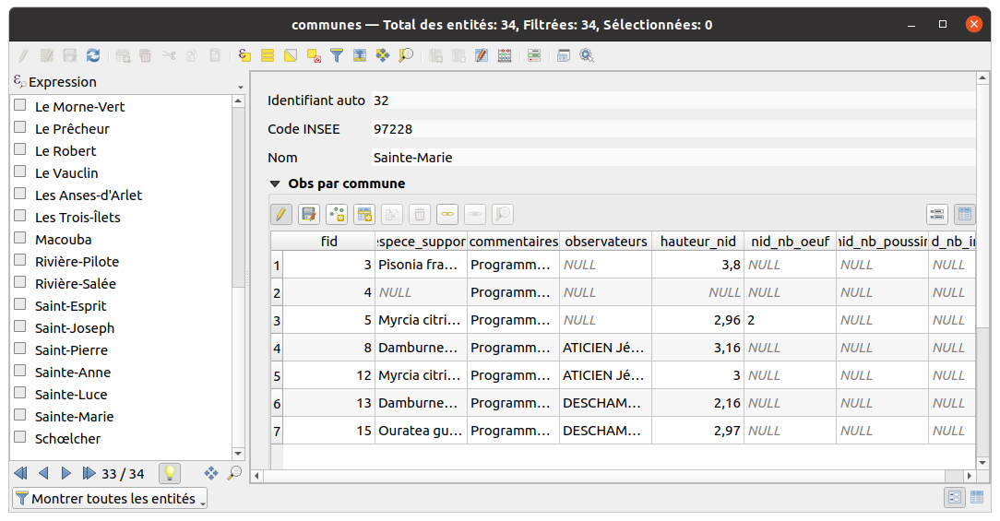

# Construire un formulaire de saisie

On souhaite **contrôler la saisie** des observations. On ouvre les propriétés de la couche `observations`, menu **Formulaire**.

* On passe en mode `Conception par glisser/déplacer`
* Pour chaque champ, on clique sur son nom, on ajoute un `alias`
* On **réordonne les champs** dans l'ordre souhaité.
* On peut créer des **groupes** et y déplacer les champs

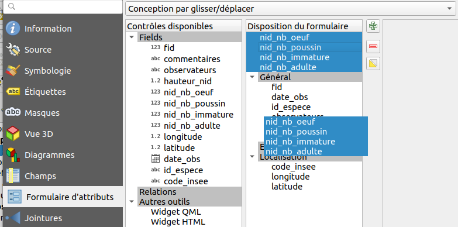

# Construire un formulaire de saisie

* Pour certains champs, on les marque en **non éditable**: `fid`, `longitude`, `latitude`
* On choisit pour chacun le `type d'outil` pour chaque champ:
  * **Édition de texte** pour `fid, commentaire, observateurs`
  * **Référence de la relation** pour `id_espece` et `code_insee` avec `Autoriser la valeur NULL`, `Trier par valeur` et
  * **Date/Heure** pour `date_obs`
  *  **Plage** pour les champs `hauteur_nid`, `nid_nb_oeuf`, `nid_nb_poussin`, `nid_nb_immature`, `nid_nb_adulte` entre 0 et 100
*  On ajoute des **contraintes**: `Non null` et `Renforcer la contrainte non null` pour les **champs obligatoires**
*  On peut ajouter des contraintes spécifiques:  `"date_obs" > '2000-01-01'` pour forcer une date après 2000
*  On peut utiliser des expressions pour les **valeurs par défaut**: `now()` pour la date, `x($geometry)` et `y($geometry)` pour les **coordonnées**

#  Date

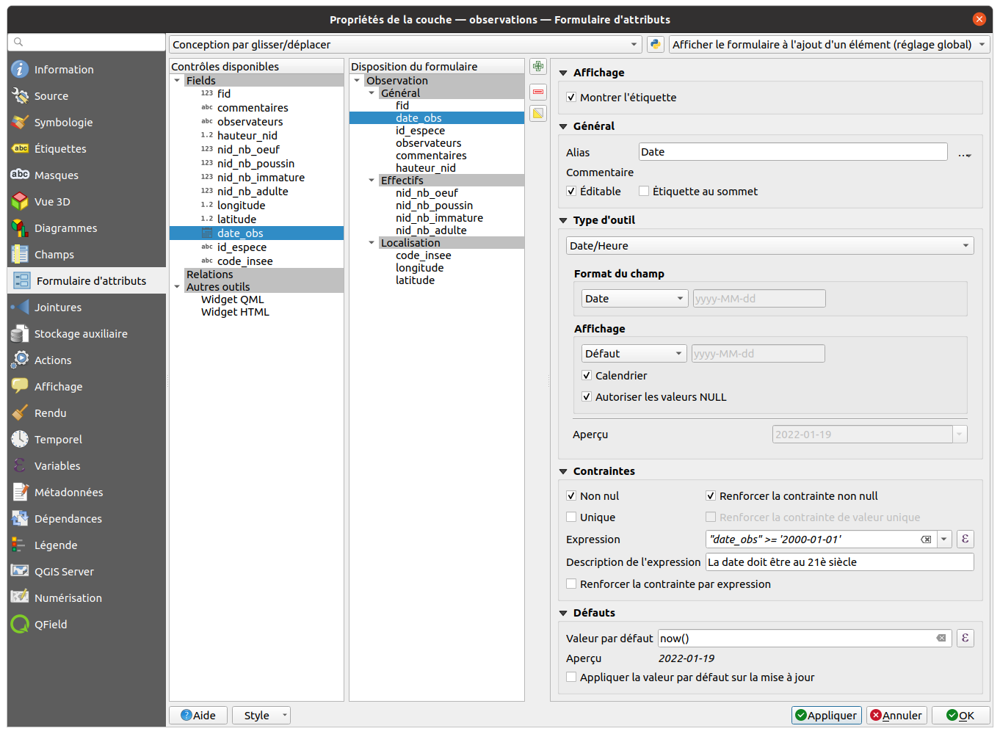

#  Espèce

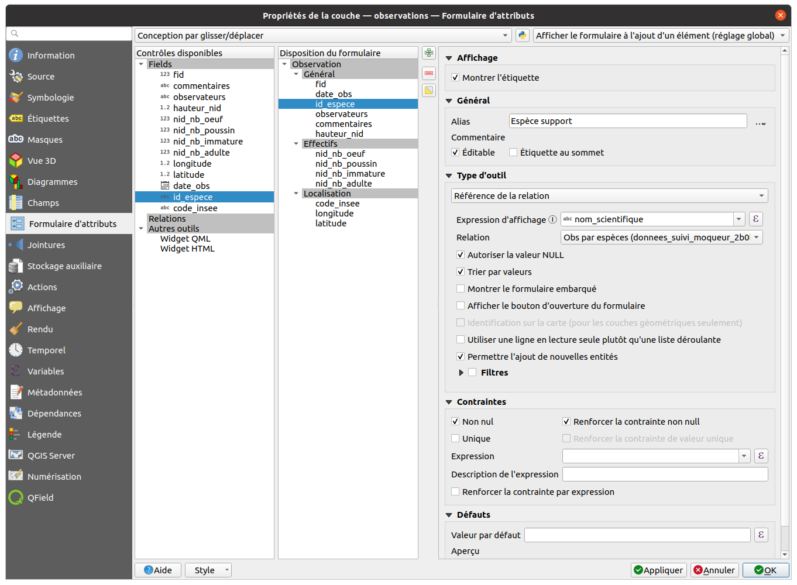

#  Le formulaire de saisie


# Une table attributaire mise en forme selon les valeurs des champs

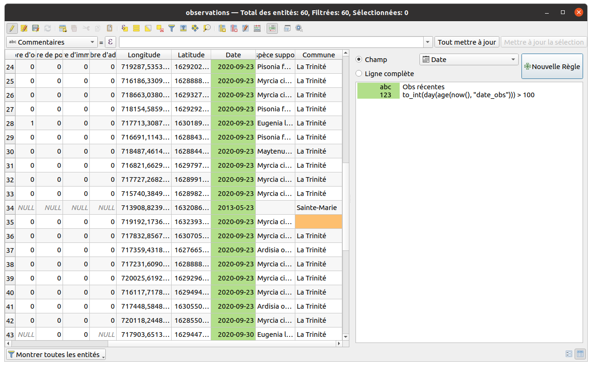

# Quelques exemples d'expression 1/3

* **Couleur continue** pour un vecteur basé sur une palette de couleur https://twitter.com/Qgis_Bzh/status/1207974981918973962
* **Rotation ou taille** qui dépend de la **position du curseur** https://twitter.com/kgjenkins/status/1298363142070767617
* Lisser les courbes de niveau SRTM https://twitter.com/timlinux/status/1331645809834811394
* Modifier la symbologie ou les étiquettes des **objets sélectionnés** `is_selected() = True`
* Couleur d'étiquette basée sur la **visibilité d'une couche** `is_layer_visible()`: https://twitter.com/northroadgeo/status/1208299125604638720


# Quelques exemples d'expression 2/3

* Trouver le **point le plus proche** : https://twitter.com/spatialthoughts/status/1421038975955791873 et https://www.youtube.com/watch?v=iCgDIxUGAp0&t=113s
* Lire les données **EXIF d'une image JPG** https://github.com/qgis/QGIS/commit/754328cbd0a4e5251f03c444221988a7031f4cef
* Récupérer un tableau des éléments d'une **multi-géométrie**: https://twitter.com/cartocalypse/status/1386647274416181253
* Utiliser `eval` pour créer des **expressions dans des expressions**. Ex: somme des 31 colonnes de données pour récupérer la somme par mois:
  ```sql
  eval(
    array_to_string(
      array_foreach(
        generate_series(1, 31),
        concat("VALUE", @element, '"')), ' + '
      )
  )
  ```

# Quelques exemples d'expression 3/3

* Déplacer des points de manière aléatoire (floutage)

```sql
with_variable(
	'distance_floutage',
	1000,
	translate(
		$geometry,
		randf(-1 * @distance_floutage, @distance_floutage),
		randf(-1 * @distance_floutage, @distance_floutage)
	)
)
```


# Attention

* Les expressions ne sont pas faites pour travailler sur des données lourdes: pas d'utilisation de l'index spatial par exemple.
* Si un script Processing fait la même chose, le privilégier pour modifier de la donnée (ex: recherche par intersection)


# Merci de votre attention


Michaël DOUCHIN
