# Comment utiliser des données OSM dan QGIS
<!-- _class: lead gaia-->
 

  

Vecteur, raster, base de données, docker, Overpass, tuile raster, tuile vecteur…

Quoi utiliser ?

 

*Etienne Trimaille*

# QGIS, l'application bureautique

<!-- _class: lead gaia-->

*Données OSM vecteur*

# Modèle de données OSM

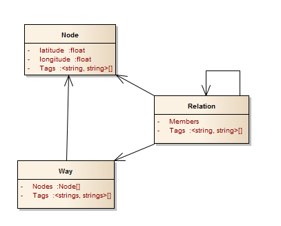

| OSM      	| SIG     	|
|----------	|---------	|
| Node     	| Point   	|
| Way      	| Ligne    	|
| Relation 	| Polygone 	|

* Un way OSM peut soit être une ligne en SIG ou alors un polygone. selon ses tags (clé/valeur)
* Une relation OSM peut être soit un point, une ligne,un polygone, une multiligne, un multipolygone, géométrie générique...

# Modèle de données OSM

Une autre différence ➡ **les attributs**

* En SIG, la **couche** a un ou plusieurs **champs**, définissant **toutes** les entités de cette couche

* Dans OSM, la **couche** **n'existe pas**. Chaque entité est individuelle et possède ses propres champs.

#
<!-- _class: lead gaia-->

Et donc ....

les données OSM dans QGIS ne seront jamais à l'identique que les données OSM brutes

#
<!-- _class: lead gaia-->

## De plus, il faut se poser quelques questions

# Est-ce que vous avez besoin…

* d'avoir des données OSM très à jour ?
* de travailler sur une petite emprise ou alors une grande emprise ?
  * À propos, qu'est-ce qu'une petite ou une grande emprise ? (pour une API en ligne)
  * Densité de données dans les différentes parties du monde
* d'avoir les métadonnées OSM comme le contributeur, le numéro du changeset, la date et l'heure, numéro de version etc ?
* données pour l'affichage d'une carte, de l'analyse spatiale, du calcul d'itinéraire, du géocodage ou … ?
* toutes les clées et les valeurs d'OSM ou un sous-ensemble ?

#
<!-- _class: lead gaia-->

## Il n'y a pas qu'une seule réponse

#
<!-- _class: lead gaia-->

## Regardons ce qui est possible

# Avec QGIS seulement

* Avoir le thème **mapnik** comme un raster, depuis *l'explorateur*

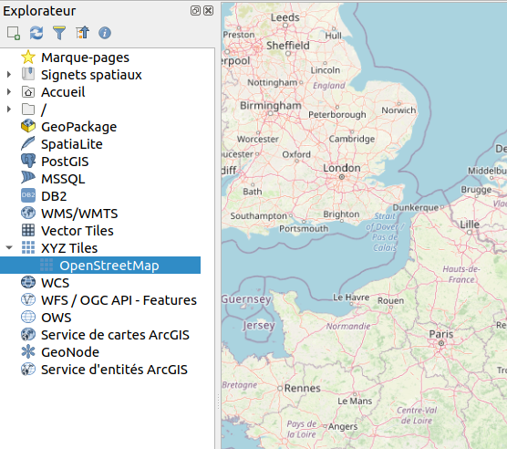

# Avec QGIS seulement

* Des outils en ligne existent pour transformer les données en format SIG (SHP, Geopackage, ...)
* https://download.geofabrik.de/
* https://www.data.data-wax.com/ France et autres pays, symbologie QGIS, GitHub (➡ capture ci-dessus)
* Portail data.gouv https://www.data.gouv.fr (présentation Région Sud par ex)

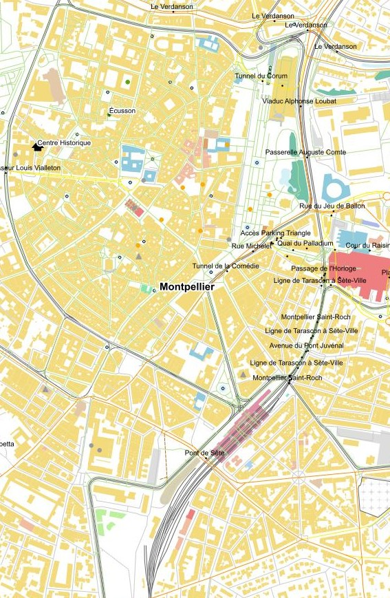

# Avec QGIS seulement

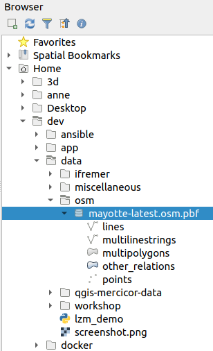

* Charger un fichier OSM XML ou PBF
  * Grâce à GDAL/OGR en fond
* Plusieurs sites pour télécharger ces fichiers, à l'échelle mondiale :
  * http://download.openstreetmap.fr/extracts/
  * https://download.geofabrik.de/
  * ...

# Avec QGIS seulement

* Si on souhaite certains champ précis, cela se complique légérement
* Ce champ `other_tags` est de type **HStore**

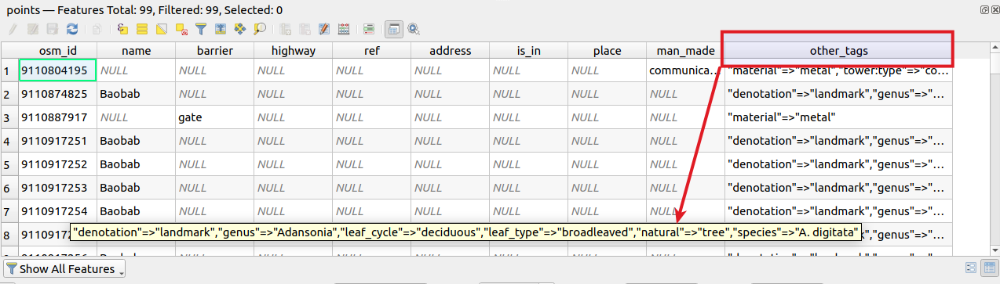

# Utiliser QGIS Processing pour l'exploser

Menu  "traitements" ➡ "Boite à outils"

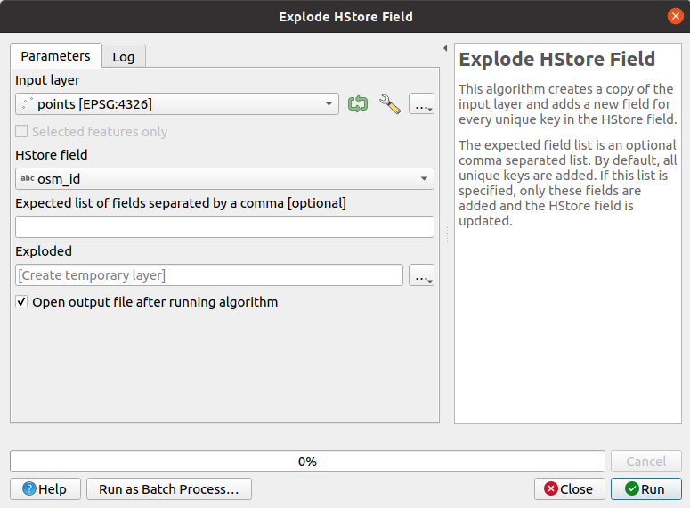

# Ou alors une expression QGIS

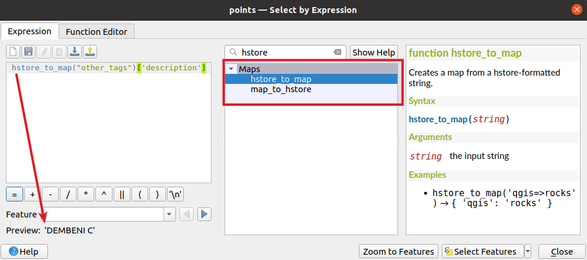

pour faire de la sélection, de l'étiquettage ...

# Avec des extensions QGIS

Certaines extensions concernent OSM parmi les 914 extensions disponibles dans le gestionnaire de QGIS 😎

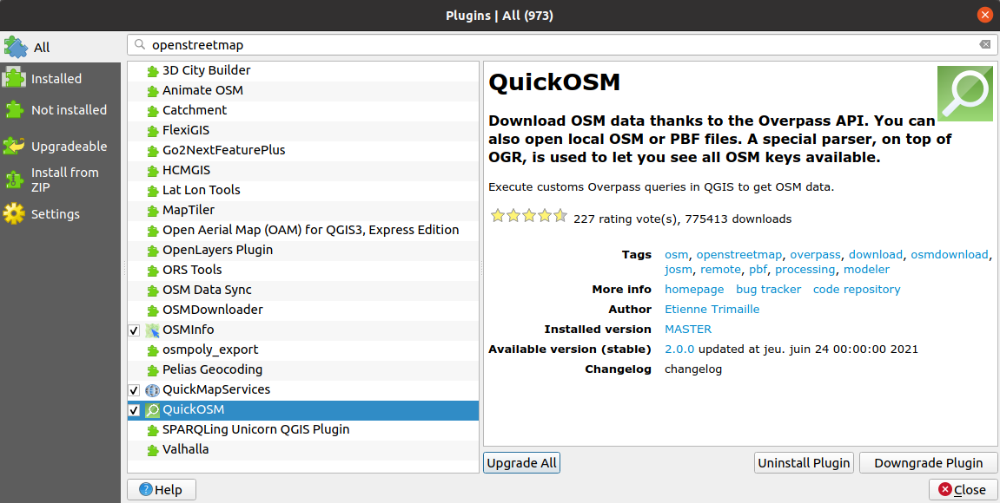

# Extension QuickMapServices

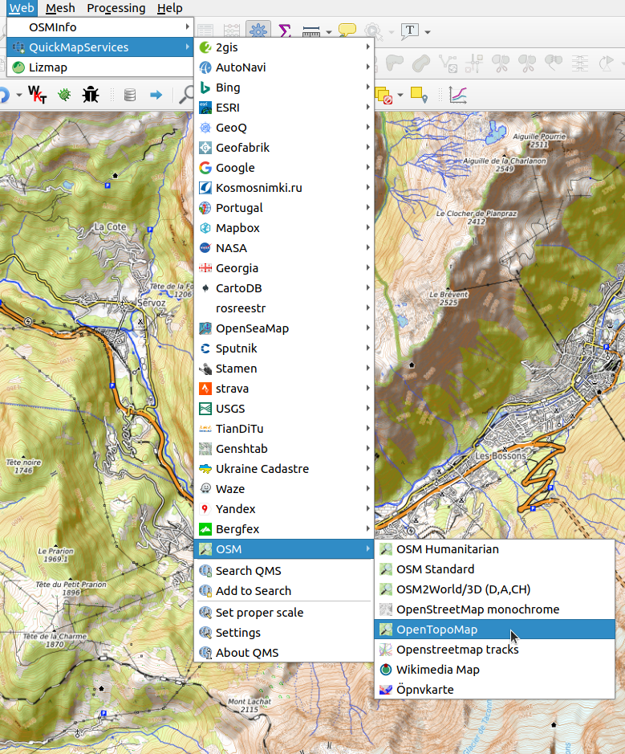

*OpenTopoMap* en fond, basé sur OSM, destiné à la randonnée 🏔

# Extension QuickMapServices

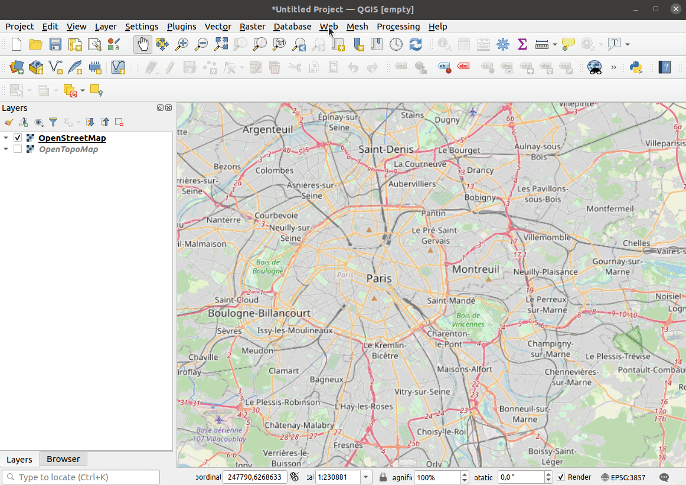

Dans *QuickMapServices*, aller dans *Settings* ➡ *More services* ➡ *Get contributed pack* pour activer **plusieurs** fonds de carte 🚀.

# Extension QuickOSM

* Télécharger les données à la volée
* Permet de faire des requêtes à Overpass, similaire à Overpass-Turbo
  * Serveur pour récupérer les données OSM brutes en utilisant un langage de requête OQL
* QuickOSM 2.1.0 arrive **très prochainement**
* L'extension cible 
  * les non contributeurs OSM, qui ne connaissent pas forcément les clés/valeurs
  * et aussi les experts de l'Overpass
* Suppression du champ HStore `other_tags` en l'explosant 
* Cela utilise une API, donc limite sur la quantité de donnée

# Requête rapide

* Recherche dans la langue native de l'utilisateur
  * 🇬🇧 `Bakery`
  * 🇩🇪 `Bäckerei`
  * 🇫🇷 `Boulangerie`
  * ➡ `shop=bakery` dans OSM
* Plusieurs clés/valeurs sont désormais possibles avec les opérateurs `AND`/`OR`

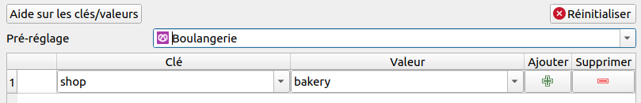

* *Merci aux communautés JOSM et Vespucci pour le dépôt GitHub*

# Requête rapide

*French people love 🥖 and 🧀*

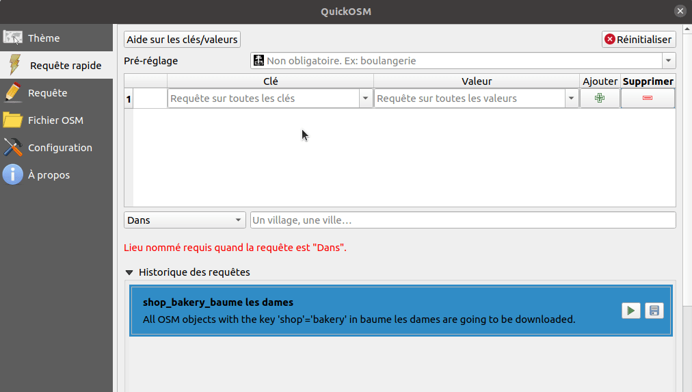

# Thème de carte

* Permet le téléchargement de **plusieurs** couches, plusieurs types d'objets, avec une symbologie QGIS en **2** clics

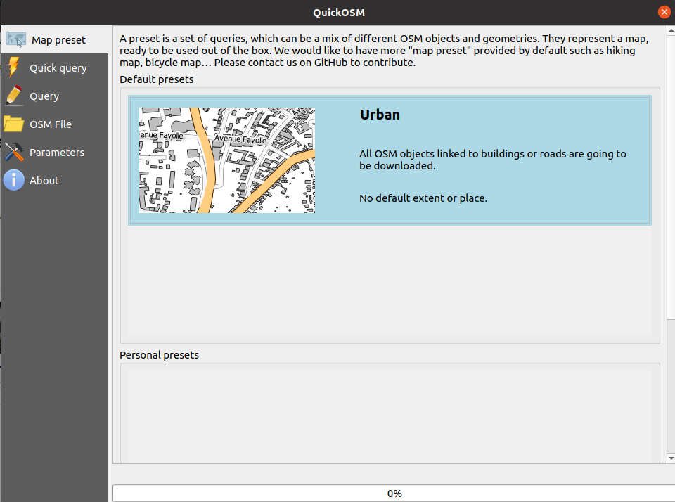

# Thème de carte

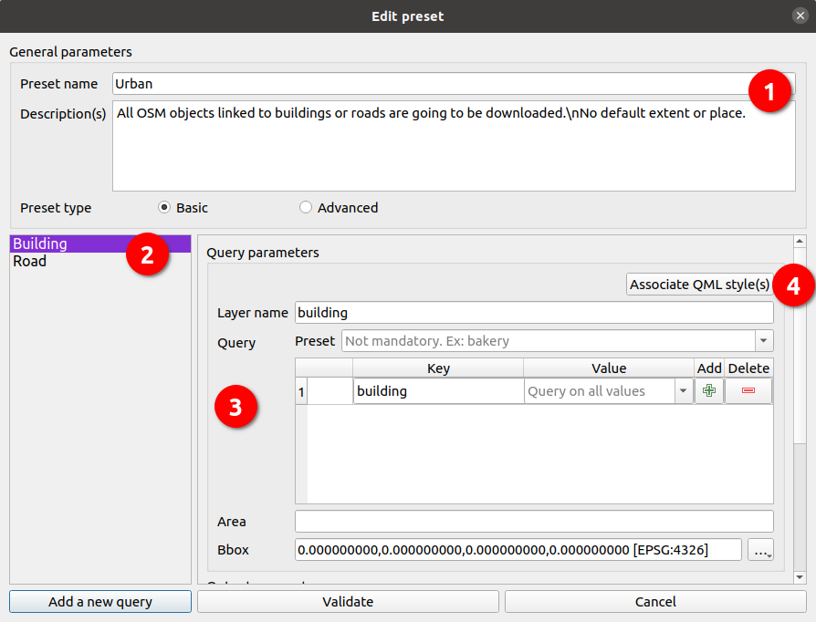

# Thème de carte

<!-- _class: lead gaia-->

*Carte cyclable*, *occupation du sol*, *cadastre*,...

https://docs.3liz.org/QuickOSM/user-guide/map-preset/

# QuickOSM dans Processing

* Disponible dans la **boîte à outils** et dans le modeleur Processing
* Traitement par lot possible dans Processing
* Exemple : téléchargement des bornes incendies, reprojection en 2154, zone tampon, application d'une symbologie, import dans une base de données PostGIS

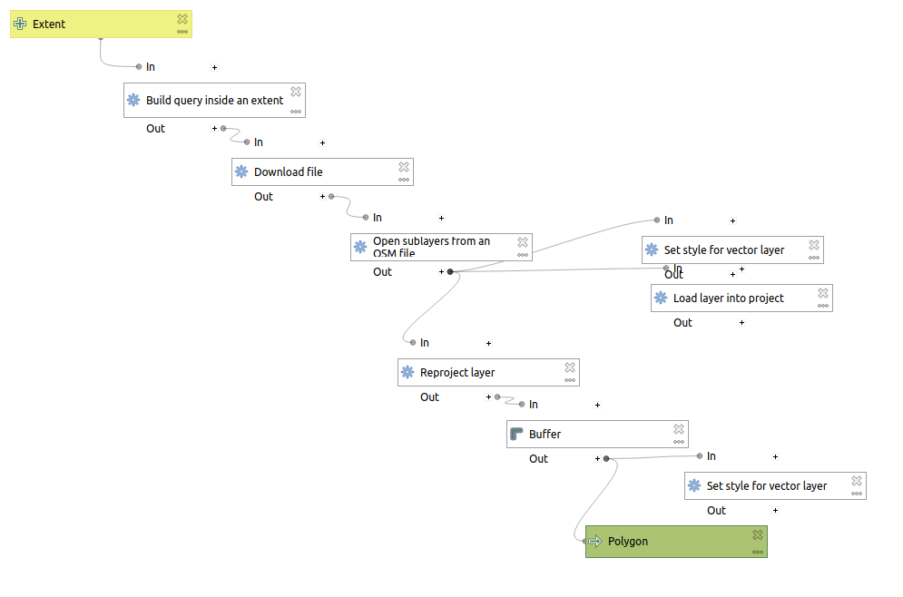

# QuickOSM dans Processing

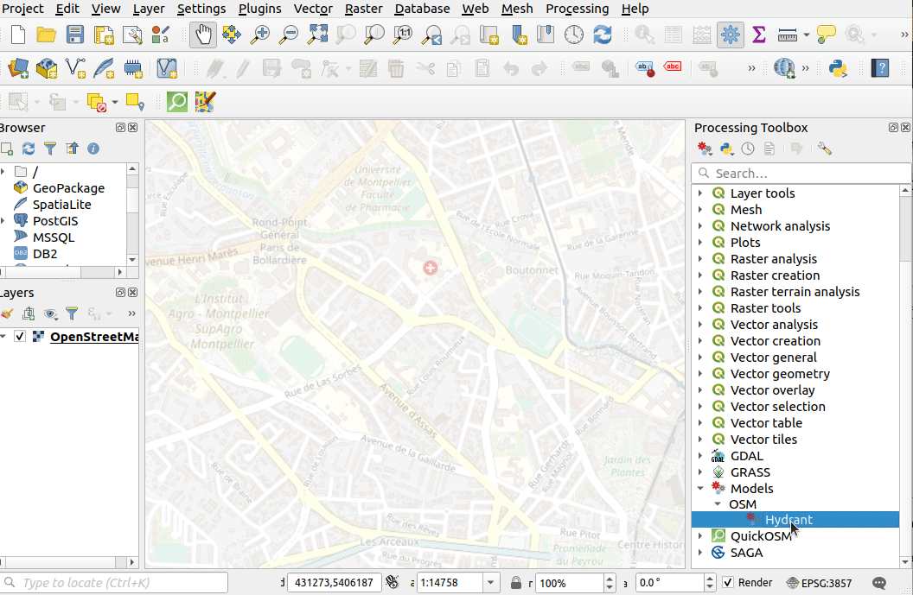

# Fichier OSM local

* Lire un fichier OSM XML/PBG local, filtrage sur clé/valeur

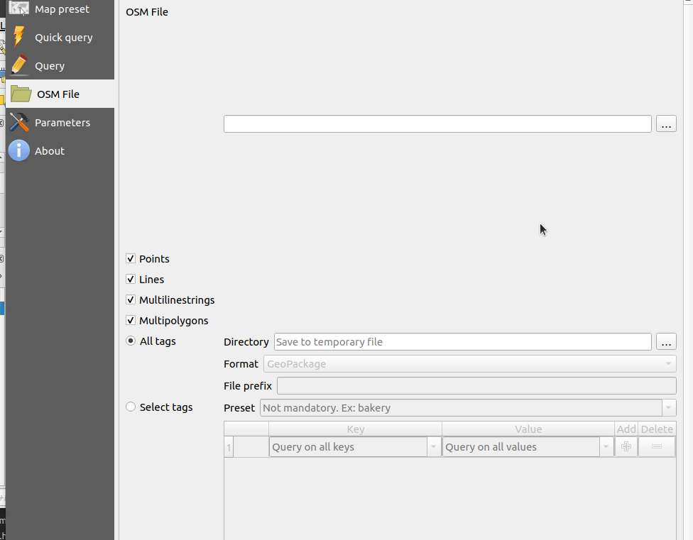

# Quelques astuces rapides dans QuickOSM

<!-- _class: lead gaia-->

# Recharger une requête pour mettre à jour les données OSM

<!-- _class: lead gaia-->

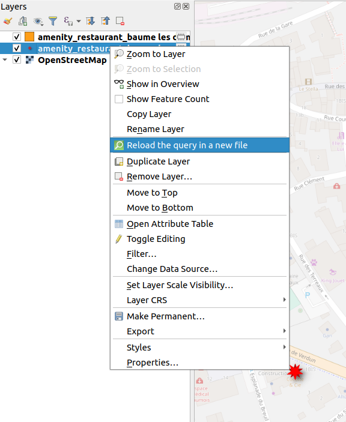

# Faire des requêtes sur plusieurs villes avec `;`

<!-- _class: lead gaia-->

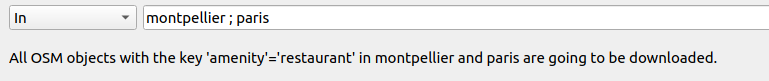

# Actions disponibles par défaut

<!-- _class: lead gaia-->

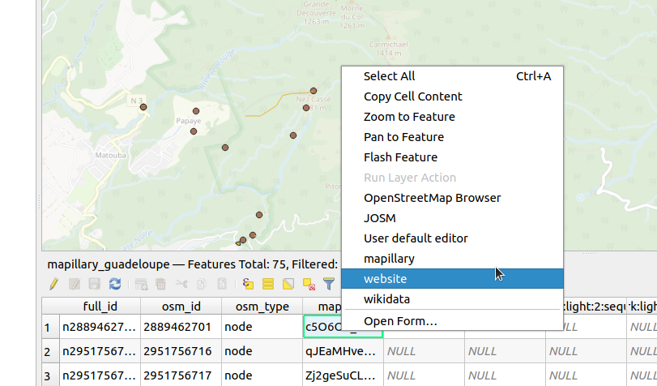

# Geocodage

* Nouveau dans QGIS 3.20 🌟
* Plus besoin d'extension
* https://nominatim.qgis.org
* Algorithme Processing dans le modeleur ou pour du traitement par lot
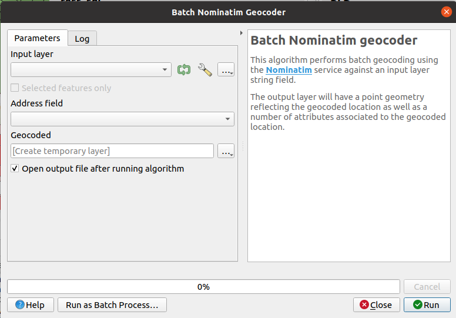

# Geocodage

* Nouveau dans QGIS 3.20 🌟
* Plus besoin d'extension
* https://nominatim.qgis.org
* Intégration dans le localiseur

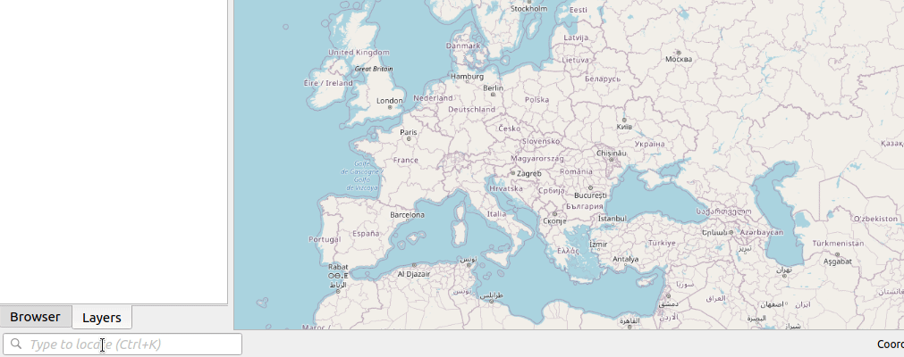

# Routage

* ORS Tools
* API avec les données OSM
* Isochrones, matrice de distances

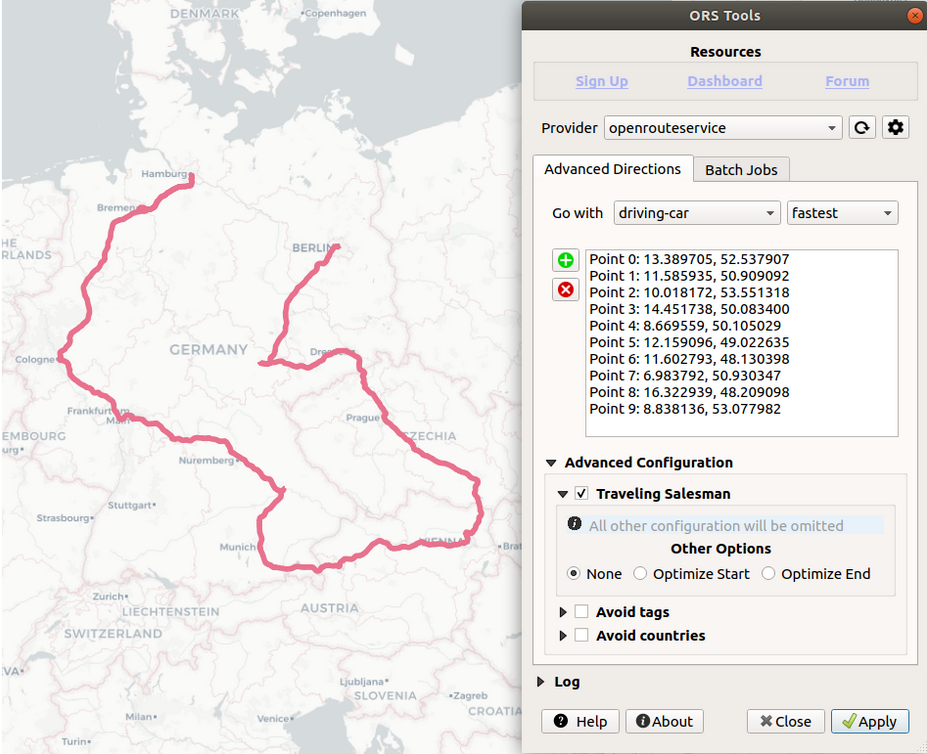

# Importer OSM dans une base de données ?

https://wiki.openstreetmap.org/wiki/Databases_and_data_access_APIs#Database_Schemas

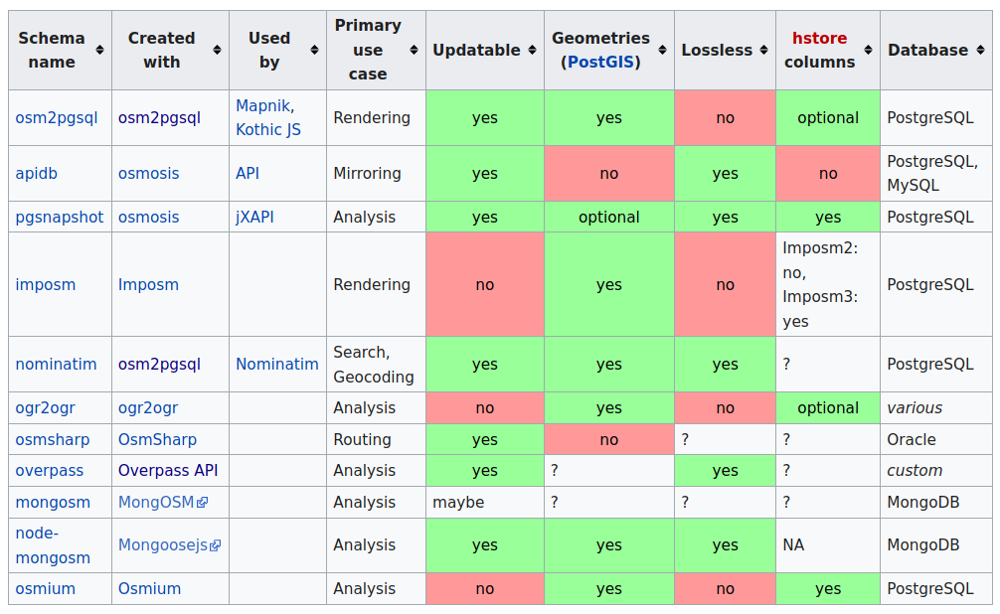

* Principalement **osm2pgsql**, utilisé pour du rendu, projet assez vieux mais très utilisé
* Imposm, version **3** peut-être mise à jour. Chaque couche PostGIS possède sa propre configuration : clé/valeur, généralisation etc

# Base de données avec docker

* 🐘 and 🐳
* https://github.com/kartoza/docker-osm
* Projet docker-compose :
  * Conteneur PostgreSQL
  * Conteneur Imposm
  * Conteneur OSMUpdate : pour télécharger les diff régulièrement
* Méthodologie
  * Un fichier PBF dans le dossier
  * Zone d'intérêt pour le découpage
  * Copier la configuration d'exemple `.example.env` en `.env` pour les paramètres locaux par défaut
  * `make run`

# et voila !

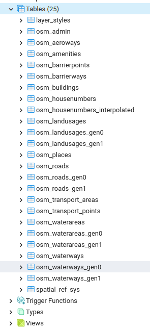

Possible de personnaliser la configuration :
  * Le **mapping**
  * Généralisation pour différentes échelles
  * Mise à jour toutes les 2 minutes par défaut
  * Fichier SQL pour trigger, vues
  * Symbologie dans la table `layer_styles`, propre à QGIS

# Tuile vecteurs

* Support des tuiles vecteurs, nouveau dans QGIS 3.14 🌟
* MapTiler / OpenMapTiles https://openmaptiles.org/
* Présentations du vendredi après-midi

# Questions

<!-- _class: lead gaia-->

Ceci est juste un aperçu des possibilités.
Il existe encore d'autres extensions, etc

 

*Etienne*
🐦 @etrimaille
