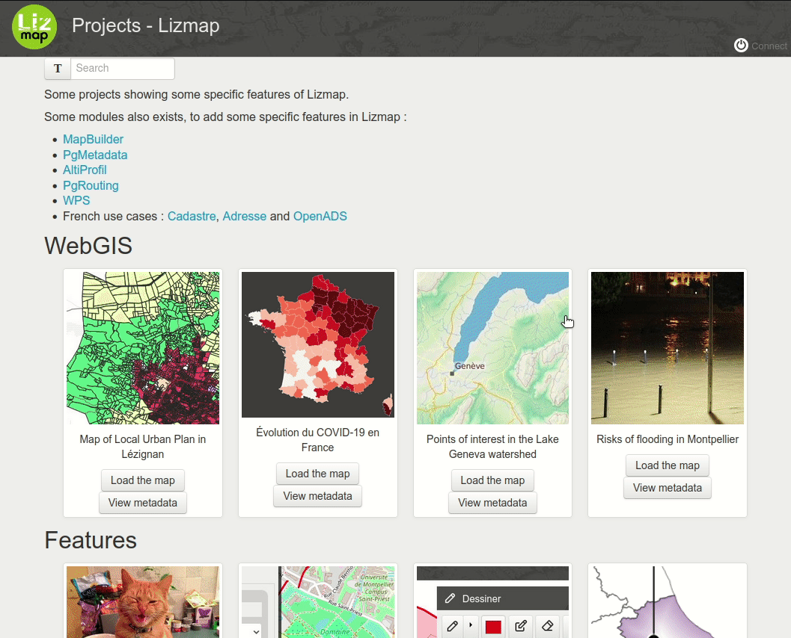
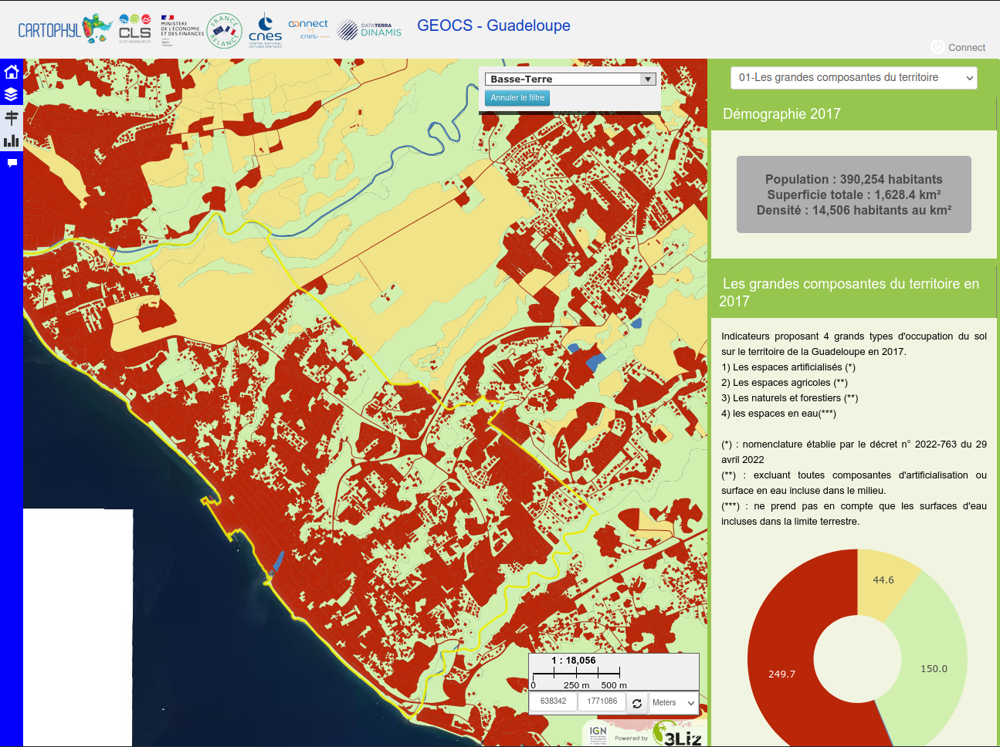
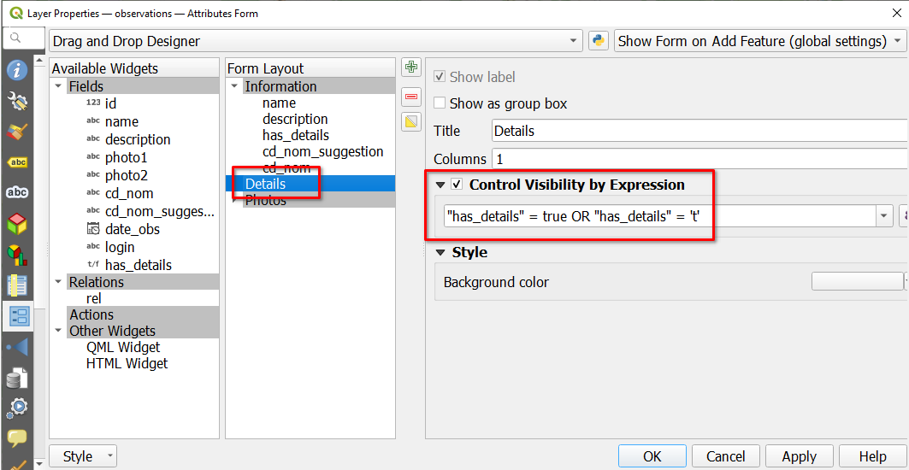

# Lizmap Web Client
<!-- _class: lead gaia-->
 

  

Create web map applications from **your** QGIS desktop

 

*Etienne Trimaille*
🐦 [@etrimaille](https://twitter.com/etrimaille)

# 3Liz

* French company
* **Open Source** forever, check our GitHub https://github.com/3liz/ 
* Core contributors in QGIS, server side mainly
* PyQGIS development, Lizmap server hosting, trainings about PyQGIS, PostGIS...

# QGIS Desktop

We might spend a lot of time configuring our project in QGIS Desktop ⏰

* Setting up layers and relations

* Layer symbology

* Build form to make it easy to add data

* PDF print layout

* ...

# QGIS Desktop

<!-- _class: lead gaia-->

# Need to share your work ?

* We already use and love QGIS as our main GIS tool
* We **are used to it** !
* Then we need to publish a full-featured application to the web ?
* We **do not** want to spend **again** time to set up and configure web maps in complex admin panels, re-styling layers, forms etc

# One thing to know

<!-- _class: lead gaia-->

* QGIS is **not only** a desktop application
* But a GIS server as well 🚀
* OGC certification since 2018 : WMS, WFS, WMTS...
* **Recent test report**: http://test.qgis.org/ogc_cite/ogcapif/latest/report.html

# On top of QGIS Server

* Lizmap Web Client
* Prepare on QGIS desktop, deploy on Lizmap
* Github
Open source : Mozilla Public Licence

Web administration panel is mainly for authentication and authorization management (users and groups)

All other configurations are done within QGIS desktop

# History

* Created as a simple QGIS project **web** viewer
* based on QGIS server and its OGC capabilities : WMS, WFS, WPS...
* has evolved to a **full-featured** web GIS application generator by integrating many QGIS great native features : symbology, relations, printing, forms

# How to

* Create a project with some layers
* Use the Lizmap plugin to configure some options specific for the web (extent, scales, tools available)
* And upload on the Lizmap server
* You've got a web map based on the QGIS project

# The power of QGIS Server

<!-- _class: lead gaia-->

A few days **before** the FOSS4G, in my Twitter timeline 🤔

# The power of QGIS Server

<!-- _class: lead gaia-->

_Oh, wait ... I like opensource, just sharing tips🤗_

# The power of QGIS Server

<!-- _class: lead gaia-->

It seems I had nothing to do to make it work on the web 😋

Available on https://demo.lizmap.com/, **download** it !

# The power of QGIS Server

<!-- _class: lead gaia-->

* The original author **didn't plan** to publish it on the web at the beginning
* **But**, thanks to QGIS Server, same code base as QGIS Desktop, 99% of the job to publish it and share this project 🚀

# Use cases of Lizmap

<!-- _class: lead gaia-->

Some examples to demonstrate
the main features

# Map Catalog in Meylan

<!-- _class: lead gaia-->

French city in the Alps
Publish thematic maps for citizens
Eye-candy, with simplicity
https://geo.myelan.fr

#

# 

# CSS, theme in Calvados and Gard

<!-- _class: lead gaia-->

* Custom CSS themes
* Publish thematic maps for citizens
* Promote landscapes and monuments
* https://atlas.calvados.fr and https://sig.gard.fr

#

#

# Embed in another website - AF3V

<!-- _class: lead gaia-->

* Possible to embed Lizmap in another website
* AF3V : French association about bicycle routes
* https://Af3v.org

#

# Dataviz with land use in Guadeloupe

<!-- _class: lead gaia-->

* Guadeloupe island in the Caribbean
* Valorisation of Land Use data
* Evolution of Land use data
* https://cartophyl.lizmap.com/demo/index.php/view/map/?repository=cartophyl&project=indic_GP#

#

#

#

# Identify feature

<!-- _class: lead gaia-->

* ADUGA, Urban planning agency
* Highlight key figures of **local business parks**
* Use core **QGIS HTML Maptip** to use **QGIS expressions**

# 

# Layer editing

<!-- _class: lead gaia-->

Setting up forms in QGIS can be **very** powerful ! 😎

thanks to many features such as Drag&Drop designer, container, visibility by expression, constrains, widgets...

# Layer editing

<!-- _class: lead gaia-->

Support of Drag&Drop designer form, with **tabs** to organize the form **and** the "control visibility by expression"

# Layer editing

<!-- _class: lead gaia-->

# Layer editing

<!-- _class: lead gaia-->

Constraints with expression

# Layer editing

<!-- _class: lead gaia-->

# Layer editing - Extra capabilities

<!-- _class: lead gaia-->

* **Geolocation**, GPS accuracy control
* **Snapping** with existing features
* Geometry toolbar
  * Reverse line geometry etc

# Form filtering in Narbonne

<!-- _class: lead gaia-->

* Find local products and markets
* Using form filtering : checkbox or dropdown menu
* https://lizmap.legrandnarbonne.com/index.php/view/map/?repository=public&project=circuit_court

#

#

<!-- _class: lead gaia-->

## Extent Lizmap core with some additional modules 🌟

# AltiProfil

* Developed by a Lizmap user in the Indian Ocean
* https://github.com/arno974/lizmap-altiProfil

# French address

* Funded by **Calvados**, French province
* Support for municipalities
* Helper to manage addresses
* Auto generation of address number
* Export to the French standard (BAL) for the national DB
* Specific GIS application

#

# Cadastre - Business application

* Funded by a group of cities
* Search parcels by location or owner
* Dedicated Cadastre Lizmap modules with a **QGIS Server Python plugin**
* Lizmap native **access control** to protect these sensitive data

#

# Web Processing Service

* To expose QGIS Processing (the toolbox and modeler) on the web

#

<!-- _class: lead gaia-->

## Extent Lizmap with some additional **JavaScript**

https://github.com/3liz/lizmap-javascript-scripts

#

# Like a Mapillary viewer

<!-- _class: lead gaia-->

_This idea and Javascript code was initiated by a Lizmap user in Italy, and then we also add to develop it_

# Access control

* Possible to have users and groups
* Different level of filtering and check access control :
  * Make group of projects visible or not on the landing page
  * Make projects visible or not
  * Make layers visible or not
  * Make editing available or not for a layer
  * Within the same layer, make features visible or not (either by attribute or by spatial intersection)

# Access control

<!-- _class: lead gaia-->

* Spatial filtering, like a **mask layer**

# A growing community

* Different kind of users
  * Private companies
  * Public organizations
  * Research centers
* Main contribution from the **Open Source** community in 
  * **translations**
  * the **Javascript** library
  * helping each other on the **Lizmap mailing list**
  * and gis.stackexchange.com
  * and writing some **documentation**

# Translations

* https://www.transifex.com/3liz-1/lizmap-locales/dashboard/
* 25 languages on Transifex
  * 18 languages with **at least** 70% translated

🇬🇧 🇨🇿 🇫🇷 🇵🇹 🇯🇵 🇷🇺 🇺🇦 🇮🇹 🇵🇱 🇷🇴 🇩🇪 🇸🇰 🇸🇪 🇧🇷 🇪🇸 🇳🇱 🇭🇺 🇫🇮 🇬🇷 🇳🇴 🇦🇷 🇮🇩 🇸🇮

# Translations

_August 22nd 2022_

<!-- _class: lead gaia-->

# Freely usable and used worldwide

* Groundwater mapping **Western cape, South Africa** https://www.groundwaterinfo.africa
* **Indian ocean** environment survey http://homisland.seas-oi.org/
* **Switzerland** https://www.wandelderzeit.ch/
* Faunalia (**Italia**) https://lizmap.faunalia.eu/
* Consorzio Toscana Nord (**Italy**) http://geoportale.cbtoscananord.it
* **World** Live QField users map: http://demo.qfield.org/websig/lizmap/www/
* Município de Arraiolos (**Portugal**) http://pdm-revisao.municipioarraiolos.pt/
* SAERI (**South Atlantic**): https://data.saeri.org/saeri_webgis/lizmap/www/
* IRSTEA Earth Observation: https://mdl4eo-cartes.irstea.fr
* Bonelli eagle 2017-2019 http://lizmap.aigledebonelli.fr/websig/lizmap/www/

#

# Roadmap

<!-- _class: lead gaia-->

# Roadmap

* Next version **3.6** is in **beta**
* Version **3.6.0-beta2** released **last month**
* Current target, release the final version 3.6.0 in the coming **weeks**
* Development on **3.7** has already **started** 🚀

# Changelog 3.6

* Improving **again** of **QGIS relations**
* Use **display values** instead of **raw values** when using a "Value map", "Value relation", "Relation Reference" widget in some tools
* **New administration panel** for GIS administrator showing metrics on each QGIS project 👍
* New **legend option** to display it automatically on startup
* ...
* The changelog is still "raw", wait for the final changelog https://github.com/3liz/lizmap-web-client/blob/master/CHANGELOG-3.6.md#360-beta1---2022-07-27

# Version 3.7 has started

<!-- _class: lead gaia-->

* Form filter
* Dataviz improvements
* Layer tree improvements
* Use more and more the QGIS Server Lizmap plugin

# Ongoing efforts

<!-- _class: lead gaia-->

_under the hood_

* Refactoring
* Unit tests
* End2End tests

# End2end

# Questions

### [@etrimaille](https://twitter.com/etrimaille)
### [@LizmapForQgis](https://twitter.com/LizmapForQgis)
### [@3LIZ_news](https://twitter.com/3LIZ_news)
