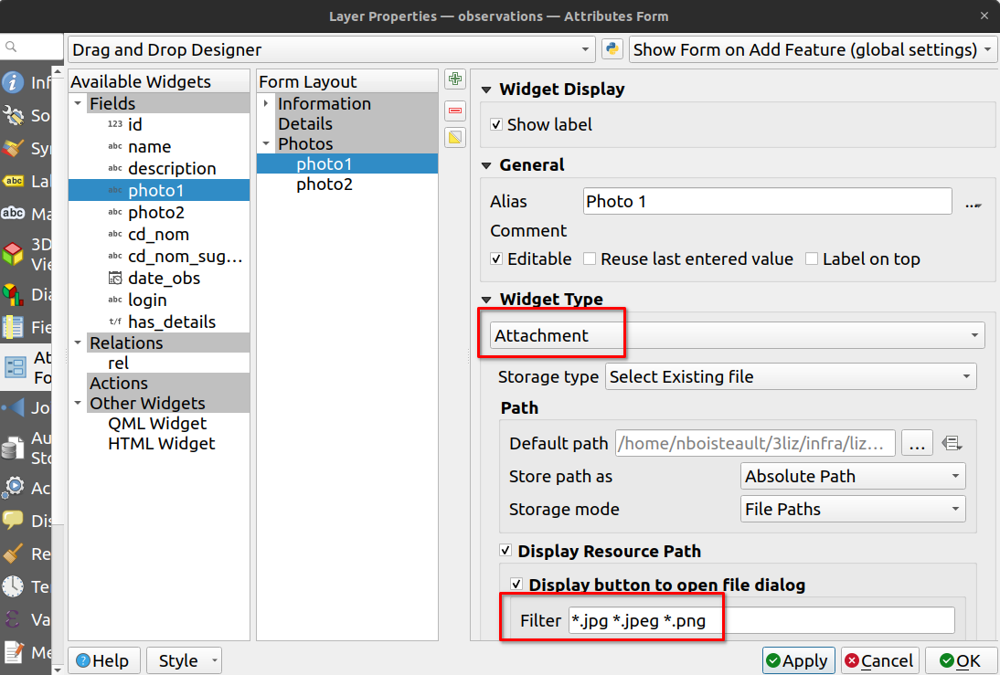
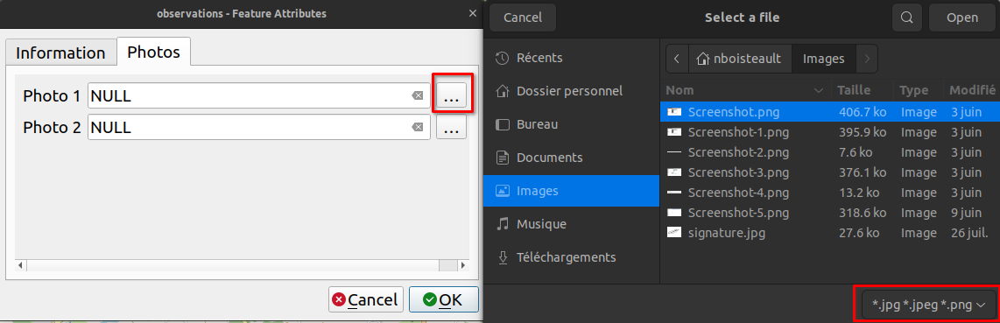
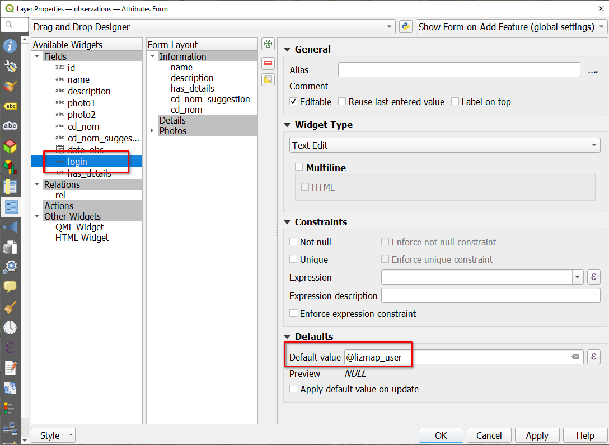
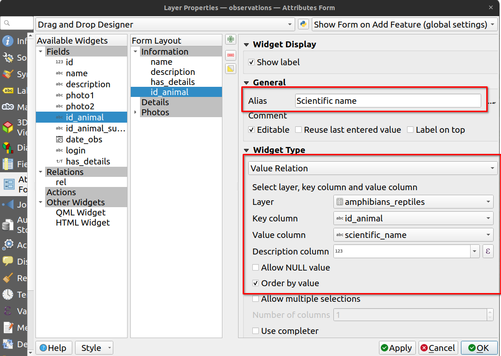
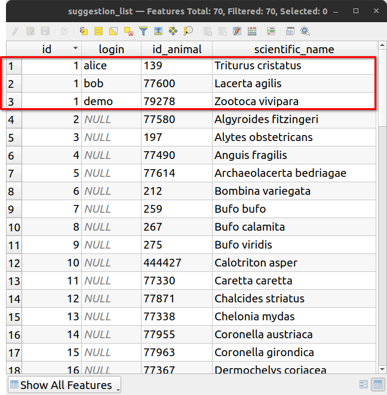
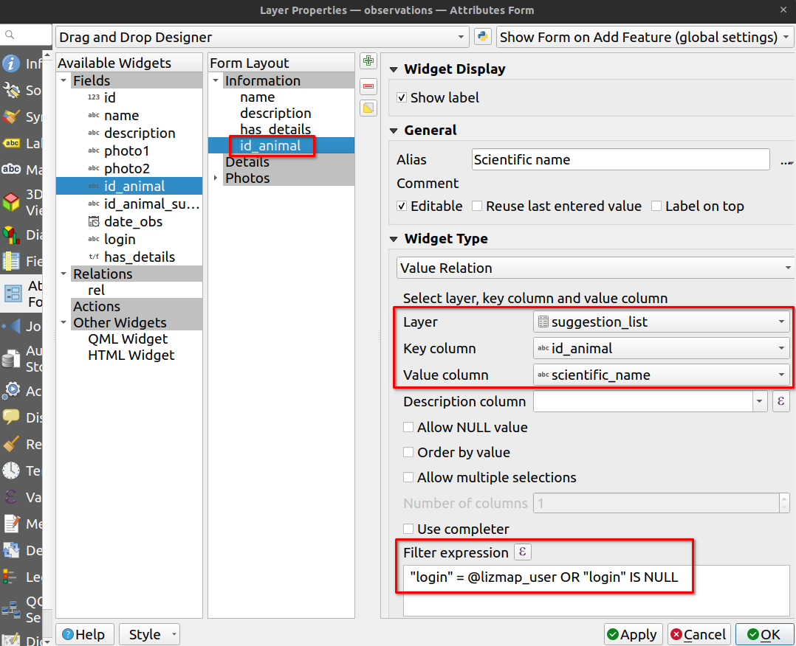

# Advanced QGIS forms into the web with Lizmap


Nicolas BOISTEAULT - 3LIZ

<!-- (15s) Hi, I'm going to show you some tips to make advanced forms in QGIS which will be easy for users to be filled.
I also will show you that you'll get those forms in the web thanks to Lizmap with no more configuration most of the time.
This way you'll get more participation and less mistake in your data.
 -->

# Organize form's fields

- Use QGIS "Drag and Drop Designer"


<!-- (20s)
First with the QGIS "Drag and Drop Designer" we can:
- Decide which fields are to be visible 
- Change the field's order
- Create tabs and group boxes
-->

# Toggle tabs or group boxes visibility on condition


<!-- (35s) Let's say we create a form for a crowdsourcing campaign but also logged in users in Lizmap (like people in our organization).
This form will have many fields but many of them are not mandatory so we don't want to show them all when users open the form to not scare them. If it seems too long to fill it, they might give up and close it.
Here I've created a boolean field called `has_details`, with `Add details` as an Alias to have a more understandable title for this field which is defined as a `Checkbox`... -->

---


<!-- (15s) ...I have also created a `Details` tab thanks to the `Drag and Drop Designer` configured with a `Control Visibility by Expression` to only display it when the `has_details` checkbox is checked. -->

---


<!-- (10s) Here is the result. As you can see `Details` tab is only visible when `Add details?` is checked -->

# Upload photos

- Use "Attachment" widget and "Filter" to define allowed extensions



<!-- (10s) Now we want people to upload photos. We create fields defined with the `Attachment` widget type and with a Filter to only display JPEG and PNG files -->

---

<!--  -->


<!-- (10s) You can see the result in Lizmap. Only files with defined extensions are displayed when selecting them -->

---
- Edit pictures directly in Lizmap


<!-- (10s) In Lizmap, you can also rotate or crop images. It is more convenient than to have to install a software for that. -->

# Constraints with expression


<!-- (5s) Here we use an expression to constraint a field to have at least thirty characters -->

---


<!-- (10s) Here you can see the result in Lizmap -->

# Save login and groups

- Expression variables: @lizmap_user for users, @lizmap_user_groups for groups



<!-- (15s) When contributors are logged in Lizmap, we can use their user login or user groups in form's expressions thanks to expression variables.
Here I have created an invisible `login` field which get filled with the user login when form is saved.
 -->

# Value relation



<!-- (5s) The Value Relation widget is very convenient to display a list of value from another layer. -->

---


<!-- (10s) But sometimes the list can be very long. In this example, we display scientific names for amphibians and reptiles in France. It would be more convenient to suggest the last previous record for example -->

# Use case: suggestion based on previous record

```sql
SELECT * FROM (
  (
    SELECT DISTINCT ON (login)
      1 AS id,
      obs.id_animal,
      amph.scientific_name,
      login
    FROM foss4g.observations obs
    LEFT JOIN foss4g.amphibians_reptiles amph 
    ON obs.id_animal = amph.id_animal
    ORDER BY login, date_obs DESC
  )
  UNION ALL 
  (
  SELECT row_number() over (ORDER BY scientific_name) + 1 AS id,
    id_animal,
    scientific_name,
    NULL AS login 
  FROM foss4g.amphibians_reptiles
  )
) sub_query ORDER BY id
```

<!-- (10s) We create a layer from a view with this SQL query. It is a UNION ALL with the last previous record for logged in users and the whole list -->

---



<!-- (20s) In red, the attribute table shows us the last record for alice, bob and demo users. The rest is the whole list of animals. -->

---



<!-- (15s) To only get the previous record for the logged in user in Lizmap we use this `Filter expression` which uses again the `@lizmap_user` expression variable -->

# Still here? :) Result


<!-- (15s) As you can see now when a logged in user save a form he then has on top of the scientific name's list the last specie suggested. -->

# Thank you for your attention

* 3Liz: https://3liz.com
* Twitter 🐦
  * Nicolas BOISTEAULT: https://twitter.com/nboisteault
  * 3Liz: https://twitter.com/3LIZ_news


<!-- (5s) -->