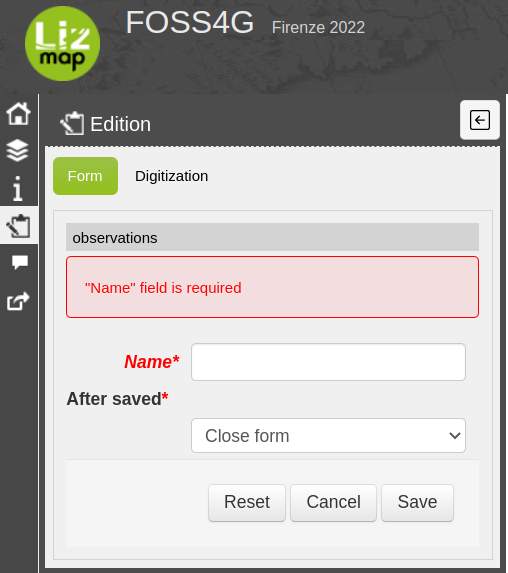
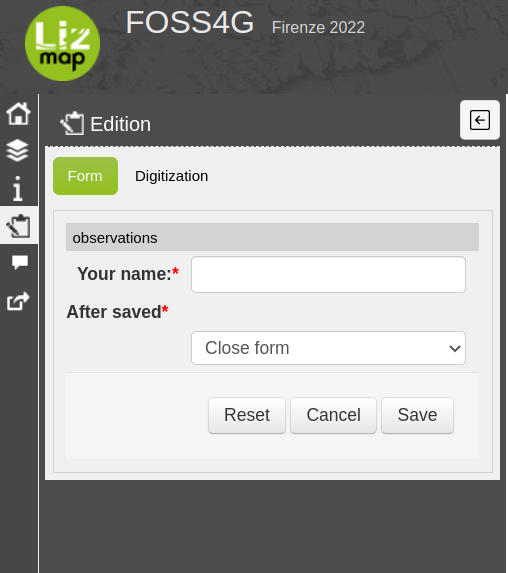
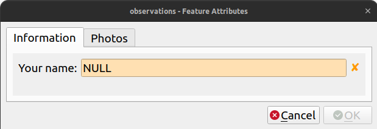
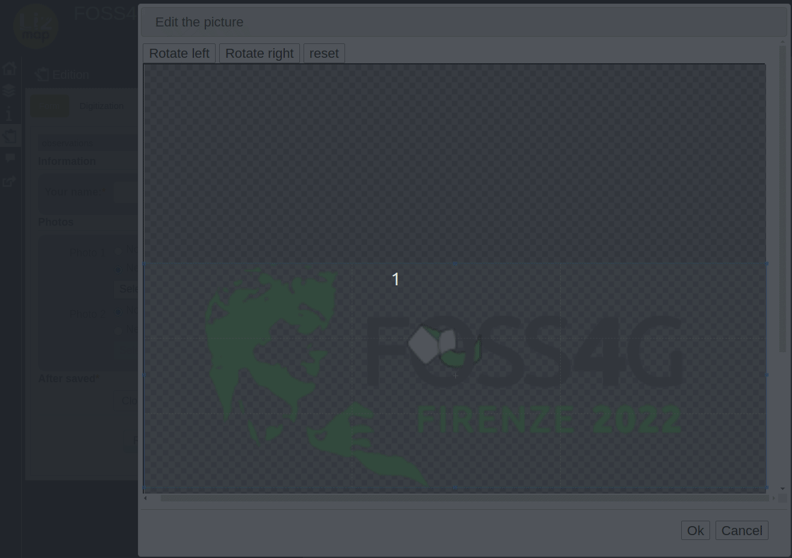
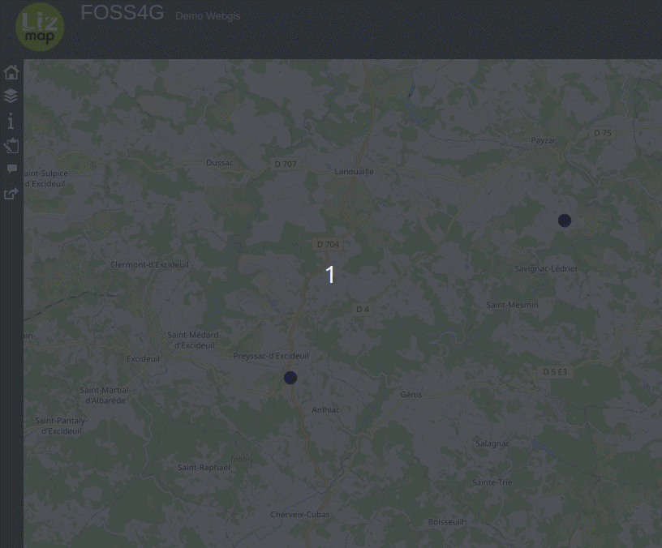

# Advanced QGIS forms into the web with Lizmap

Nicolas BOISTEAULT - 3LIZ

# Mandatory fields

- Define fields as `NOT NULL` in postgreSQL

 

# Alias

- Define aliases for your fields

 

<!-- 
- Fields name in database are simple/raw
- Make the field more comprehensive
-->

# Organize form's fields

- Use QGIS "Drag and Drop Designer"

<!-- 
- Change field's order
- Create tabs and group box
-->

# Tabs

 

# Group box

 

# Upload files

- Use "Attachment" widget and "Filter" to define allowed extensions

---

---
- Edit pictures directly in Lizmap

# Constraints with expression

---

# Thank you for your attention

* 3Liz: https://3liz.com
* Twitter 🐦
  * Nicolas BOISTEAULT: https://twitter.com/nboisteault
  * 3Liz: https://twitter.com/3LIZ_news

