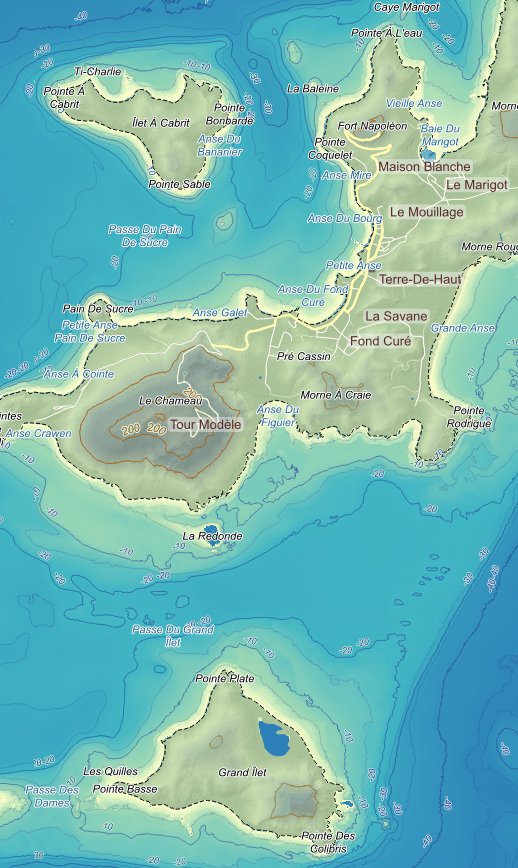
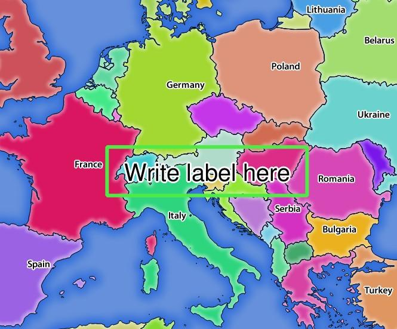
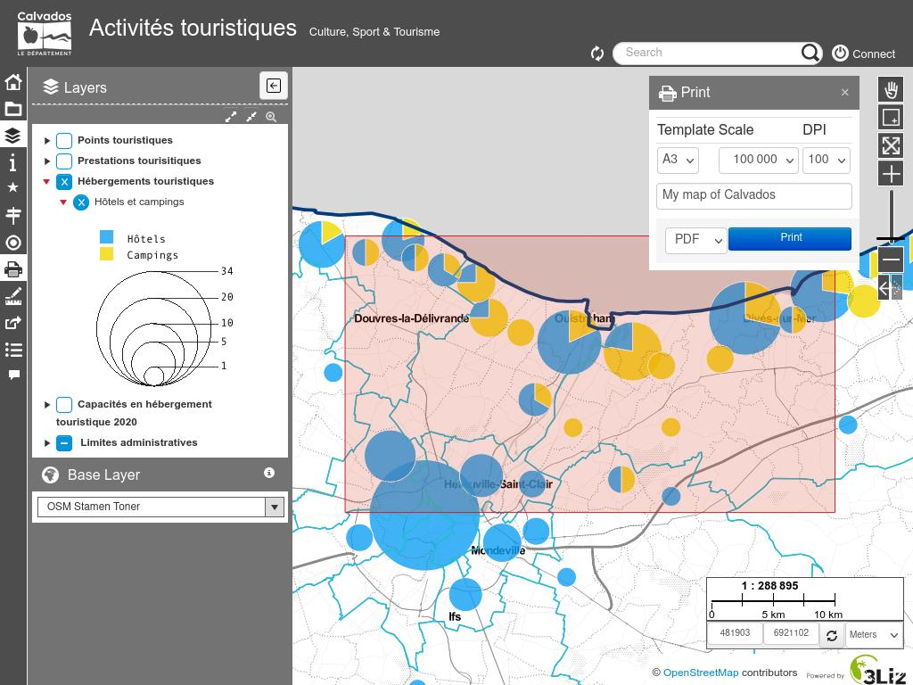
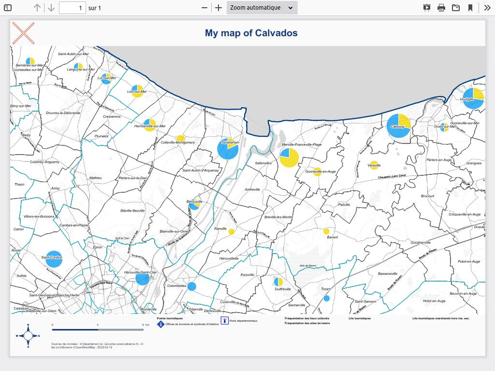
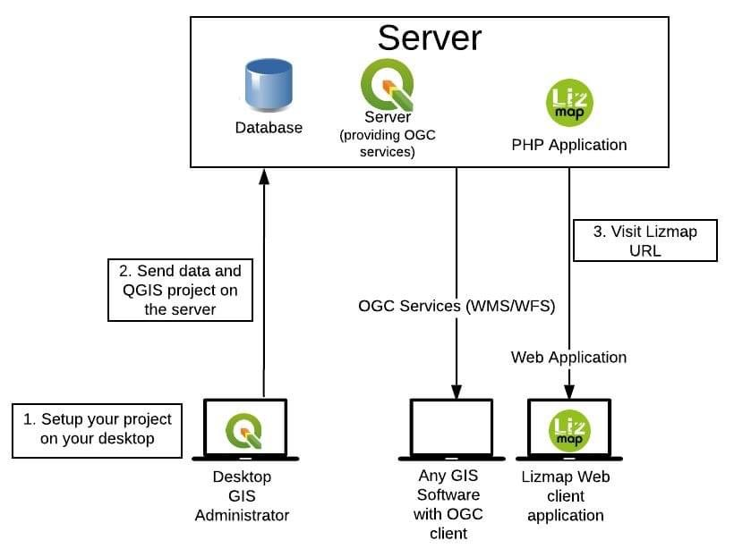
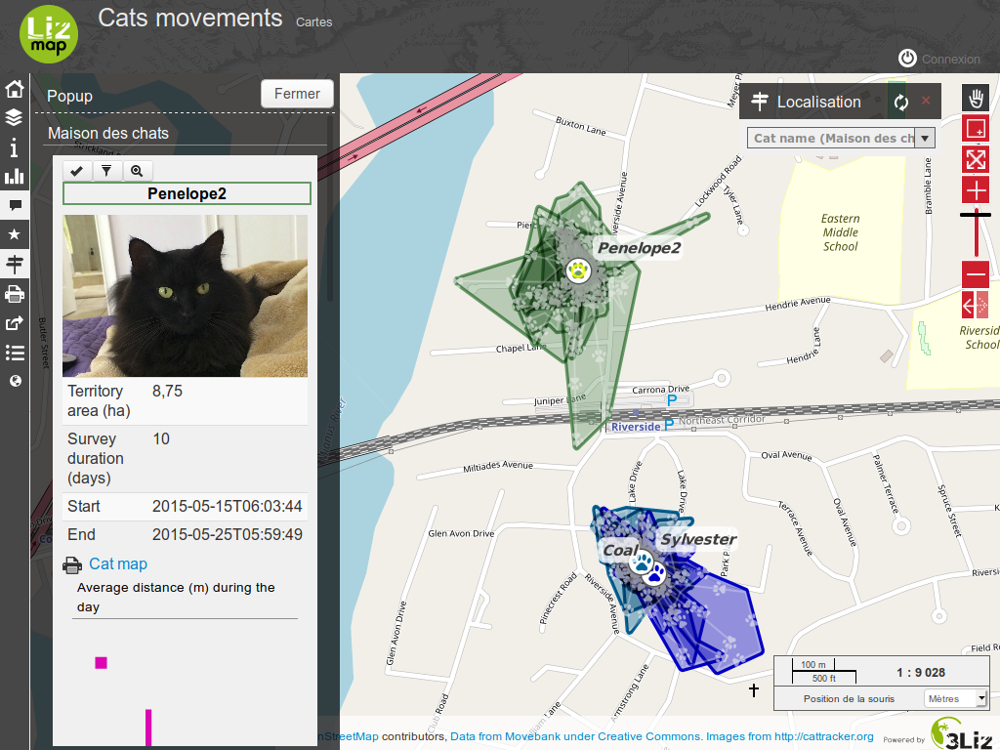
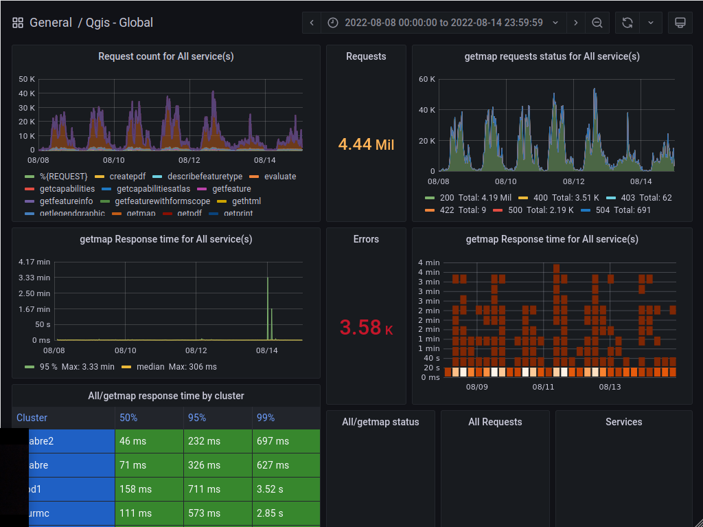
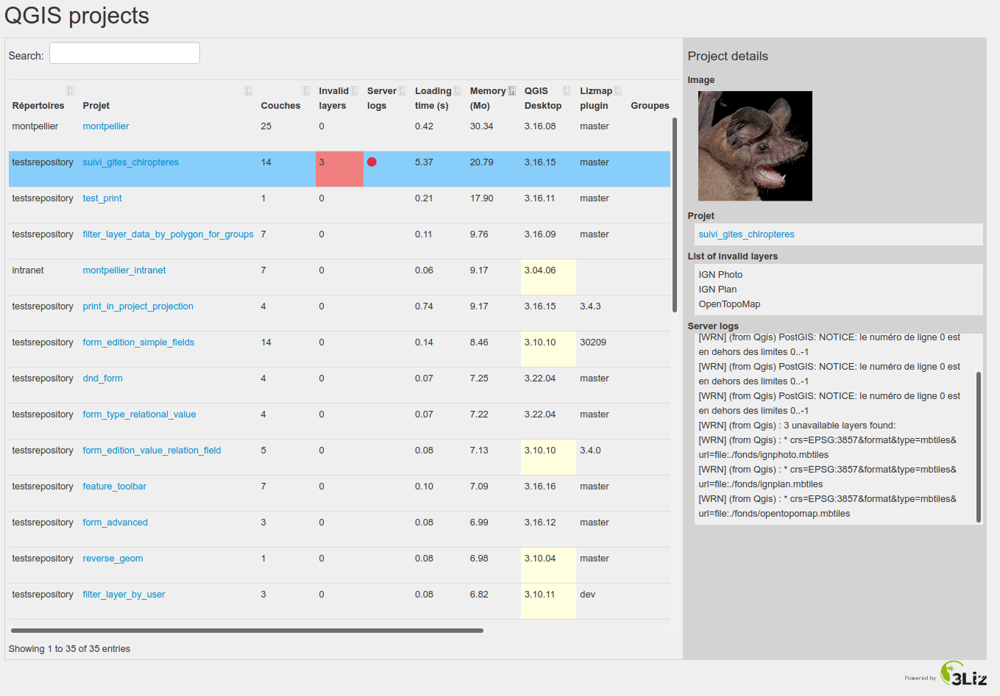
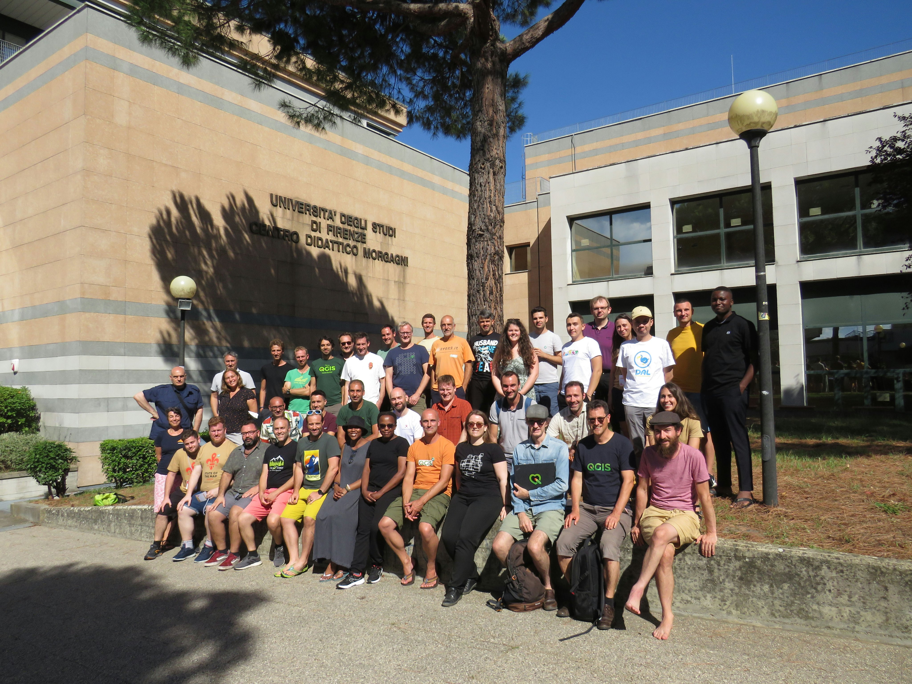

#  **Server** into the wild

Feedback from the 3Liz team

by *Michaël Douchin*

<!-- _class: lead gaia-->

# 3liz

A French company dedicated to create and share **open-source GIS solutions**

* QGIS Server **core developers**
* QGIS and QGIS Server [plugins](https://docs.3liz.org/plugins/)
* Creators of [Lizmap Web Client](https://www.lizmap.com/en/) to publish QGIS projects online
* We offer **PostgreSQL/PostGIS** courses
* and QGIS, PostgreSQL, Lizmap Web Client **support**

# QGIS Server

The power of  **Desktop** in the "cloud"
<!-- _class: lead gaia-->

# QGIS Server

> QGIS Server is an **open source** WMS, WFS, OGC API for Features 1.0 (WFS3) and WCS implementation

QGIS Server is able to **serve data** according to **standard protocols** as described by the Open Geospatial Consortium (OGC):

which means: **Ask questions (requests) and get answers (responses)**:
* "Give me a JPEG of the layers 'Rivers' at this scale and in this area"
* "Please pass me some vector data for this layer 'Towns' where the name begins with A"

QGIS Server uses **QGIS as back-end** for the GIS logic and for map rendering: 1 **QGIS project** = 1 MAP service / the **same visualization libraries** = the same map rendering

# QGIS Server services

* **WMS**: Web Map Service 1.1.1 and 1.3.0 -> Images of layers
* **WFS**: Web Feature Service 1.0.0 and 1.1.0 -> Vector features
* **OGC API - Features** (WFS3) -> Vector features
* **WCS**: Web Coverage Service 1.0.0 and 1.1.1 -> Publish Raster data
* **WMTS**: Web Map Tile Service 1.0.0 -> Publish web map tiles

# QGIS Server additional features

* **Redlining**: pass geometries and labels and draw them above map features -> `GetPrint` `GetMap`
* **Filter** specific features with a QGIS **subset string** (SQL Like) with `FILTER` or with an **expression** with `EXP_FILTER` for -> `GetMap` `GetPrint` `GetFeatureInfo`
* **Selection**: the `SELECTION` parameter allow passing a list of **feature ids** -> `GetMap` `GetPrint`
* **Build HTML feature info** with QGIS map tip: `WITH_MAPTIP` for the `GetFeatureInfo` request -> use **Expressions** to create **rich HTML content**.

# QGIS Server specific requests

Additional requests:

* **GetProjectSettings**: Returns specific information about QGIS Server and a given QGIS project
* **GetSchemaExtension**: Returns XML metadata about optional extended capabilities
* **GetPrint**:
  * Returns a **QGIS layout** export as PDF, PNG, SVG.
  * Support **Atlas** configured in the layout
  * Additional parameters for **redlining**, **selection**, **filter**, etc.

# QGIS Server: GetPrint example

# QGIS Server: GetPrint example

# OGC certification

Since its beginning, a lot of work has been done to respect the **OGC specifications**:

  * **since 2018**, it is certified as official [OGC reference implementation](https://blog.qgis.org/2018/06/27/qgis-server-certified-as-official-ogc-reference-implementation/)
  * A complete **test suite** has been created to easily check the current status
  * **Recent test report**: http://test.qgis.org/ogc_cite/ogcapif/latest/report.html

# Lizmap Web Client

Create web applications based on your QGIS projects

<!-- _class: lead gaia-->

# Lizmap Web Client 

**LWC** is an **open-source** software developed by **3liz** which allows creating & publishing **web map applications** based on **QGIS projects** with the help of  **QGIS Server**

# Lizmap home page

# Lizmap map

# Lizmap editing form

#  LizCloud

**3liz hosting plan** for QGIS Server, Lizmap & PostgreSQL

<!-- _class: lead gaia-->

# LizCloud 

3liz proposes **Spatial server hosting plans** based on:

*  QGIS Server
*  Lizmap Web Client
*  PostgreSQL/PostGIS

**One instance** = 1 Lizmap Web Client + 1 PostgreSQL database

2 main offers:

* on a **shared** server
* on a **dedicated** server

# LizCloud key figures

**QGIS Server** is used by 3liz in **production** context since **10 years**

* More than **40 servers**
* More than **200** QGIS Server **workers** (at least 4 workers per server)
* QGIS Server **versions** from **3.10** to **3.22**
* More than **3 million requests per week** to QGIS Server
* **99,99%** requests without errors
* Mainly **GetMap WMS requests**
* **GetCapabilities** are **the longest requests** = QGIS project **loading**
* **GetMap Response times** are very good and depend a lot on the QGIS project, layer, configuration complexity (symbology, number of features, expressions, etc.)
  * 50% (median): **20 ms -> 500 ms**
  * percentile 95: **150 ms -> 2 seconds**

# QGIS Server hosting challenges

We choose **to trust our users** and let them use the **full power** of QGIS

* **QGIS projects** can be heavy: **up to 400 layers**
* We **accept every QGIS compatible vector and raster format**, except proprietary formats
* **PostgreSQL views and complex queries** can take time to respond
* **External WFS or WMS servers** can be slow or unreachable
* **Layer configuration** (symbology) can lead to poor performances

**Main issues**

* **Project loading time**: the **first** request on a QGIS project initializes all the layers and print layouts. Then a cache is used.
* **Memory consumption**: QGIS Server memory usage cannot yet be shared between workers (no shared project cache)
*
# Solutions

* **Support**: we help our clients to improve their QGIS projects, layers underlying data, PostgreSQL queries, etc.
* **Monitor and alert**: we store metrics for the key components: QGIS Server, Lizmap, PostgreSQL databases, file storage
* **Contribute**: we help to improve QGIS Server (core contributors since QGIS Server start)
* **Develop** new tools to address encountered issues: **py-qgis-server**, QGIS Server plugins, qgis-plugin-manager, etc.
* **Proxy** requests from QGIS Server to external resources
* **Architecture**: parallelize requests with several QGIS Server workers, use cache, separate services, etc.

# Monitor & alert

<!-- _class: lead gaia-->

# Store and view metrics

Each service is monitored:

* **Lizmap & QGIS Server requests** with time, status, project & parameters, instance name, physical server ID, etc.
* **PostgreSQL databases**: the number of connections, databases size, errors, etc.
* **Server metrics**: CPU, memory, disk status, network bandwidth, etc.

We integrated all the metrics in **Grafana** to have a complete vision of the services, and also store aggregated metrics to see how it evolves during long periods.

**Alerting** is also configured to send **emails & SMS** for critical issues: website down, disk 80% full, memory almost full, etc.

# Grafana dashboard example

# Help Lizmap administrator to evaluate the published QGIS projects

The idea is to show the publisher of the projects helpful information on its QGIS projects:

* QGIS **desktop version** / QGIS **Server version**
* **Layer count**
* **Last date** of modification
* **Invalid layers count** and list of layer names
* **Memory** used to load the project (Mo)
* **Loading time** of the project (seconds)
* **QGIS Server Log** written when loading the project

Depending on the values displayed, a **yellow or red background** will help to focus on **potential issues to solve**

# Lizmap administration dashboard

# Improve QGIS Server & develop specific tools

<!-- _class: lead gaia-->

# QGIS Server improvements

The **3liz team** contributes to the effort of improving QGIS Server for every version, for example:

* Implement **service module registry**: use a modular approach for each service (WMS, WFS, WCS, etc.)
* **Project properties** tool to check if the project is ok to serve
* **Improve the QGIS project loading times**. Fresh example: open the project in [read-only mode](https://github.com/qgis/QGIS/pull/49440) to avoid unnecessary requests to database providers (PostgreSQL, Oracle, etc.)
* **Fix bugs or regressions** discovered in new versions: memory leaks, high memory usage for big JPEG files in composers, etc.
* Improve **unit test suite** to avoid regressions

Blog post: https://www.3liz.com/en/news/qgis-ltr-3-22.html

# Py-Qgis-server

Python QGIS embedded WMS/WFS/WCS **asynchronous scalable server** https://docs.3liz.org/py-qgis-server/

* Easy configuration: **environment variables** or simple **ini file**
* Multiple **parallel workers**
* Fair **queuing request** dispatching
* **Timeout** for long-running/stalled requests
* Full support of QGIS server **plugins**
* **Auto-restart** trigger for workers based on memory, number of requests, etc.
* Support adding new **projects cache handlers** as python extension
* **Preloading** of Qgis projects in a static cache
* Control the exposition of **QGIS API** to secure access

# QGIS Server plugins

The 3liz team developed several plugins for QGIS Server:

* **WFSOutputExtension**: add more formats for the **WFS service** (SHP, KML, ODS, XLSX, etc.)
* **AtlasPrint**: extend QGIS Server to allow exporting a PDF from a **print layout with Atlas**
* **WMTS Cache**: allow to cache the map tiles served by QGIS Server
* **Lizmap Server**: allow to evaluate QGIS Expressions (feature, layer, global context), help to control access to data

Documentation: https://docs.3liz.org/plugins/#server

To install server plugin, you can use our **qgis-plugin-manager** Python tool: https://github.com/3liz/qgis-plugin-manager

# Py-QGIS-WPS

-> example of a complementary tool for QGIS Server

[Py-QGIS-WPS](https://github.com/3liz/py-qgis-wps) is an implementation of the **Web Processing Service** standard from the OGC based on the **QGIS Processing API**.

This implementation allows you to expose and run on a server:

* QGIS Processing **algorithms** available on Desktop
* QGIS Processing **models and scripts**
* QGIS plugins having a **Processing provider**

It is written in **Python** and is a fork of PyWPS.

# Conclusion
<!-- _class: lead gaia-->

* QGIS Server is a great OWS server with **the power of QGIS desktop**
* A continuous process under the hood to **improve performance and robustness**
* The **3liz team** helps with **core contributions**, **plugins** development, new **tools**, **ideas** and **support**
* You cannot just install and use QGIS Server: as any server, it needs **monitoring and alerting**, and a good **architecture**
* **3liz** proposes a **production-ready hosting service** with QGIS Server, PostgreSQL & **Lizmap Web Client**

# Resources

* QGIS Server documentation: https://docs.qgis.org/latest/en/docs/server_manual/
* 3liz documentation with plugins, tools, tutorials, etc: https://docs.3liz.org
* Twitter: [@3liz_news](https://twitter.com/3Liz_news) and [@LizmapForQgis
]((https://twitter.com/3Liz_news))
* Email: info@3liz.com

# Thanks for your attention !

Michaël Douchin, 3liz
Twitter: [@kimaidou](https://twitter.com/kimaidou)
Github: [@mdouchin](https://github.com/mdouchin)

<!-- _class: lead gaia-->

# A big thanks to the QGIS community !

`Some were here just before the Foss4G conference for the QGIS developer meeting`

