# Formulaires QGIS avancés sur le web avec Lizmap
<!-- _class: lead gaia-->

  

René-Luc DHONT - 3LIZ


<!-- (15s) Bonjour, je vais vous montrer quelques astuces pour faire des formulaires avancés dans QGIS qui seront faciles à remplir pour les utilisateurs.
Je vais aussi vous montrer ces formulaires dans le web grâce à Lizmap sans plus de configuration la plupart du temps.
De cette façon, vous obtiendrez plus de participation et moins d'erreurs dans vos données.
 -->

# Les champs obligatoires

- Pour les champs définis comme `NOT NULL` dans PostgreSQL
- Ou avec une contrainte `Non nul` dans le formulaire QGIS

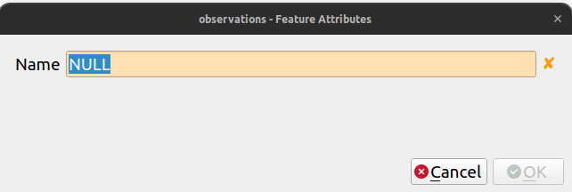 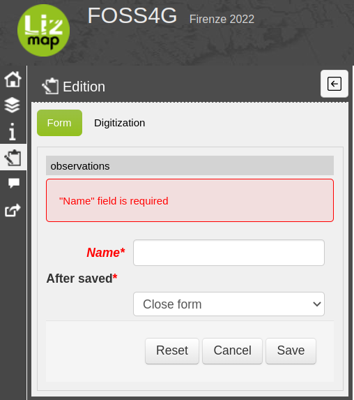

<!-- Commençons par forcer la saisie de certains champs !
 -->

# Alias de champs

- Définissez des alias pour vos champs

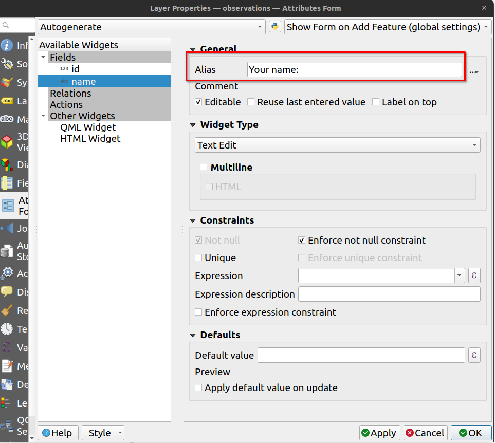 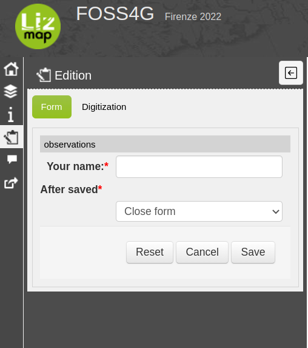

<!--
- Les noms des champs dans la base de données sont simples/bruts.
- Rendre le champ plus compréhensible
-->

# Organiser les champs du formulaire

- En utilisant la `Conception par glisser / déposer`

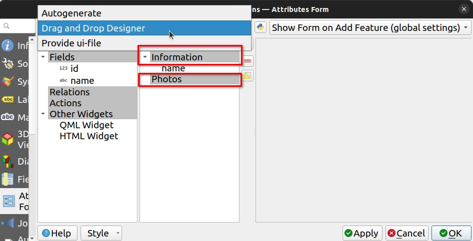

<!-- (20s)
Avec le "Conception par glisser / déposer" de QGIS nous pouvons :
- Omettre certains du formulaire
- Changer l'ordre des champs
- Créer des onglets et des boîtes de groupe
-->

# Les onglets

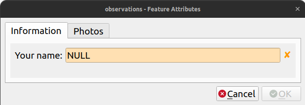 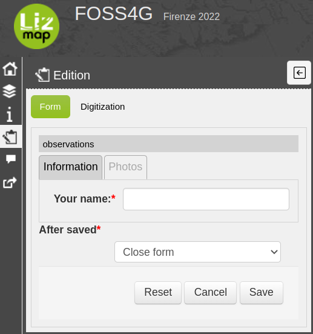

<!-- Le premier niveau de groupes de champs se présentent sous la forme d'onglet
 -->

# Les boîtes de groupe

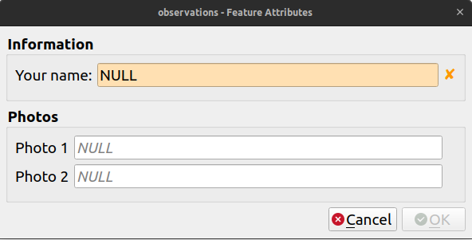 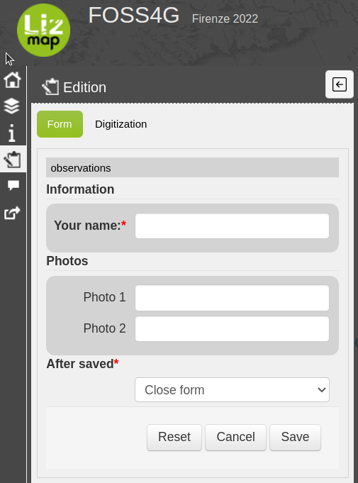

<!-- En dessous, il est possible d'avoir des boîtes de groupe
 -->

# Modifier la visibilité des onglets ou des boîtes de groupe en fonction d'une règle

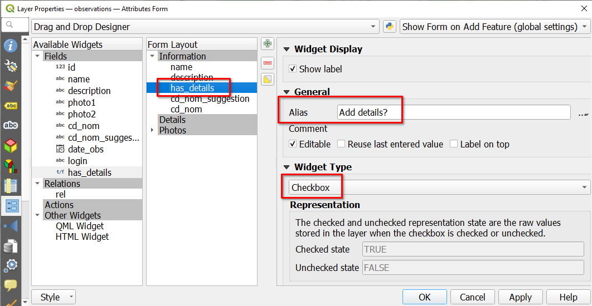

<!-- (35s) Disons que nous créons un formulaire pour une campagne de crowdsourcing mais aussi pour les utilisateurs connectés à Lizmap (comme les personnes de notre organisation).
Ce formulaire comporte de nombreux champs, mais beaucoup d'entre eux ne sont pas obligatoires. Nous ne voulons donc pas les afficher tous, car lorsqu'un formulaire semble trop long à remplir, certains utilisateurs risquent d'abandonner et de le fermer.
Pour éviter cela, nous créons un champ booléen appelé `has_details`, avec `Add details` comme alias pour avoir un titre plus compréhensible pour ce champ qui est défini comme une `Checkbox`... -->

---

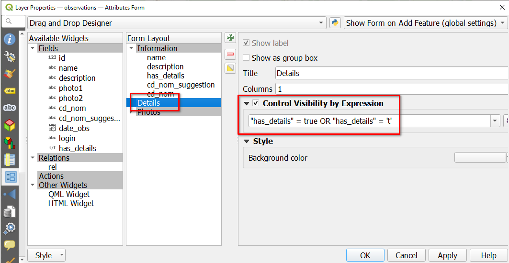

<!-- (15s) ....nous créons également un onglet "Détails" configuré avec un "contrôle de visibilité par expression" pour ne l'afficher que lorsque la case "has_details" est cochée. -->

---


<!-- (10s) Voici le résultat. Comme vous pouvez le voir, l'onglet "Détails" n'est visible que lorsque l'option "Ajouter des détails" est cochée. -->

# Upload de photos

- Utilisez l'outil `Pièce jointe` et le paramètre `Filtre` pour définir les extensions autorisées

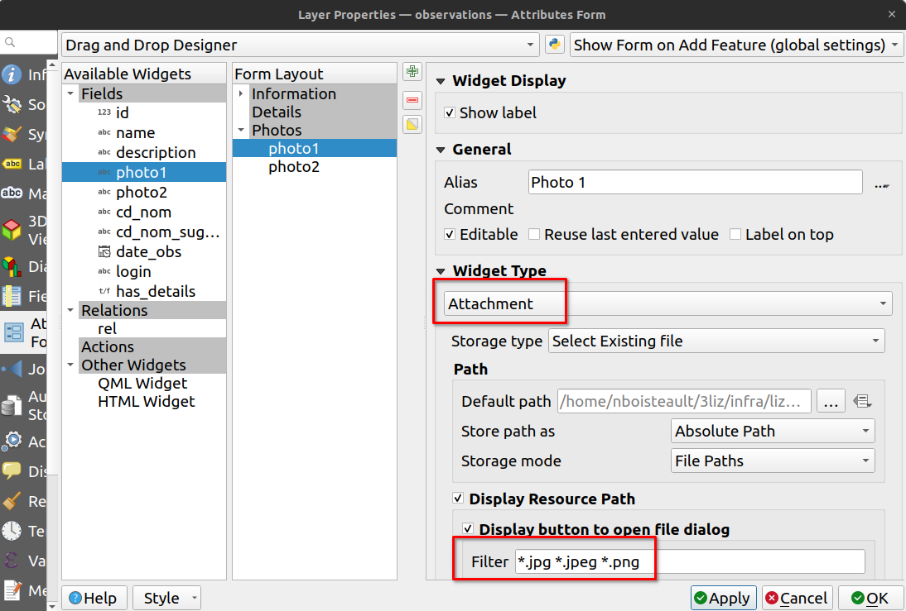

<!-- (10s) Maintenant, nous voulons que les gens puissent télécharger des photos. Nous créons des champs définis avec le type d'outil' `Pièce jointe` et avec un filtre pour afficher uniquement les fichiers JPEG et PNG. -->

---

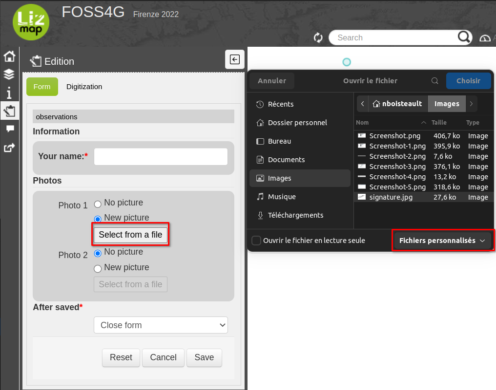

<!-- (10s) Vous pouvez voir dans Lizmap que seuls les fichiers avec des extensions définies sont affichés lors de leur sélection. -->

---
- Modifier les images directement dans Lizmap

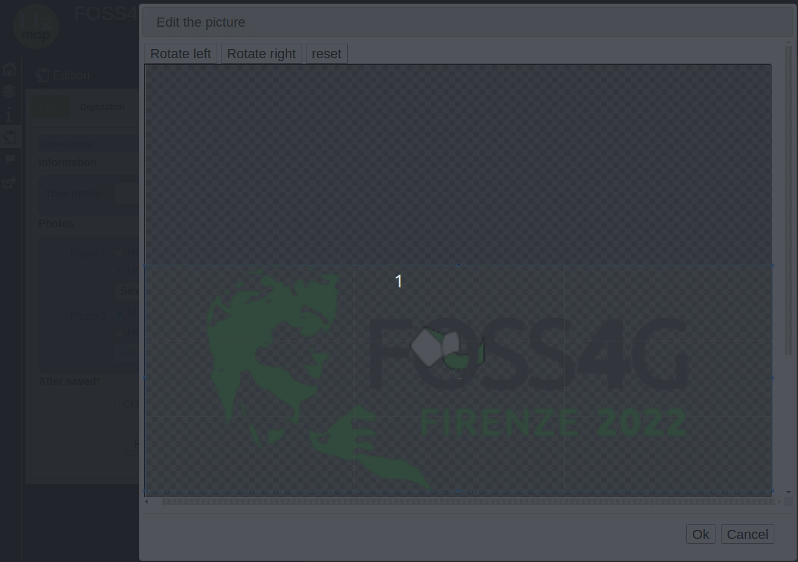

<!-- (10s) Après la sélection des fichiers, vous pouvez également faire pivoter ou recadrer les images. C'est plus pratique que de devoir installer un logiciel pour cela. -->

# Contraintes avec expression

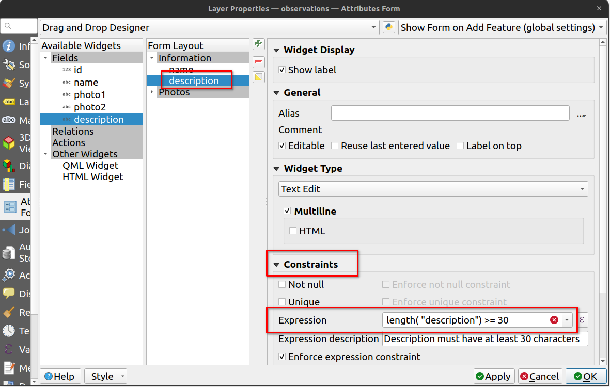

<!-- (10s) Ici, nous définissons un champ `Multiligne` et utilisons une expression pour contraindre le champ à avoir au moins trente caractères et afficher un message informatif lorsqu'il n'est pas honoré. -->

---

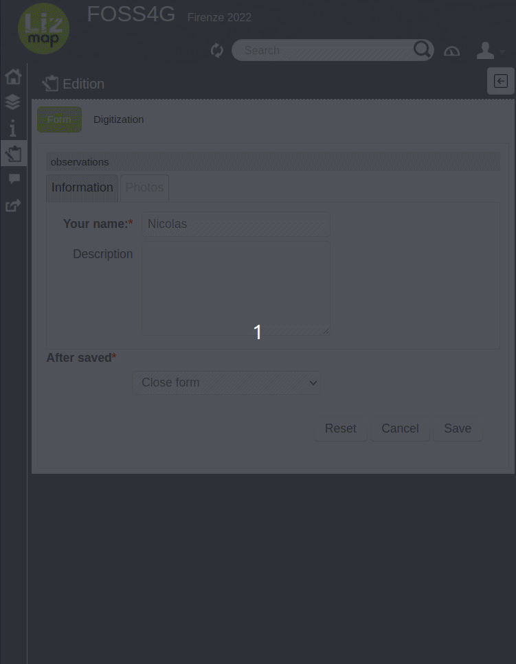

<!-- (10s) Dans Lizmap, la contrainte est visible au survol du nom du champ et lorsqu'elle n'est pas honorée à la soumission du formulaire. -->

# Enregistrer le login et les groupes de l'utilisateur

- Avec les variables d'expression : `@lizmap_user` et `@lizmap_user_groups`

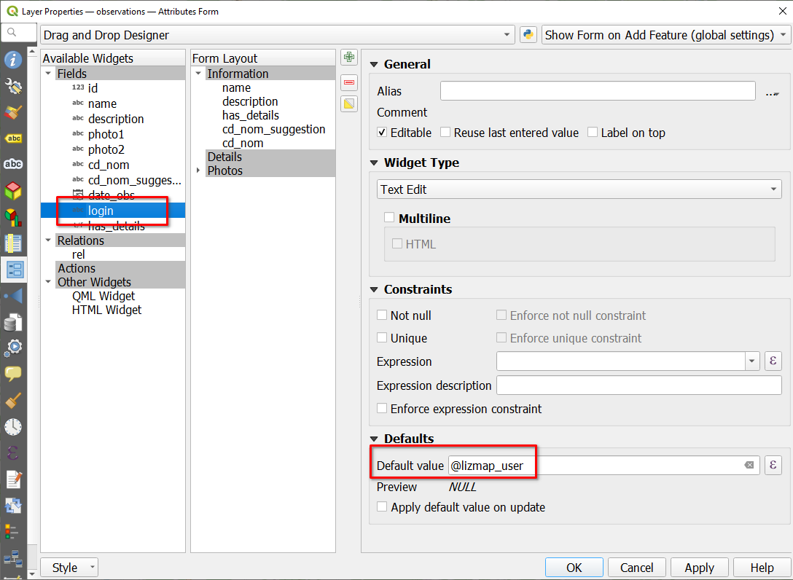

<!-- (15s) Lorsque les contributeurs sont connectés à Lizmap, nous pouvons utiliser leur login ou leurs groupes d'utilisateurs dans les expressions du formulaire grâce aux variables d'expression.
Ici nous créons un champ invisible `login` qui sera rempli avec le login de l'utilisateur lorsque le formulaire sera sauvegardé.
 -->

# Valeur relationnelle

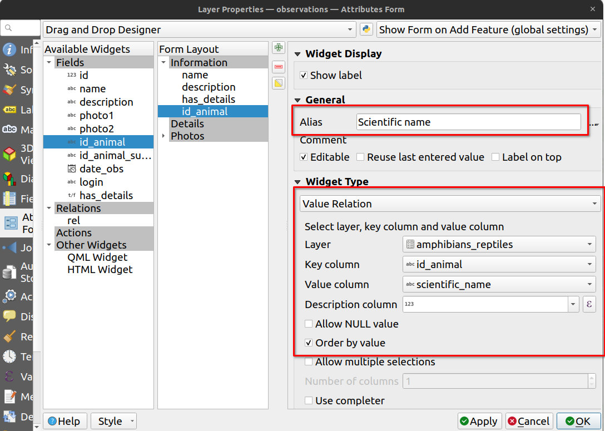

<!-- (5s) L'outil valeur relationnelle est très pratique pour afficher une liste de valeurs d'une autre couche. -->

---

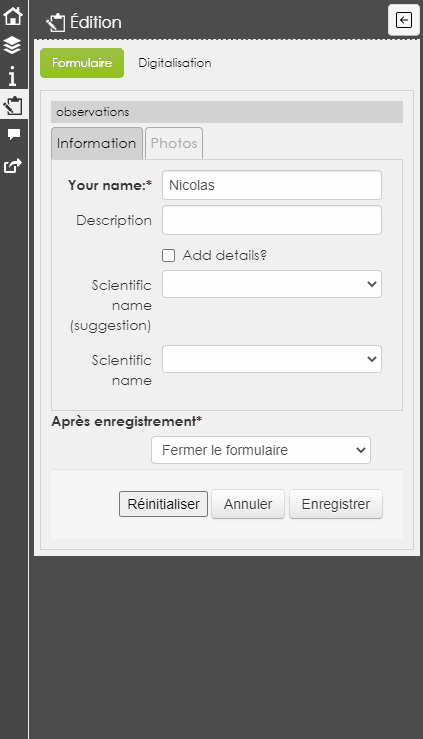

<!-- (10s) Mais parfois la liste peut être très longue. Dans cet exemple, nous affichons les noms scientifiques des amphibiens et des reptiles en France. Pour faciliter la sélection, nous pourrions, par exemple, suggérer le dernier enregistrement précédent en haut de la liste pour les utilisateurs connectés -->

# Cas d'utilisation : suggestion basée sur l'enregistrement précédent

```sql
SELECT * FROM (
  (
    SELECT DISTINCT ON (login)
      1 AS id,
      obs.id_animal,
      amph.scientific_name,
      login
    FROM foss4g.observations obs
    LEFT JOIN foss4g.amphibians_reptiles amph
    ON obs.id_animal = amph.id_animal
    ORDER BY login, date_obs DESC
  )
  UNION ALL
  (
  SELECT row_number() over (ORDER BY scientific_name) + 1 AS id,
    id_animal,
    scientific_name,
    NULL AS login
  FROM foss4g.amphibians_reptiles
  )
) sub_query ORDER BY id
```

<!-- (10s) Pour cela, nous créons une couche à partir d'une vue avec cette requête SQL. Il s'agit d'un UNION ALL avec le dernier enregistrement précédent pour les utilisateurs connectés et la liste complète des animaux. -->

---

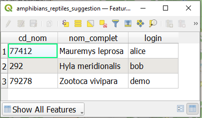

<!-- (20s) En rouge, la table attributaire nous montre le dernier enregistrement pour les utilisateurs alice, bob et demo. Le reste est la liste complète des animaux. -->

---


<!-- (15s) Pour obtenir uniquement l'enregistrement précédent de l'utilisateur connecté dans Lizmap, nous utilisons cette expression `Filter` qui utilise à nouveau la variable d'expression `@lizmap_user`. -->

# Résultat 🎉

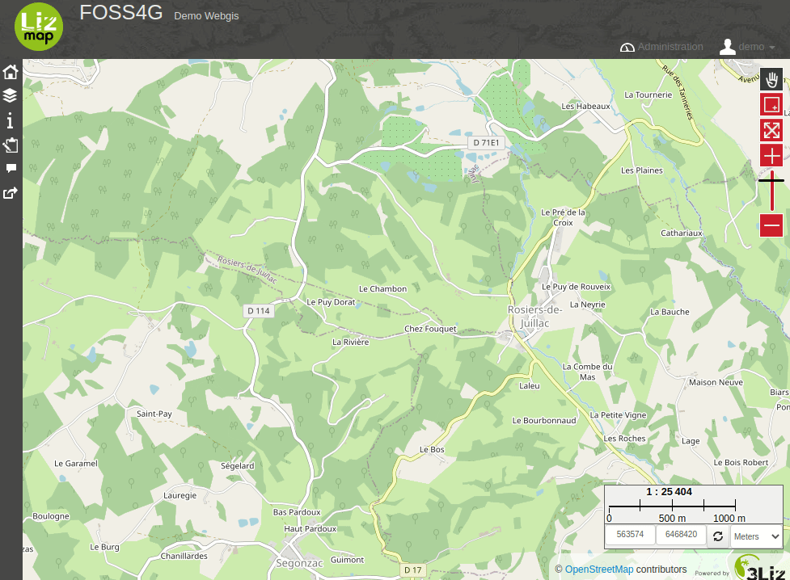

<!-- (15s) Comme vous pouvez le voir maintenant, lorsqu'un utilisateur connecté enregistre un formulaire, il a en haut de la liste des noms scientifiques la dernière espèce suggérée. -->

# Autres filtres

- Filtrage géographique

```
intersects($geometry, @current_geometry)
```
```
intersects($geometry, buffer(@current_geometry, 100))
```

- Liste en cascade
```
"code_reg" = current_value('code_reg')
```
```
"code_dep" = current_value('code_dep')
```


# Merci pour votre attention
<!-- _class: lead gaia-->

  

- 3Liz: https://3liz.com
- Twitter 🐦
  - René-Luc DHONT: https://twitter.com/relucblog
  - 3Liz: https://twitter.com/3LIZ_news
- LinkedIn
  - René-Luc DHONT: https://www.linkedin.com/in/rldhont
  - 3Liz: https://www.linkedin.com/company/3liz/
- Lizmap: https://lizmap.com

<!-- (5s) -->
