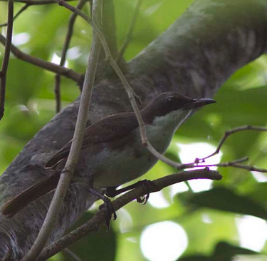
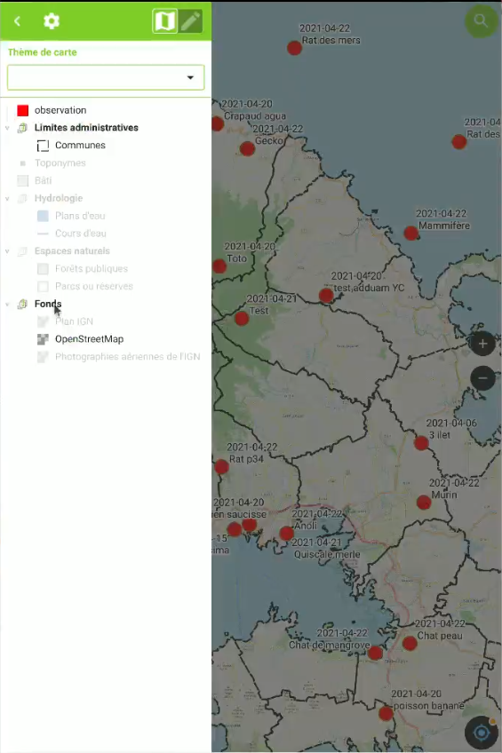

# QGIS au ♥ de la plateforme SINP de la Martinique MadiNati

Michaël DOUCHIN, 3liz

Observatoire Martiniquais de la Biodiversité

# Madinati

Portail SINP de la Martinique

<!-- _class: lead gaia-->

# MadiNati - Les objectifs

Collecter, qualifier et stocker les données d'**observations faunistiques et floristiques**

* Une plateforme régionale du **Système d'information de l'inventaire du patrimoine naturel** (SINP) pour la Martinique
* Faciliter le **regroupement, la validation et la diffusion** des données géolocalisées sur la **biodiversité**
* Un réceptacle de données d'origine diverse : importation de **jeux de données de différents acteurs**

# MadiNati

L'interface Web : une **carte** en pleine page avec un **outil de recherche** et d'**affichage** des observations

*Partie visible de l'iceberg*: c'est tout un système d'information et un ecosystème complet autour de QGIS et PostgreSQL

# Les fonctionnalités principales

* Affichage des **données de références** sur la carte : Communes, mailles, masses d'eau, espaces protégés, fonds de carte
* **Recherche d'observations** multicritère :
  * par **espèce**, par **date**, par **statuts** (menace, protection, endémicité), par **localisation spatiale**, etc.
* Visualisation des **observations sur la carte** : maillées ou géométrie précise (ayants droits)
* **Tableaux des données** :
  * **Statistiques** : nombre d'observations par groupe d'espèces
  * **Jeux de données** et le nombre d'observations
  * Liste des **espèces observés** avec leur nombre d'observations
  * **Liste des observations** (ayant-droits)
* Fiche d'**un taxon** et fiche détaillée d'une **observation** (ayant-droits)
* **Export** aux formats **tableur (CSV)**  et **SIG** (GeoJSON ou WFS)

# Éléments d'interface

# Éléments d'interface

# Un écosystème centré autour de QGIS

<!-- _class: lead gaia-->

# MadiNati est basé sur des logiciels libres

Les principaux logiciels utilisés :

* **QGIS**, application SIG bureautique
* **PostgreSQL**, une base de données spatiale pour stocker, traiter et transformer les données d'observation
* **QField**, une application sur tablette (Android, iPhone) pour faire des relevés de données métier sur le terrain
* **Lizmap Web Client**, pour publier des **cartes QGIS sur internet** et **créer des applications de saisie de données**
* **QGIS Server** comme serveur cartographique pour Lizmap

# Importer des données dans MadiNati

<!-- _class: lead gaia-->

# QGIS - Importer les données de référence spatiale

L'ensemble des données de référence ont été visualisées dans QGIS puis importées dans la base de données PostgreSQL: **communes, mailles, masses d'eau, espaces naturels**

* **Ouverture** des jeux de données dans QGIS au format **Shapefile**
* **Vérification du contenu** et corrections éventuelles (nommages manquants, doublons, etc.)
* Menu **Traitement**: algorithme **Exporter vers PostgreSQL** qui permet d'envoyer les données locales vers la base de manière performante
* **Mise en forme** des données dans QGIS: symbologie, seuils d'échelle, étiquettes, etc.

# Mise en forme des référentiels géographiques

# Visualiser et retravailler les données

Les données d'**observations** sont collectées par **différents acteurs** : associations, collectivités, particuliers, etc.

Retravailler ces données **dans QGIS** pour qu'elle respectent le **standard OccTax**: liste de champs, nomenclature, règles

* Algorithme **Refactoriser les champs** du menu Traitement (ETL)
* **Expressions QGIS** pour trouver les données problématiques et les corriger `to_date("date_observation", 'dd/MM/yyyy')`
  Voir la présentation sur [les expressions dans QGIS](https://docs.3liz.org/presentations/2022-01_QGISFR_2022_outil_saisie_avec_expressions_Michael_DOUCHIN.html)

# Applications de saisie de données

Les masques de saisie

<!-- _class: lead gaia-->

# Masques de saisies avec des formulaires

Pour éviter des corrections a posteriori et assurer des données confomes, des **masques de saisie** ont été **conçus avec QGIS** et publiés sur internet avec **Lizmap Web Client**

# Masques - la puissance des formulaires QGIS

Utilisation des possibilités avancées des **formulaires de QGIS**

* Organisation des champs en **onglet et groupes**
* **Listes déroulantes** basées sur la nomenclature
* **Relation** entre les données
* **Expressions** pour contrôler les saisies
* Ajout de **photographies** et **pièces jointes**

Voir la présentation [Formulaires QGIS avancés sur le web avec Lizmap](https://docs.3liz.org/presentations/2022-09-geodatadays-formulaire-qgis-lizmap.html)

# Exemples de masques de saisie dans QGIS

# Exemples de masques de saisie dans Lizmap

# QField

Des projets QGIS dans la poche

<!-- _class: lead gaia-->

# Faire de la saisie sur le terrain avec QField

Les projets QGIS utilisés précédemment sont exploités dans **QField** pour permettre aux personnes de saisir les données sur le terrain **avec ou sans connection internet**

Le **plugin QField** permet dans QGIS :

* d'**exporter** les données du projet dans un **GeoPackage**
* de créer une **version portable du projet** pour travailler hors-connexion
* de **synchroniser** les projets et les données avec **QFieldCloud**

Nous avons généré des fonds de cartes spécifiques au format `Mbtile` avec l'algorithme **Raster / Générer des tuiles XYZ (MBTiles)** : IGN Plan, OpenStreetMap

# QField - Configuration des couches

# QField - les bonnes pratiques

Préparer grâce à QGIS des **projets spécifiques** pour le recueil de données terrain

* Un **projet spécifique par acteur**
* MAIS un modèle de données **portable, modulaire et adaptable** :
  * *observateurs, espèces, nomenclature, observations*
* Utiliser toutes les **possibilités de QGIS**: formulaires, thèmes de carte, nommage d'entité (expression), symbologie en fonction des données
* **Simplifier** : Limiter au maximum les données à saisir
* Attention à la **volumétrie des données** :
  * les couches essentielles
  * utiliser le `MbTiles` pour créer une seule couche de fond de carte avec les données de référence (communes, relief, cours d'eau, etc.)
  * éviter les couches "en ligne" selon le contexte (WFS, serveurs PostgreSQL)

# QField - l'interface

* La carte en **plein écran**
* Des boutons pour **zoomer** et gérer le **GPS**
* Un menu "Hamburger" pour ouvrir le **panneau de gauche**
  * Liste des couches
  * Thèmes de cartes QGIS
  * accès aux paramètres
* Un appui long sur la carte pour **identifier les données**
  * sélectionner une ou plusieurs entités
  * modifier ou supprimer une entité

# QField - l'interface

Le panneau ouvert avec :

* l'**arbre des couches** et le sélecteur de **thèmes de cartes**
* les 2 boutons en haut à droite pour basculer entre le mode **Consultation** et le mode **Édition**

# QField - le formulaire de saisie

* le formulaire montre les **onglets, groupes** et **les champs** (listes déroulantes, cases à cocher, texte long, etc.)
* Le titre du haut apparaît **en rouge** si les **expressions de contrôle** des valeurs renvoient "Faux"
* il peut être affiché en **plein écran**
* support des **relations**

# QField - les méthodes de synchronisation

* Utiliser **le plugin QField** depuis QGIS :
  * de retour du terrain
  * pas toujours évident à prendre en main
  * pour des **données légères**
  * pour une seule tablette
* **Copier/coller** les données à la main dans QGIS :
  * **simple et robuste** pour le géomaticien
  * ok si les données sont **seulement ajoutées**
  * ok si peu de personnes vont sur le terrain
* Utiliser l'application Web **QFieldCloud** :
  * **simple d'utilisation** : tout se fait depuis l'application de la tablette
  * on récupère les projets QGIS directement depuis la tablette
  * **plusieurs utilisateurs** peuvent ajouter/modifier/supprimer
  * payant pour du PostgreSQL (mais libre donc auto-hébergement possible)

# Conclusion

* **QGIS** permet :
  * de **visualiser, préparer et importer** des données SIG de référence
  * d'**analyser, corriger et mettre au format** standard les données d'observation
  * de préparer des **projets dédiés à la saisie** avec des formulaires d'édition et des expressions
* **Lizmap Web Client**, basé sur **QGIS Server**, permet :
  * de proposer à des utilisateurs des **cartes en ligne** pour découvrir les données naturalistes: `MadiNati`
  * d'offrir aux acteurs des **applications Web de saisie d'observations**
  * consulter et saisir depuis le téléphone si connexion 3/4/5G
* **QField** permet de :
  * proposer aux non géomaticiens des **cartes portables** pour visualiser les données sur le terrain
  * **saisir des données** et les **synchroniser** avec la base centrale

# Merci de votre attention !

*Vos questions sont les bienvenues !*

