# Publier une carte d'occupation du sol avec Lizmap

Journée professionnelle
OpenIG 2023

Michaël DOUCHIN, 3liz
Lizmap https://lizmap.Com

# Les données

<!-- _class: lead gaia-->

#  Occupation du sol open-data du Grand Narbonne

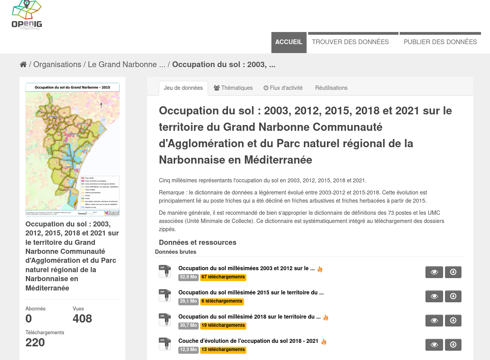

# Dans QGIS

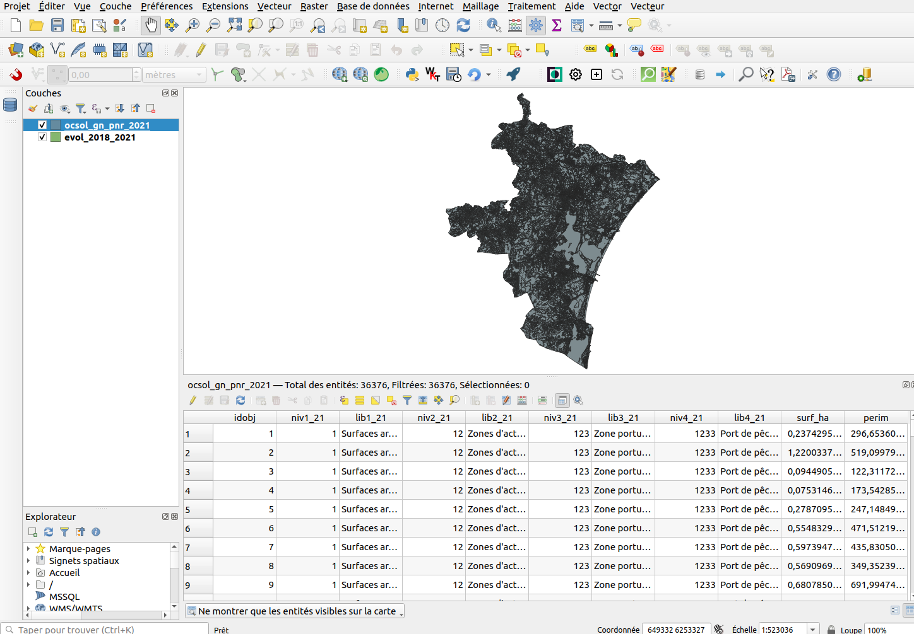

* 2 couches : **occupation du sol** et **évolution** 2018/2021
* Nomenclature Excel avec **les couleurs** des classes
* Pas de **code INSEE**

# Préparation

Utilisation de l'algorithme **Intersection** de 

* Limiter à **quelques communes** pour la démo
* **Re-découper** les zonages
* Ajouter le **code de la commune** `code_insee`
* Recalcul des **surfaces en hectare** `$area / 10000`

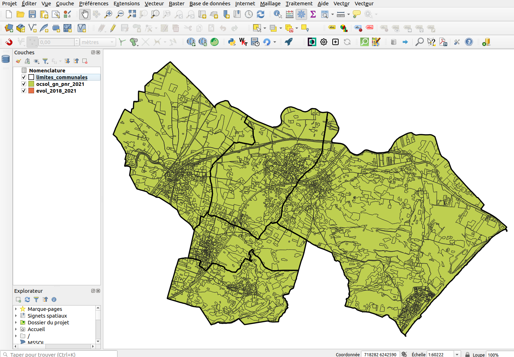

# Organisation et renommage des couches

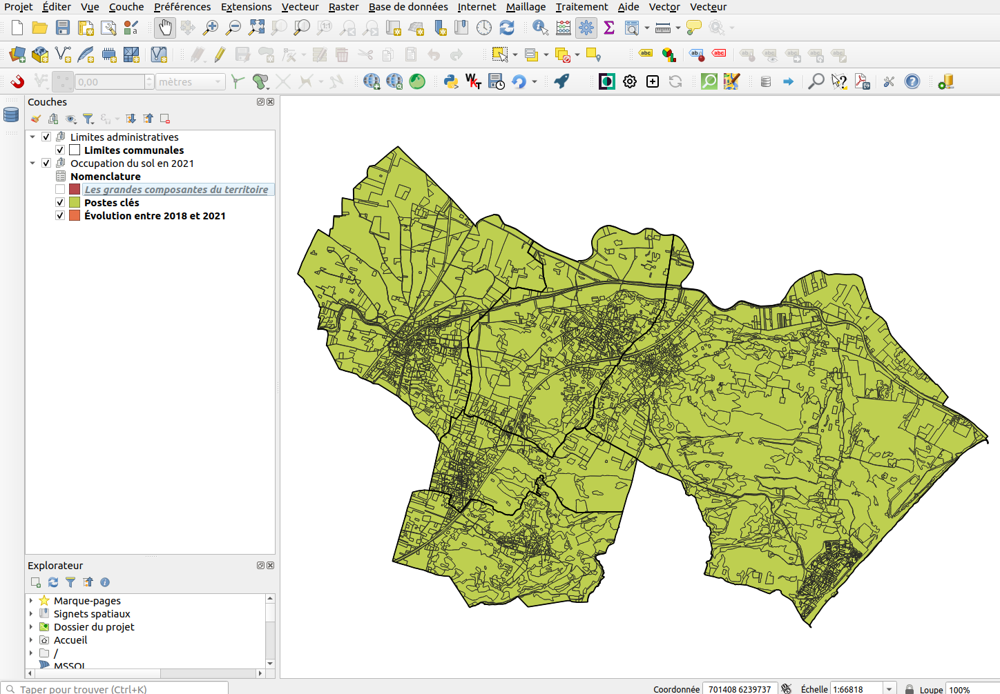

# Lecture de la nomenclature

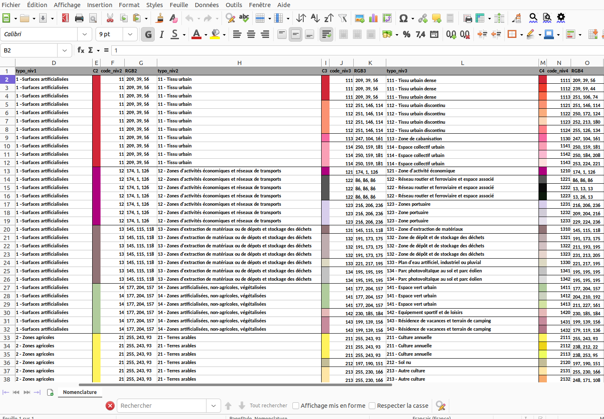

# Mise en forme des données

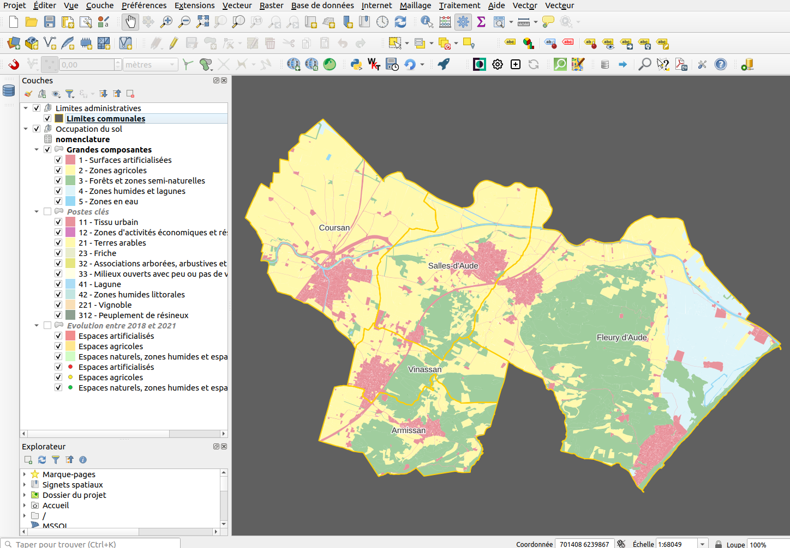

# Publier dans Lizmap Web Client

<!-- _class: lead gaia-->

# Utilisation du plugin Lizmap

* On l'installe
* On l'ouvre et on ajoute l'URL du serveur
* On valide, et on publie sur le serveur

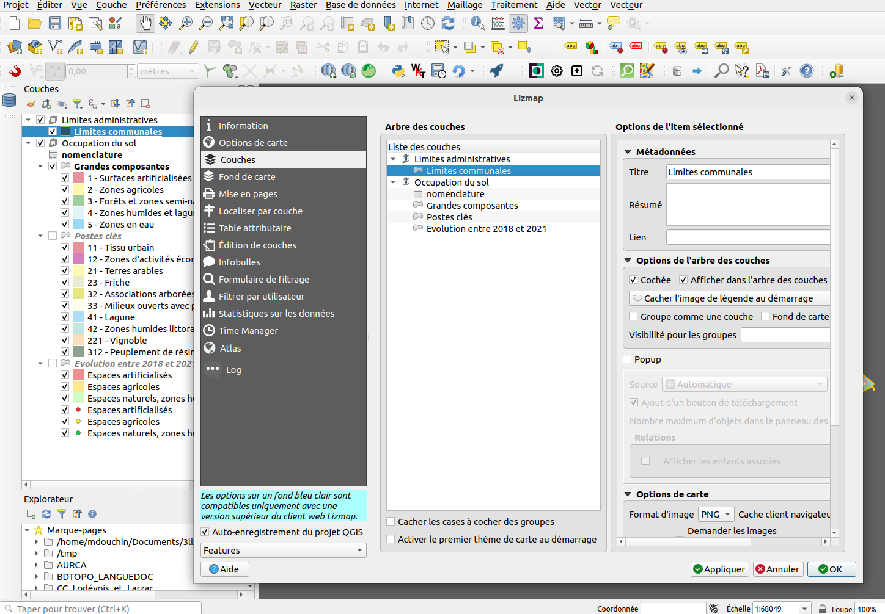

# Première carte

[Voir le résultat](https://demo.snap.lizmap.com/lizmap_3_6/index.php/view/map?repository=miscellaneous&project=demo_ocsol_3_lizmap)

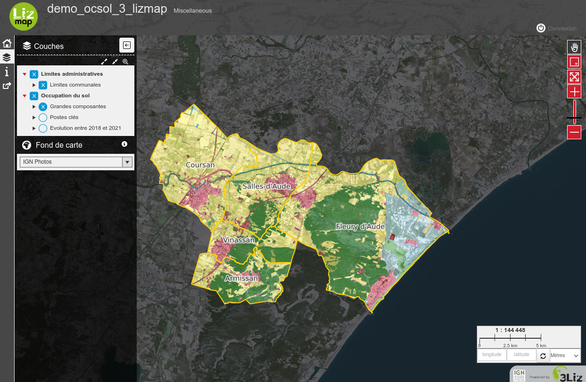

# Ajout des graphiques dans le plugin Lizmap

* Choisir le **type de graphique**: camembert, diagramme en bâtons, etc.
* Choisir les **informations**: titre, description, etc.
* Choisir la **couche source** et les champs **abscisse et ordonnée(s)**

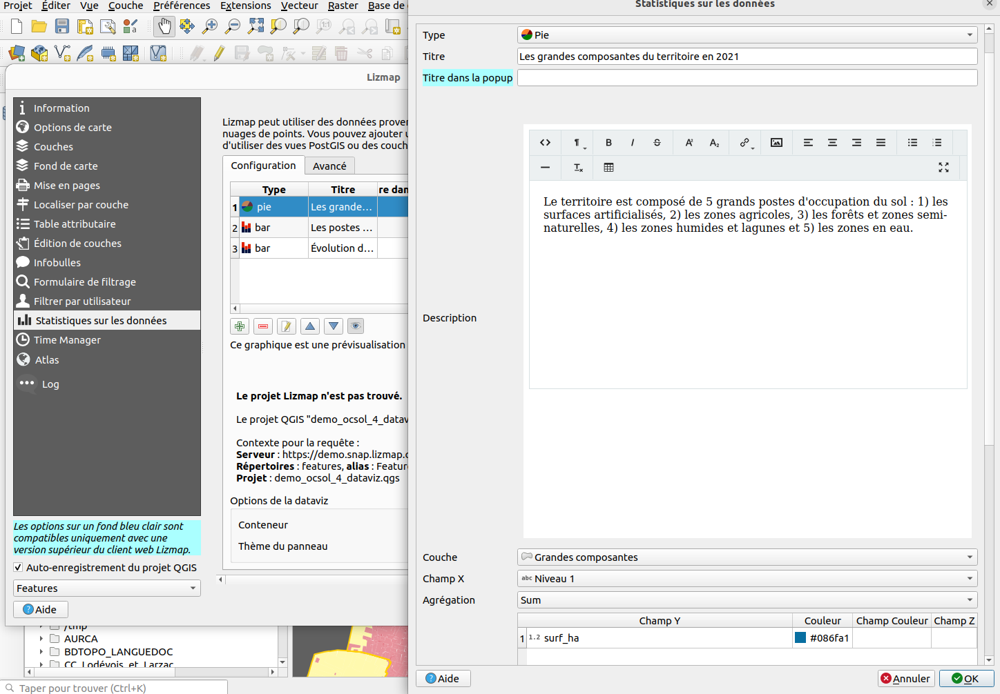

# Carte avec les graphiques

[Voir le résultat](https://demo.snap.lizmap.com/lizmap_3_6/index.php/view/map?repository=miscellaneous&project=demo_ocsol_4_dataviz)

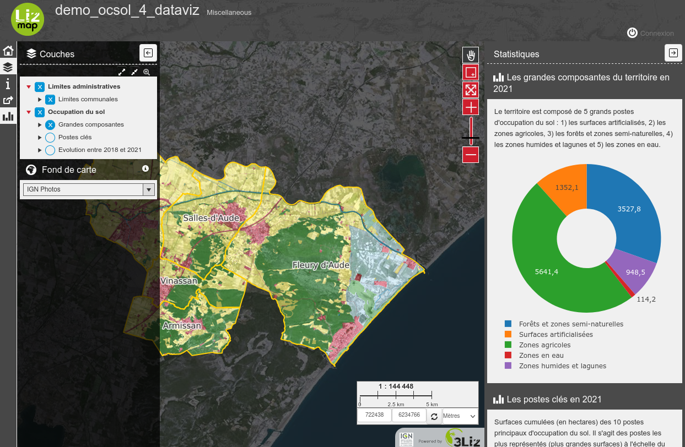

# Mettre en couleurs les graphiques

* une **jointure** avec le fichier de **nomenclature**
* une **expression QGIS** pour créer une couleur compatible
* chaque couche a un **nouveau champ** `color`

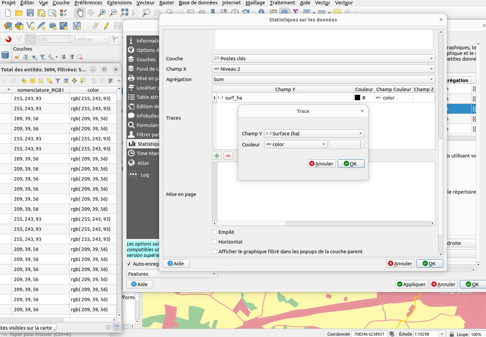

# Cartes avec les graphique en couleur

[Voir le résultat](https://demo.snap.lizmap.com/lizmap_3_6/index.php/view/map?repository=miscellaneous&project=demo_ocsol_5_dataviz_couleur)

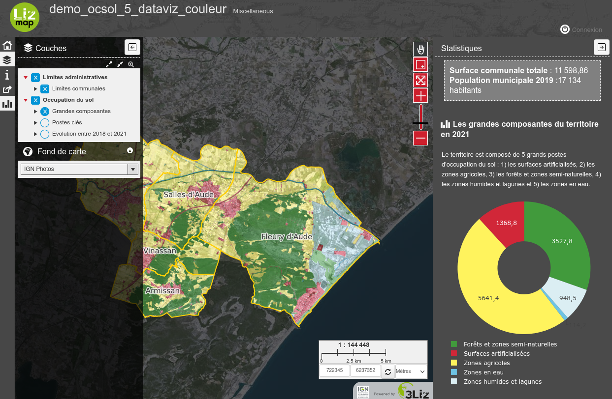

# Mise en relation des données et filtre en cascade

* Créer des **relations dans QGIS**
* Modifier la **configuration Lizmap** pour les exploiter
* Ajouter la **localisation par commune** et activer **le filtrage**
* Ajouter d'**autres graphiques** `HTML` pour la démo

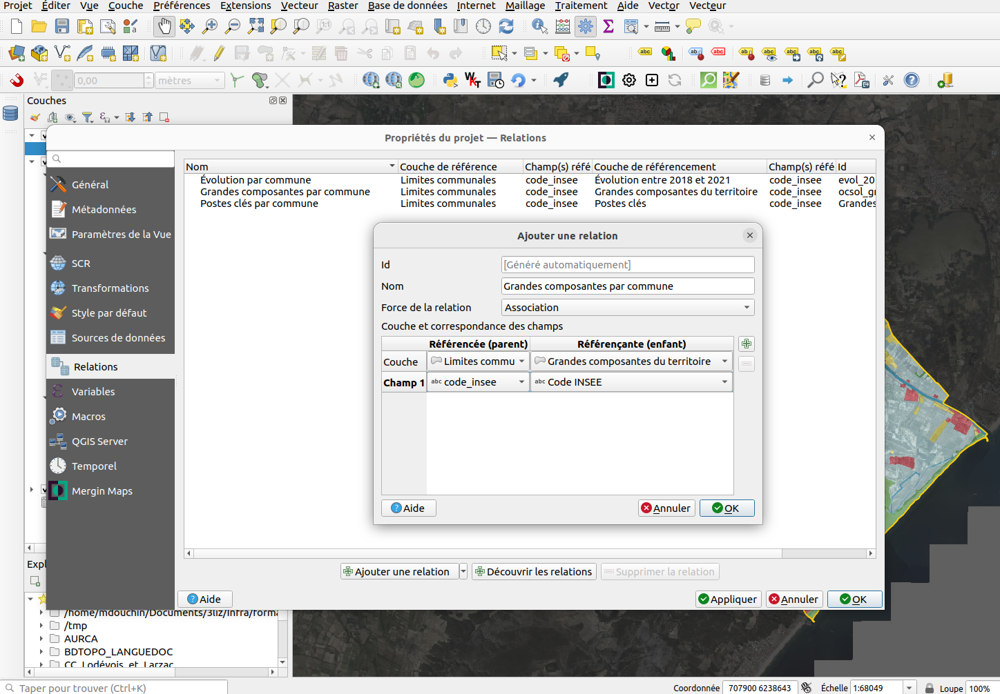

# Carte d'occupation du sol finalisée

[Voir le résultat](https://demo.snap.lizmap.com/lizmap_3_6/index.php/view/map?repository=miscellaneous&project=occupation_sol)

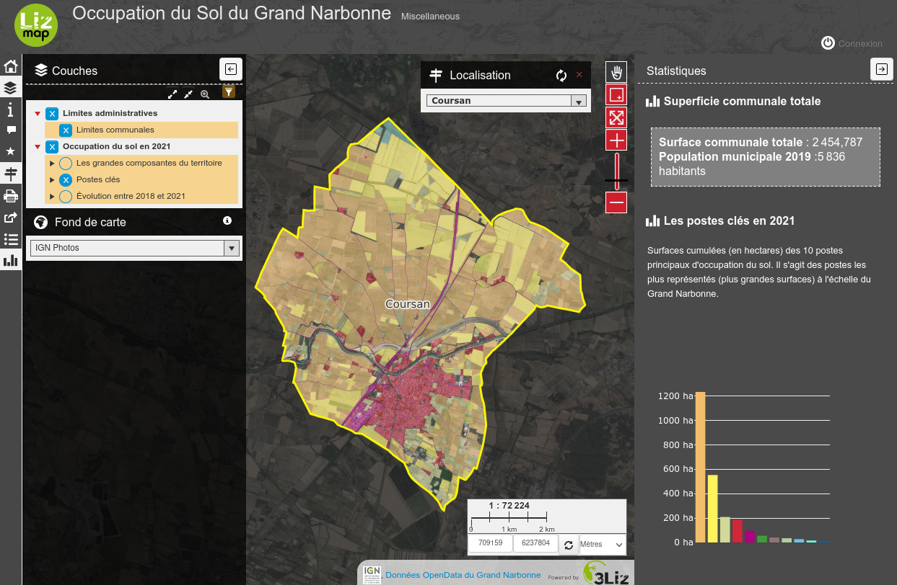

# Conclusion

* **QGIS** permet :
  * de **visualiser, préparer et importer** des données SIG d'occupation du sol
  * de préparer des **projets cartographique** de mise en valeur des données
* **Lizmap Web Client**, basé sur **QGIS Server**, permet :
  * de proposer à des utilisateurs des **cartes en ligne** pour découvrir les données d'occupation du sol
  * d'**illustrer ces données** à l'aide de graphique basés sur les données vectorielles
  * de mettre les **données en relation** pour filtrer les graphiques à partir des données

# Merci de votre attention !

**Web** : https://lizmap.com - **Twitter** 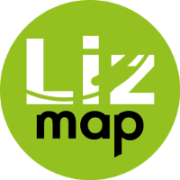 @LizmapForQGIS

