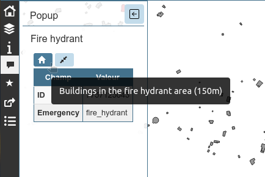
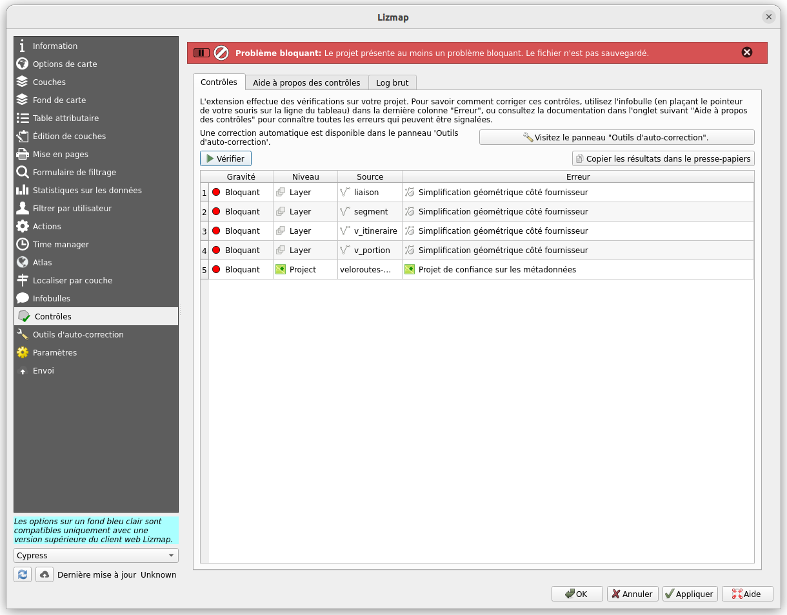
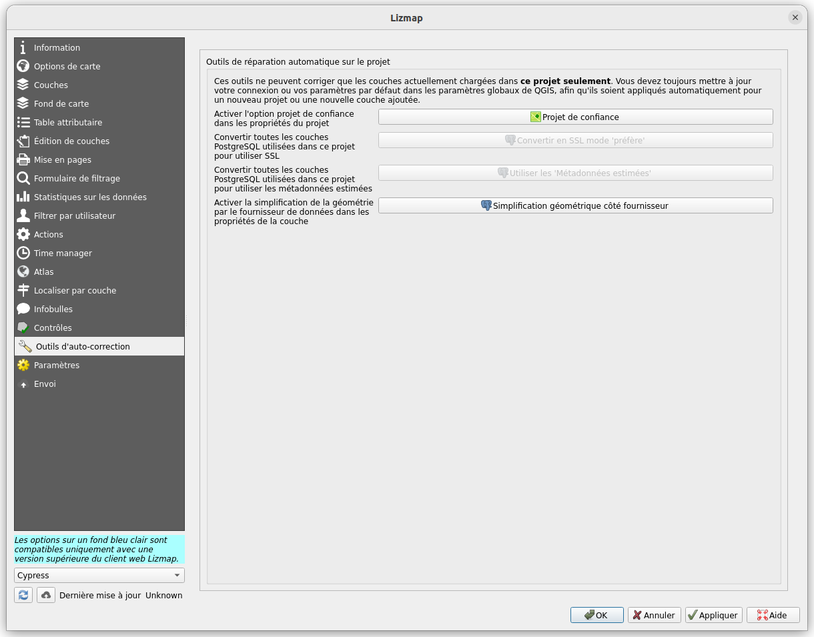
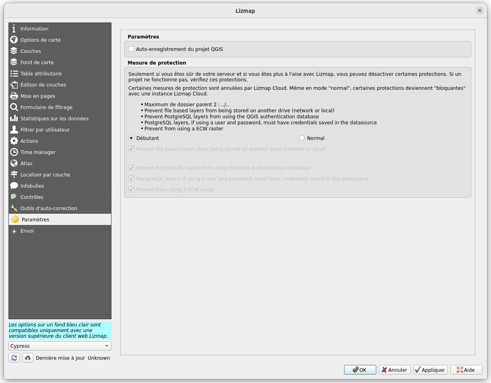
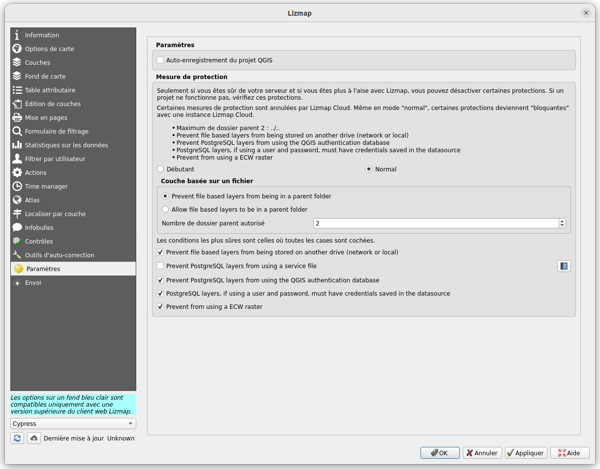

# Lizmap et l'aide à l'optimisation d'un projet QGIS pour le Web

René-Luc DHONT, 3liz

# 3Liz

- Fondé en **2007**
  - Initialement SSLL SIG
  - Développement autour de PostGIS, MapServer, OpenLayers, etc

- Depuis **2011**
  - Éditeur Open Source avec la publication de **Lizmap**
  - Centré autour de QGIS / QGIS Server / PostgreSQL+PostGIS / Lizmap

💎

- Toujours **Open Source** https://github.com/3liz/
- Contributeurs QGIS **core** (essentiellement serveur)
- Hébergement, Installation, Maintenance, Développement, Formation, Conseil, Assistance

# Petits rappels sur QGIS Server et Lizmap

<!-- _class: lead gaia-->

# QGIS **n'est pas seulement** une application bureautique

C'est aussi :

- Un serveur SIG 🚀 **QGIS Server**
- Des applications mobiles 📱 **QField** et Mergin
- Un lanceur d'algorithmes ⚙ de manipulation de données **qgis_processing**

Ils exploitent tous le même cœur 💎

# QGIS Server

- Utilise des **projets QGIS**
- Propose le **même rendu** 🚀
- La **certification OGC** depuis 2018 : WMS, WFS, WMTS...
- Nouvelle OGC API Features
- **Rapport de tests récent**: http://test.qgis.org/ogc_cite/ogcapif/latest/report.html

- **Extensible** - Plugin Python
- Des requêtes non standard - **GetPrint**, GetLegendGraphics JSON, etc

# Au dessus de QGIS Serveur

- Lizmap Web Client
- **Préparer sur QGIS bureautique, déployer sur Lizmap**
- Github, Open Source : Mozilla Public Licence
- **Proxy** à QGIS Serveur
- Administration Web pour la gestion des utilisateurs et droits.
- Toutes les autres configurations dans QGIS bureautique.

- Création **No Code** d'Application Web Cartographique
- **QGIS Bureautique** comme outil de création et publication

# Fonctionnalités principales

* Multi-projets
* Gestion des droits d'accès (répertoire, projet, couche, filtre utilisateur)
* Consultation et Interrogation
* Arbre des couches
* Outils de mesures
* Outils de dessin
* Impression
* Outils d'édition
* Graphiques
* Géolocalisation

# Améliorations de la version 3.7 de Lizmap Web Client

<!-- _class: lead gaia-->

# Améliorations de la version 3.7 de Lizmap Web Client : Arbre des couches

# Améliorations de la version 3.7 de Lizmap Web Client : Mise en page

# Améliorations de la version 3.7 de Lizmap Web Client : Ajout de données en relation depuis le parent

# Améliorations de la version 3.7 de Lizmap Web Client : Edition de données en relation depuis le parent

# Améliorations de la version 3.7 de Lizmap Web Client : Dessin ajout de texte

# Améliorations de la version 3.7 de Lizmap Web Client : Dessin avec contraintes

# Améliorations de la version 3.7 de Lizmap Web Client : Des actions de projet et de couche

Inspiré par les **actions QGIS**, les actions Lizmap permettent d'exécuter une **fonction PostgreSQL** avec pour contexte un objet vectoriel, une couche, ou simplement la vue du projet.

# Validation et optimisation des projets QGIS pour le Web

<!-- _class: lead gaia-->

# Validation et optimisation des projets QGIS pour le Web : contrôles

# Validation et optimisation des projets QGIS pour le Web : explications

# Validation et optimisation des projets QGIS pour le Web : auto-corrections

# Validation et optimisation des projets QGIS pour le Web : Paramètres débutant

# Validation et optimisation des projets QGIS pour le Web : Paramètres avancés

# Validation et optimisation des projets QGIS pour le Web : Les contrôles bloquants

- 💥 Espace en début/fin dans le nom de la couche/du groupe
- 💥 L'URL de la Géoplateforme française contient un jeton d'authentification
- 💥 Raster ECW
- 💥 Base de données d'authentification
- 💥 Service PostgreSQL
- 💥 Utilisateur et/ou mot de passe PostgreSQL
- 💥 Autre lecteur (réseau ou local)
- 💥 Dossier parent

# Validation et optimisation des projets QGIS pour le Web : Les contrôles bloquants

- 🔒 Connexion SSL à une base de données PostgreSQL
- 🚀 Métadonnées estimées
- 🚀 Simplification géométrique côté fournisseur
- 🚀 Le raster n'a pas de pyramide
- 🚀 Projet de confiance sur les métadonnées
- 🚀 Ne pas utiliser les identifiants des couches comme nom
- 🛑 La couche n'est pas publiée dans le WFS
- 🛑 Le champ n'est pas publié dans le WFS
- 🛑 Groupe "baselayers" vide

# Validation et optimisation des projets QGIS pour le Web : Les contrôles importants

- 🚀 Clés pirmaires de type entier simple pour les couches de base de données PostgreSQL
- 🛑 Nom de couche ou de groupe dupliqué
- 🛑 Validité OGC (serveur QGIS)

# Merci pour votre attention !

<!-- _class: lead gaia-->
