# Les ”actions QGIS” ⚙ et les VVV 🚲

René-Luc DHONT, 3liz

Conseil Départemental des Pyrénées Orientales

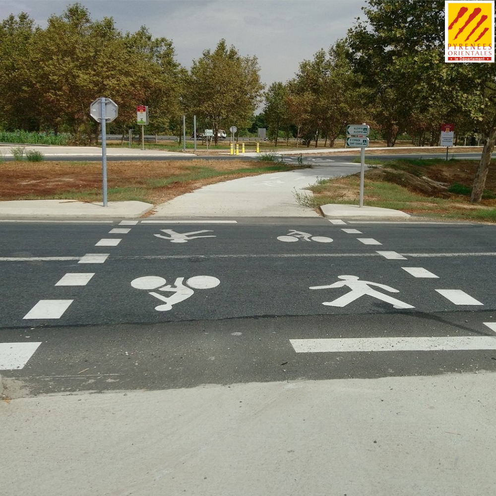

# Les ”actions QGIS” ⚙

https://docs.qgis.org/3.34/fr/docs/user_manual/working_with_vector/vector_properties.html#actions-menu

<!-- _class: lead gaia-->

# Pour quoi faire ?

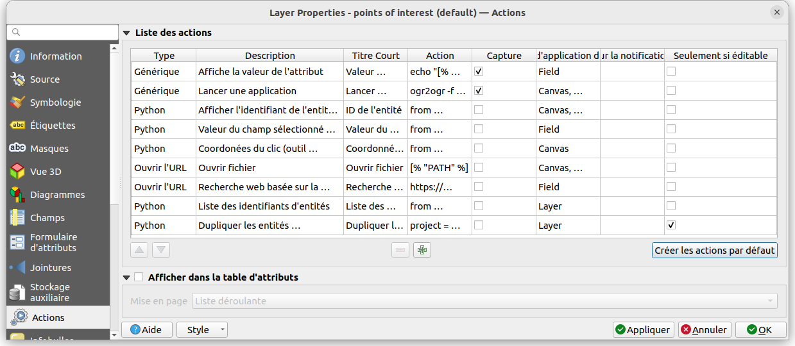

Simplifier une tâche récurrente

- Lancer un logiciel
- Ouvrir une page web
- Faire une opération avec QGIS

# Lancer un logiciel

- Générique
- Unix
- Windows
- macOS

# Ouvrir une page web

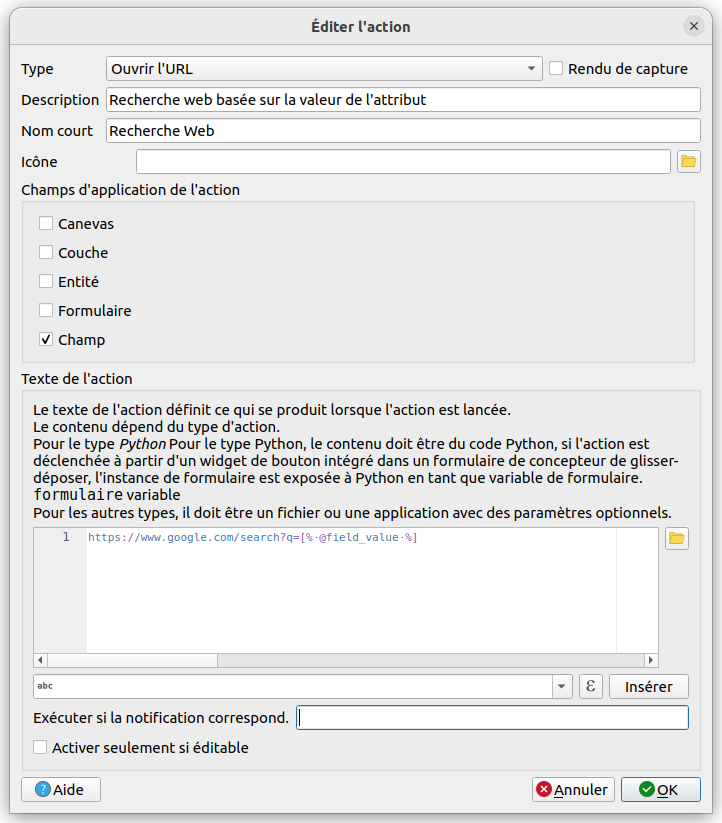

- Ouvrir l'URL
- Envoyer l'URL
  - encodé ou JSON
  - en plusieurs parties

# Faire une opération avec QGIS

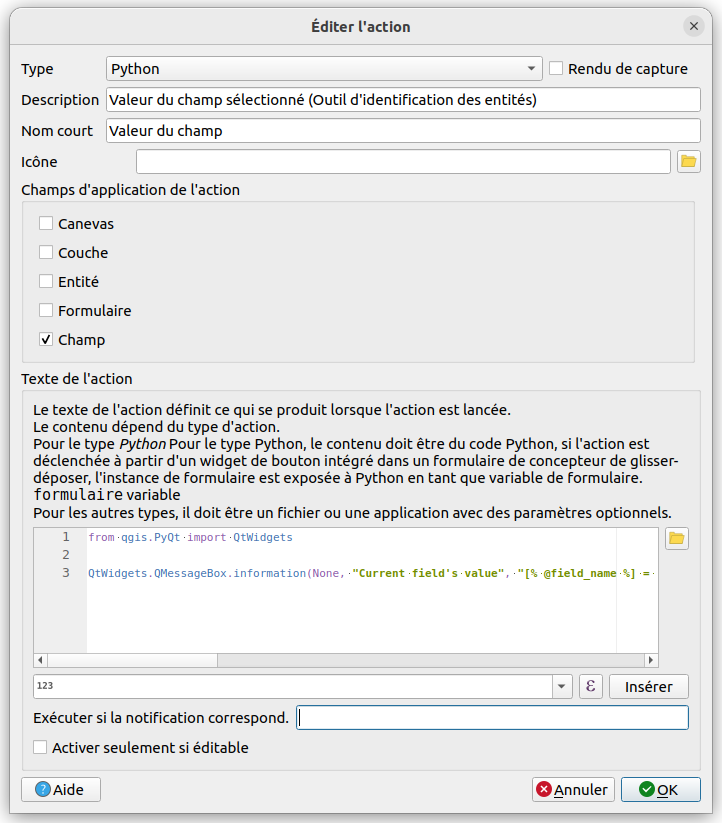

# Avec quel contexte ?

- Champ : variables `@field_index`, `@field_name` et `@field_value`
- Entité
- Canevas : variables `@click_x` et `@click_y`
- Formulaire : seulement sous forme de bouton de formulaire
- Couche

# Action entité

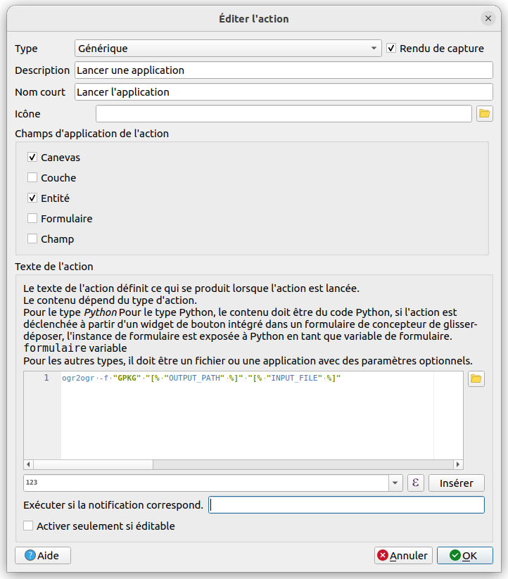

# Action couche

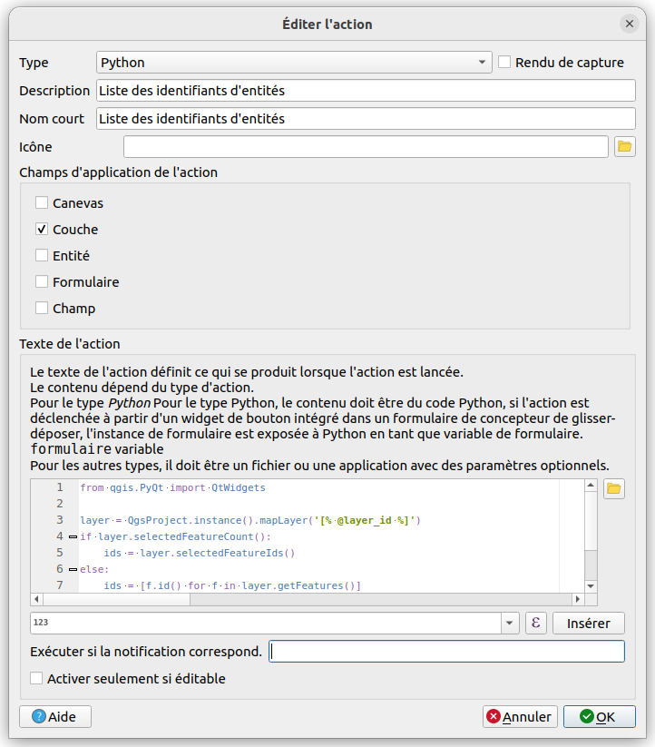

# Les actions dans la barre d'outil

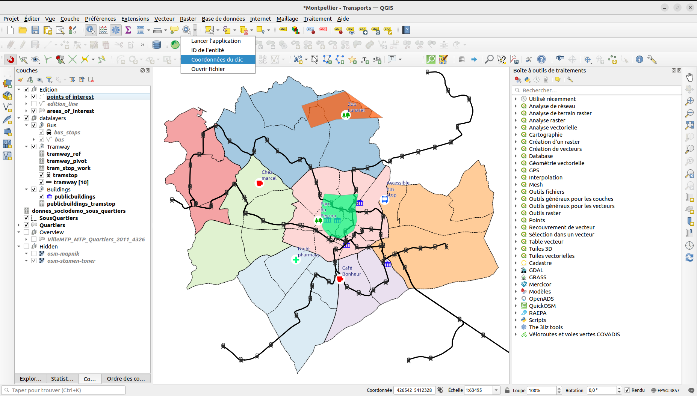

# Les actions depuis la carte avec le bouton information

# Les actions dans le formulaire

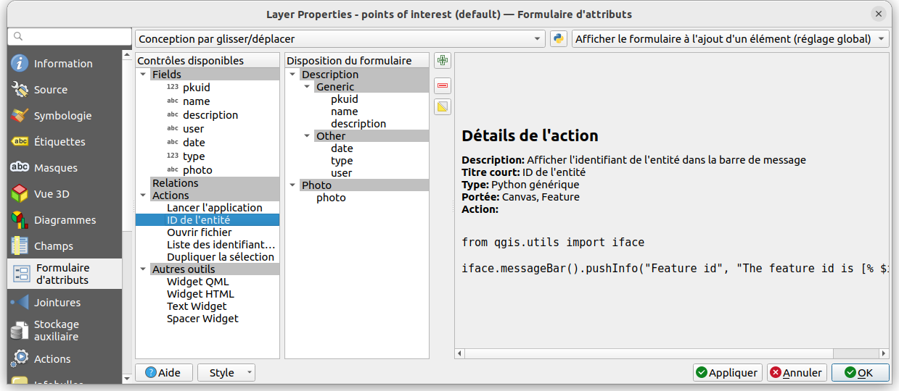

# Les Véloroutes et Voies Vertes 🚲

https://www.velo-territoires.org/politiques-cyclables/data-velo-modeles-donnees/geostandard-veloroutes-voies-vertes/

<!-- _class: lead gaia-->

#

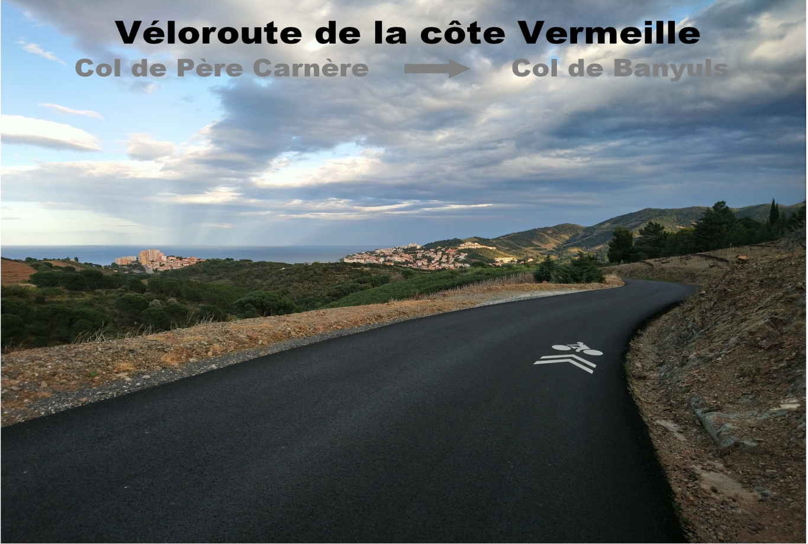

# Une véloroute ?

Une **véloroute** est un **itinéraire cyclable** de moyenne ou longue distance, **continu** (sans interruption, y compris dans les villes), adapté à la circulation à vélo (sécurité, balisage).

La **véloroute** permet de mettre en place des itinéraires cyclables sur de **grandes distances**, en exploitant notamment le réseau de routes secondaires très dense et peu fréquenté.

#

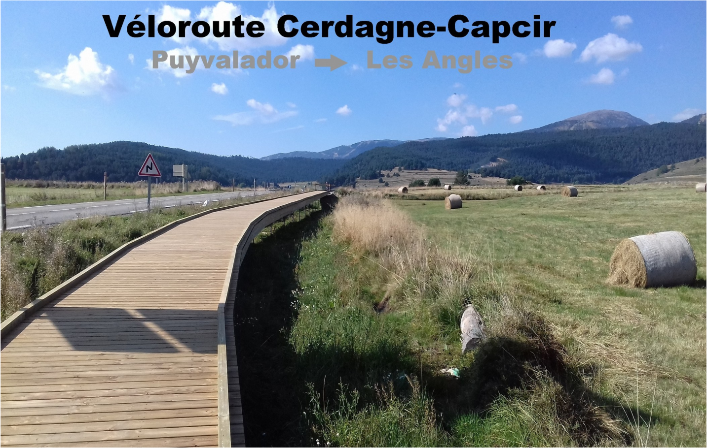

# Une voie verte ?

Une **voie verte** est un aménagement en **site propre** exclusivement réservée aux déplacements des véhicules **non motorisés** et des piétons et interdite aux cavaliers.

| Véhicule      | Autorisation |
|---------------| ------------ |
| 🚶 Piéton     | ✅           |
| 🛴 Trotinette | ✅           |
| 🚲 Vélo       | ✅           |
| 🏇 Cheval     | ❌           |
| 🛵 Scoot      | ❌           |
| 🏍 Moto       | ❌           |
| 🚗 Voiture    | ❌           |
| 🚚 Camionette | ❌           |
| 🚛 Camion     | ❌           |
| 🚜 Tracteur   | ❌           |

#

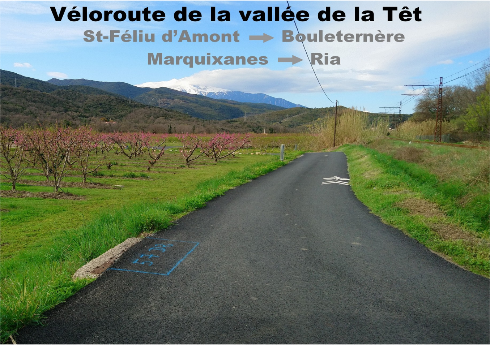

# Le réseau des Pyrénées Orientales

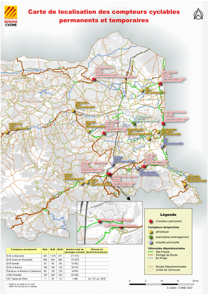

* **EuroVelo 8** : Véloroute de la Méditerranée - tronçon de Barcelone à Béziers
* **V81** : Véloroute du piémont pyrénéen - de Perpignan à Bayonne
* **Pirinexus** : Boucle Le Boulou, Prats-de-molo, Olot, Gérone, Sant Feliu de Gixols, L'Escala, le Perthus
* **V300** : Véloroute Perpignan Thuir

# Géostandard véloroutes et voies vertes 🚲

https://www.velo-territoires.org/politiques-cyclables/data-velo-modeles-donnees/geostandard-veloroutes-voies-vertes/

<!-- _class: lead gaia-->

# Le modèle conceptuel COVADIS 3V

- segments (géographiques)
- portions (composés de segments)
- itinéraires (composés d'itinéraires)

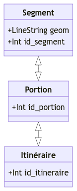

# Le modèle physique COVADIS 3V

- segments (géographiques)
- Elements
- portions (composés de segments)
- Etapes
- itinéraires (composés d'itinéraires)

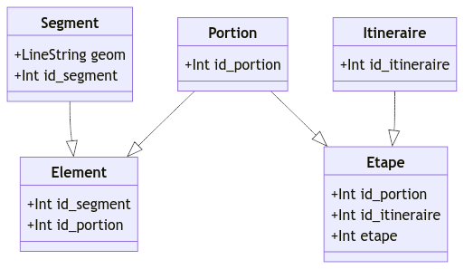

# Comment exploiter ce modèle 3V dans QGIS ? 🚲

https://docs.3liz.org/qgis-veloroutes_voies_vertes-plugin/

<!-- _class: lead gaia-->

# Comment visualiser les données 3V dans QGIS ?

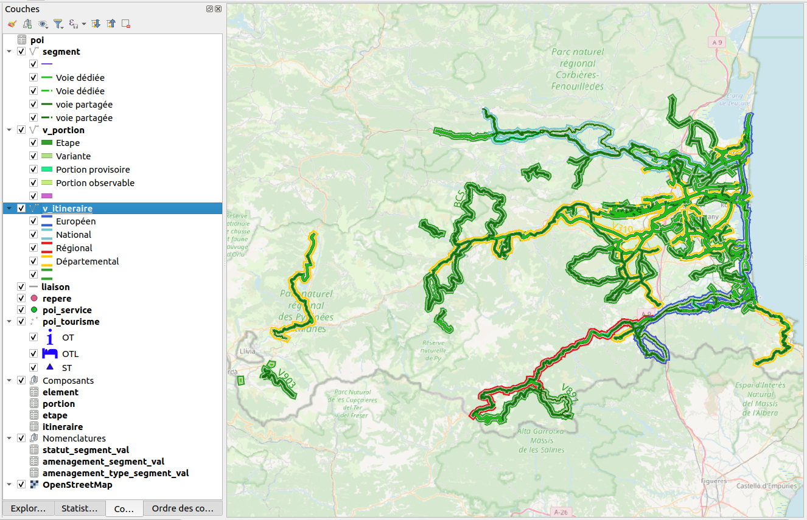

# Comment faciliter la saisie des données 3V dans QGIS ?

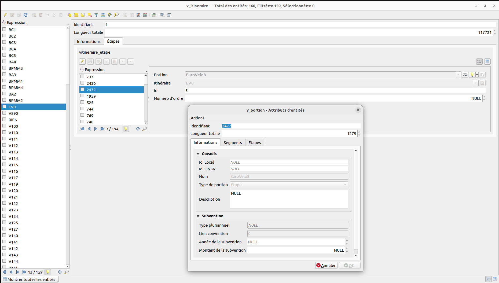

# Comment faciliter la saisie des données 3V dans QGIS ?

* Comment créer une portion facilement en gérant les éléments ?
* Comment créer facilement un itinéraire en gérant les étapes ?
* Comment couper un segment en conservant les portions ?
* Comment supprimer ou ajouter un segment d'une portion ?
* Comment supprimer ou ajouter une portion d'un itinéraire ?

# Avec des Actions !!!

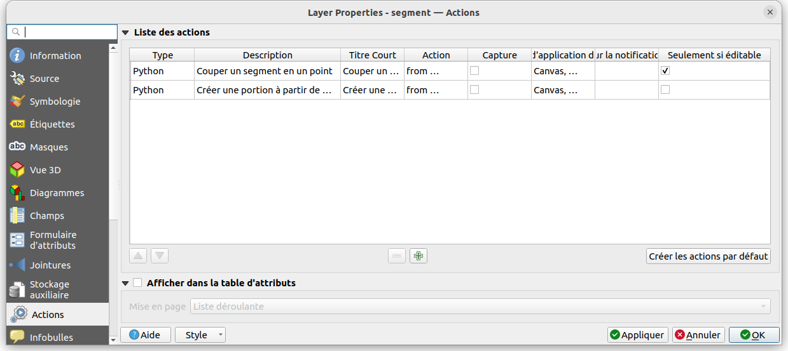

# Avec des Actions !!!

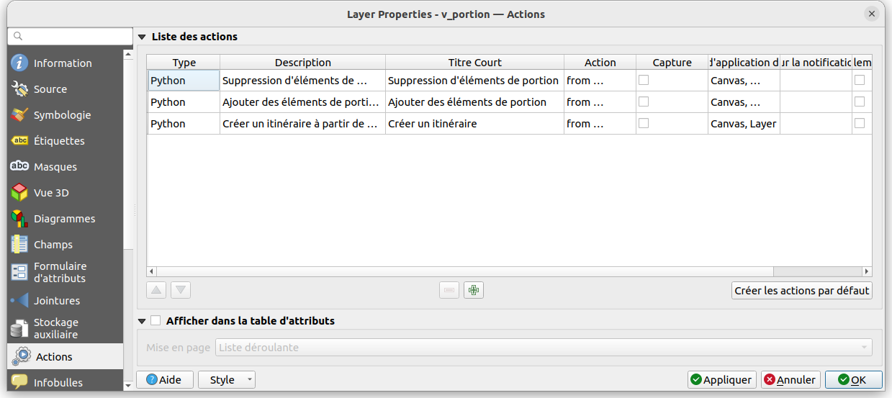

# Avec des Actions !!!

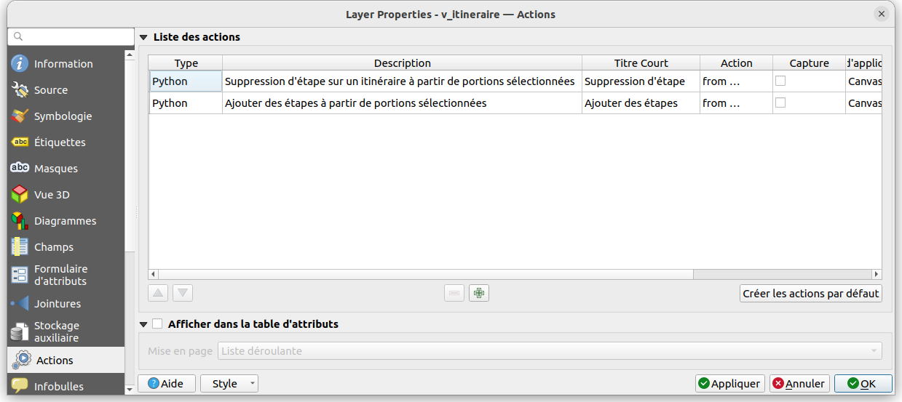

# Merci pour votre attention

Des questions ?

