#  Un QFieldCloud auto-hébergé ?


Retour d'expérience sur l'installation et la configuration de QFieldCloud


René-Luc D'HONT, 3liz


# QField & QFieldCloud

<!-- _class: lead gaia-->


# QField - Les projets QGIS dans la poche

L’application **QField** de la société **OpenGIS** permet de consulter des projets **QGIS** sur sa **tablette** ou son **smartphone**, et de faire des relevés sur le terrain via les formulaires d’édition.

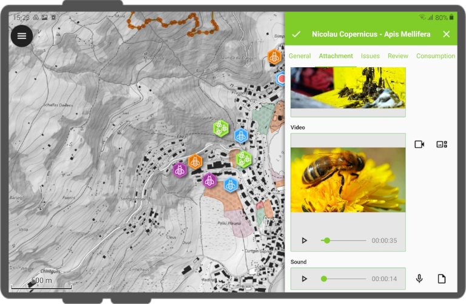

# QFieldCloud - Portail web pour synchroniser les projets et les données


**QFieldCloud** d'OpenGIS est la plate-forme de gestion centralisée des projets QGIS et des données collectées dans l’application **QField**

* Gestion d'équipe
* Envoi et partage de projets QGIS
* Synchronisation des données et des fichiers (photos, fichiers SIG)
* Consultation et synchronisation depuis QGIS, la plateforme ou QField

# QField.Cloud ou QFieldCloud auto-hébergé ?

**OpenGIS** propose la mise à disposition de QFieldCloud à travers son instance officielle https://qfield.cloud/pricing.html

* Simplicité (maintenance, sauvegardes, etc.)
* Plusieurs tarifs en fonction des besoins.
* Un accès gratuit pour des usages simples

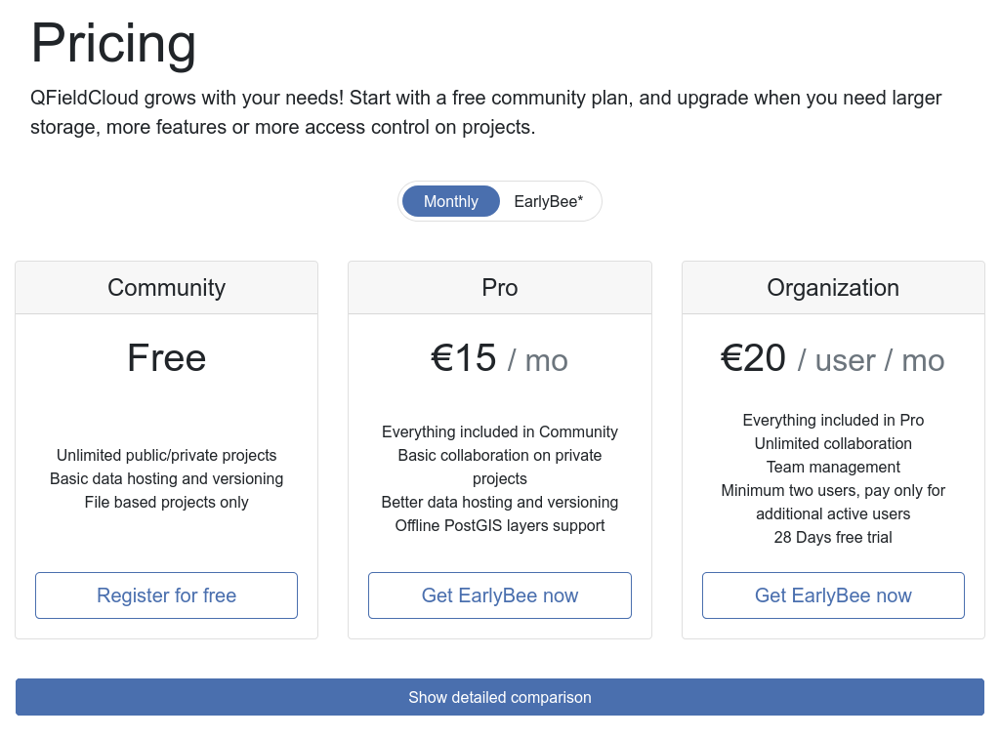

# QFieldCloud auto-hébergé


QFieldCloud est **OPEN-SOURCE**, et peut être **installé sur un serveur** :

* **centraliser** les logiciels sur son serveur (Lizmap, PostgreSQL, etc.)
* **personnaliser** les configurations logicielles et matérielles
* **maîtriser** les coûts

**Attention ⚠** Cela nécessite :

* des **compétences** en gestion d'infrastructure serveur et de déploiement de logiciels
* du **temps** pour la veille, la maintenance, la gestion
* une **responsabilité** sur la gestion des données, la disponibilité du service
* un **coût** pour la location du serveur, de serveurs de backup, de développement, etc.

# Dépôt des sources

La procédure d'installation est accessible sur **Github** :
https://github.com/opengisch/qfieldcloud/

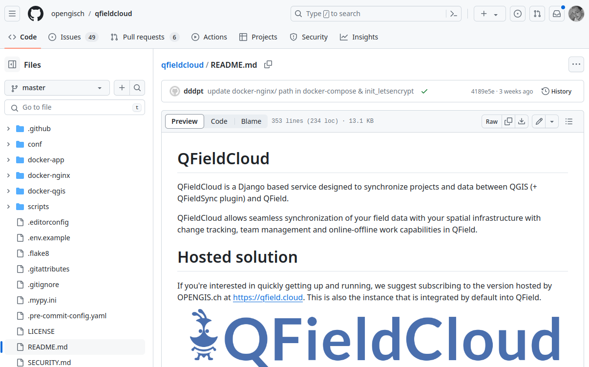

# Pré-requis

L'installation est conseillée sur une machine **Linux** qui doit être **correctement administrée** : mises-à-jour, sécurité des accès, sauvegardes, etc.

Elle nécessite de **configurer le réseau** pour permettre l'accès depuis l'extérieur. Par exemple via https://qfieldcloud.votredomaine.fr

**Plusieurs composants** sont nécessaires pour faire tourner **QFieldCloud**
* L'outil **Docker** qu'il faut bien maîtriser
* Une **base de données PostgreSQL** pour stocker les configurations et les données de l'application : comptes, logs, projets, etc.
* Un **service de stockage de fichiers** (pour les projets QGIS, les données, les photos, etc.) compatible S3 (minio)
* l'**application Web QFieldCloud** (Django) et les services liés (nginx, memcached, etc.),
* le **service de synchronisation** qui tourne en tâche de fond

# Docker

> Docker est une plateforme permettant de lancer certaines applications dans des conteneurs logiciels lancée en 2013.  (Wikipédia, 2024)


**Docker** facilite l'installation de composants logiciels grâce à la conteneurisation. Un fichier **Dockerfile** permet :
* de lister les **applications** à lancer et leur "image" (qui "contient" l'application)
* de configurer les **variables** (URL, environnement, versions, répertoires, etc.)
* de placer les applications dans un **réseau dédié** pour les faire dialoguer
* On peut l'utiliser pour **démarrer** ou **stopper** automatiquement tous les composants.
* Attention à bien séparer les données dans des **volumes dédiés** (persistence)

# Installation

Suivre le **README**
* **Installer Docker** sur le serveur
* Télécharger le **code source**
* Adapter le fichier d'**environnement**
* Construire les **images docker** et lancer les applications
* Installer la structure de la **base de données**
* Installer les **fichiers web** (CSS, JavaScript)
* Vérifier **le statut**
* Créer l'**utilisateur admin**

Un tutoriel récent en français : https://geotribu.fr/tags/#tag:qfieldcloud


# Exemple de commandes

* Récupérer les sources:
  ```bash
  git clone --recurse-submodules git@github.com:opengisch/qfieldcloud.git
  ```
* Construire les images et lancer:
  ```bash
  docker compose up -d --build
  ```
* Installer/mettre à jour la structure de la base
  ```bash
  docker compose exec app python manage.py migrate
  ```
* Fichiers statiques (CSS, JavaScript)
  ```bash
  docker compose run app python manage.py collectstatic --noinput
  ```
* Créer un utilisateur admin
  ```bash
  docker compose run app python manage.py createsuperuser --username gis_admin --email gis_admin@votredomaine.fr
  ```

♥ Il faut aimer la ligne de commande ♥

Nous conseillons d'utiliser un fichier `Makefile` pour lancer plus facilement ces commandes, comme `make build` ou `make run`


# Créer le super-utilisateur

Pour créer un super-utilisateur, par exemple `gis_admin`, on lance :

```bash
docker compose run app python manage.py createsuperuser --username gis_admin --email gis_admin@votredomaine.fr
```

On peut ensuite se connecter sur l'interface d'administration accessible par défaut sur le port 7080 : https://qfieldcloud.votredomaine.fr:7080

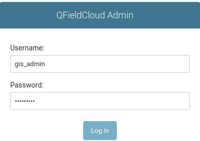

À partir de là, vous pouvez accéder à tous les **menus de gestion**

# Créer un utilisateur

On peut maintenant utiliser l'interface de QFieldCloud pour :
* créer des **groupes d'utilisateurs**
* créer un ou plusieurs **utilisateurs**
* créer des **organisations** et des **équipes**

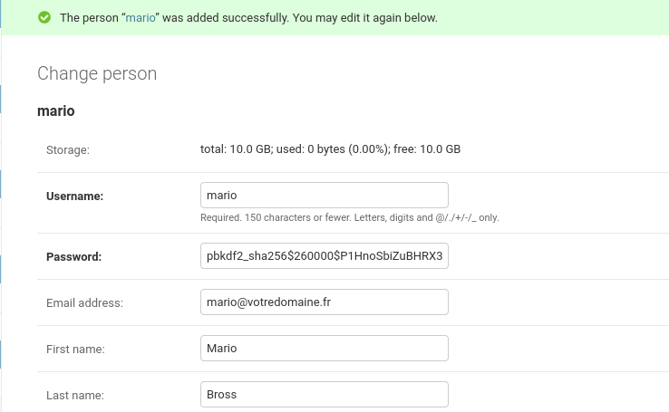

# Souscriptions

Par défaut, **les nouveaux utilisateurs** ne sont pas activés tant que le statut de leur **souscription** n'est pas `Active payée` :

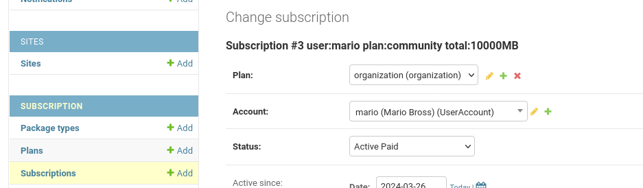

On peut aussi modifier les différentes variables pour les `Plans` :

  * taille maximum autorisée pour les fichiers,
  * accès à une base de données spatiale,
  * statut par défaut des nouveaux utilisateurs

# Se connecter depuis QGIS 

Installer l'extension **QFieldSync**

Lancer le plugin **QFieldSync** et configurer l'accès : `double-cliquer sur l'abeille` pour faire apparaître le champ pour renseigner son serveur

**Se connecter**: la liste des projets apparaît

https://docs.qfield.org/

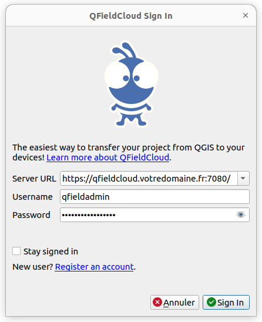

# Les étapes de publication : créer le projet

* Créer un nouveau **projet QGIS** ou ouvrir un projet existant
* Configurer le **projet**
* Dans QFieldSync, **créer un projet** dans un répertoire local

 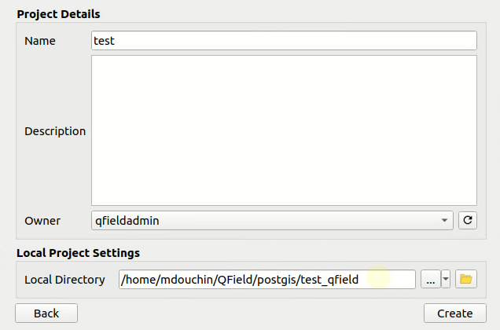


# Les étapes de publication : synchroniser

* Ajouter des couches **vecteur** (fichiers ou PostgreSQL), **raster**
* Configurer les options des **couches** (formulaire, symbologie)
* Dans QFieldSync, **synchroniser vers le serveur**

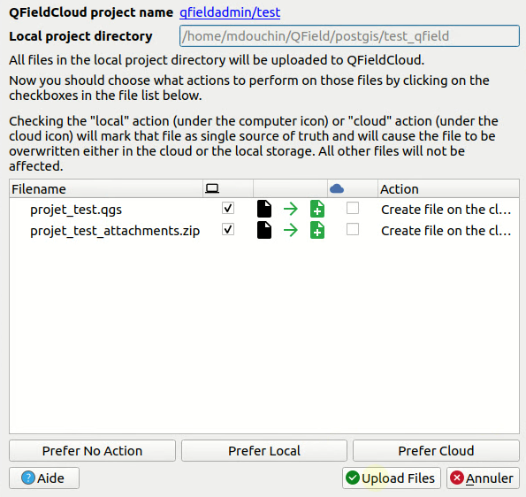

# Se connecter avec QField

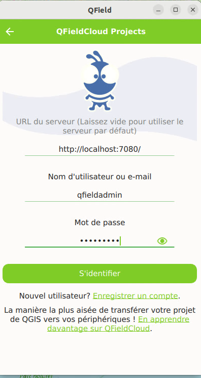

On peut préciser le **serveur** à utiliser, puis les **informations de connexion**

**QField** propose ensuite de télécharger le projet

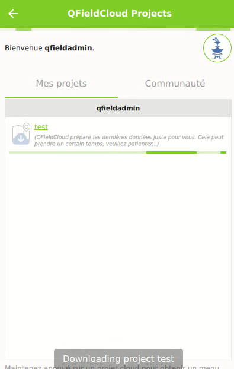 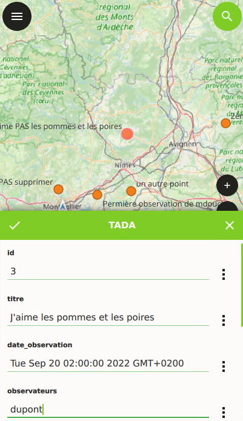

# Synchroniser les données PostgreSQL

Si on utilise des couches **PostgreSQL** hébergées sur un serveur :

* on peut permettre aux utilisateurs **sur le terrain** de travailler **hors-connexion**,
* et **QFieldCloud** va pouvoir synchroniser leurs saisies **avec la base centrale** une fois qu'ils auront synchronisé leurs changements (connexion internet retrouvée)
* nous conseillons d'utiliser les **services PostgreSQL** et pas de connexion via login/mot de passe

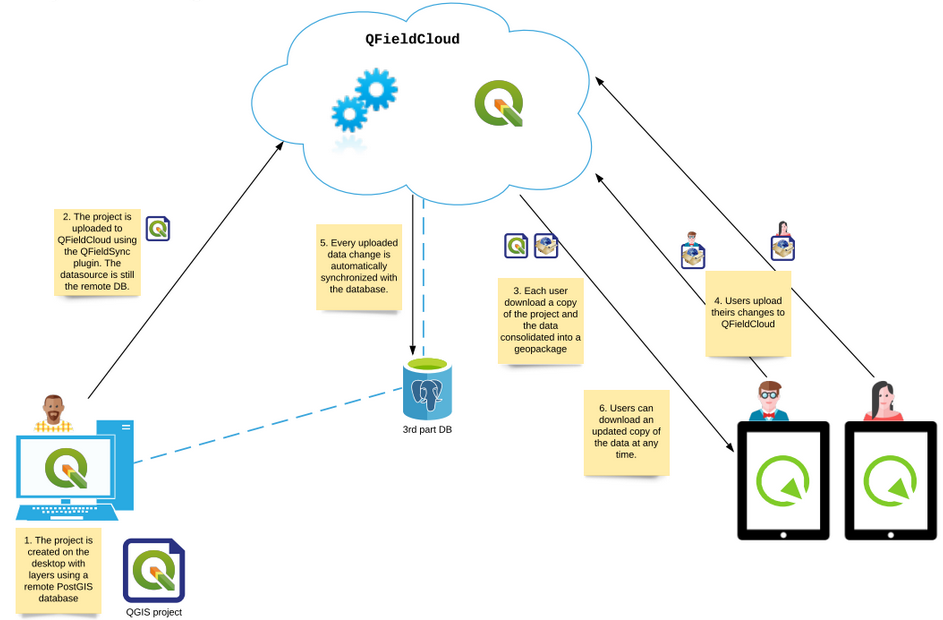

# Utiliser la synchronisation PostgreSQL

* Créer **nouveau projet QFieldCloud vide** dans un répertoire sur son poste de travail
* **Copier** le projet et les données existantes dans le **répertoire local** de ce projet vide
* Configurer les **couches PostgreSQL** qu'on souhaite éditer en mode `Édition hors connexion`
* **Pousser vers QFieldCloud** avec le plugin QFieldSync
* Alors QFieldCloud pourra utiliser les informations des couches PostgreSQL stockées dans le projet QGIS pour faire opérer **la magie de la synchronisation**

  


# Conclusion

Il est possible d'installer et d'utiliser **QFieldCloud** sur son propre serveur

Cela demande des **compétences** et du **temps**

Merci à **OpenGIS** pour la conception et la publication de ces outils !
  

**Liens** :

* Documentation : https://docs.qfield.org/
* Dépôt Github : https://github.com/opengisch/qfieldcloud/
* Discussions : https://github.com/opengisch/QField/discussions/
* 3liz: https://3liz.com

# Merci de votre attention !

*Vos questions sont les bienvenues !*


