# LIZMAP WEB CLIENT

### Past, present & future

Etienne TRIMAILLE // Michaël DOUCHIN

<!-- _class: lead gaia-->

#  GIS ecosystem

The QGIS ecosystem gathers:

- 📱 Mobile applications >  **QField** & **Mergin**
- ⚙ A processing engine  to run algs > **QGIS Processing**
- 🚀 A GIS Server  > **QGIS Server**

QGIS Server
- **Extensible** with Python plugins
- **Additional requests**: GetPrint, GetLegendGraphics as JSON, etc

**Lizmap Web Client uses the power of QGIS Server to bring maps in your browser**

#  Lizmap Web Client

**Prepare your projects on QGIS desktop / publish them with Lizmap**
- **FREE**: opensource > Mozilla Public Licence (MPL 2.0)
- **SIMPLE**: Generates **web maps** for any QGIS project - **No Code** web app publication
- **SECURE**:
  - acts as a **Proxy** to **QGIS Server**
  - has a **Web admin panel** to manage users, rights, configurations
- **POWERFUL**:
  - **many features and tools** are available: editing, printing, attribute table, search, spatial filter, etc.
  - **extensible** with **JavaScript** or **Modules**
- **MATURE** 12 years of active development in QGIS Server & Lizmap Web Client

# QGIS & Lizmap Web Client

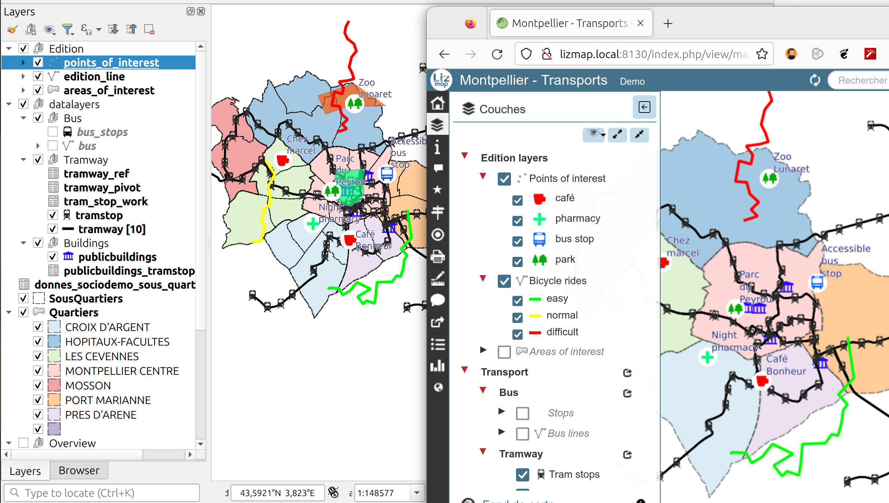

# Lizmap Web Client - some key features

- 👥 **Manage rights** on repositories, projects, layers, features, tools
- ✏️ **Rich editing forms** for PostgreSQL layers / expressions for constraints
- 🖨️ **Printing**: QGIS print layout / Feature-based atlas PDF export
- 📊 **Dataviz** - show charts based on your data (pie, bar charts)
- 🟰 **QGIS relations**: parent & child features / **cascading filter**

# QGIS Lizmap extension - An overview

The **Lizmap extension** allows:
- ✅ to easily configure the **QGIS project** to publish,
- 🛠️ to choose **which tools** must be activated in your published map:

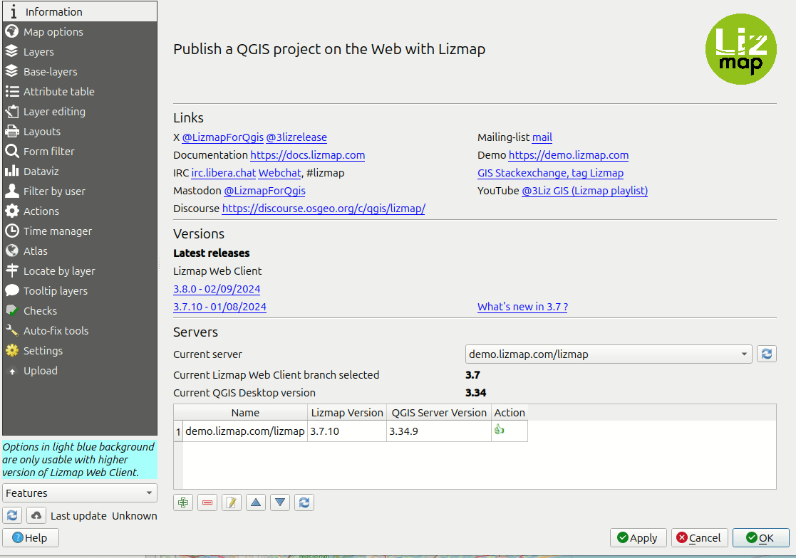

# QGIS Lizmap extension - project validation

A growing set of **validity rules**
- 🔒 **security**: PostgreSQL SSL connection, services
- 🚀 **performance**: trusted project, estimated metadata, provider geometry, simplification, raster pyramids
- ✅ **good practices**: primary keys, needed indexes
- 🐞 **issues prevention**: duplicated layers, proprietary format (ECW)

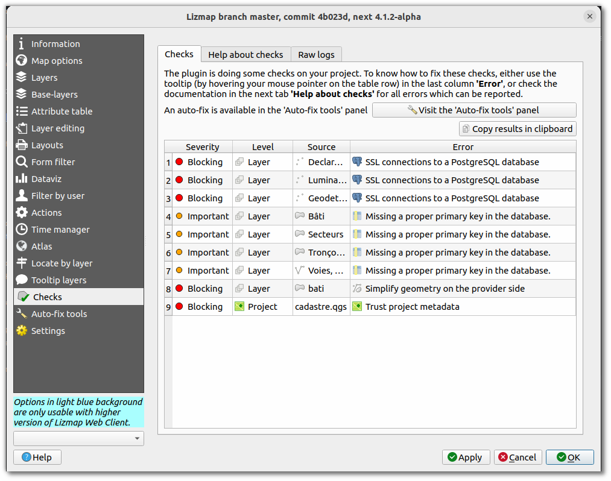

# 2023 - Lizmap 3.7 key features

<!-- _class: lead gaia-->

# Lizmap 3.7 : layer tree

- Allow to check/uncheck the layer **symbology rules** independently
- A complete rework of the **layer tree** with modern **Javascript** object oriented code

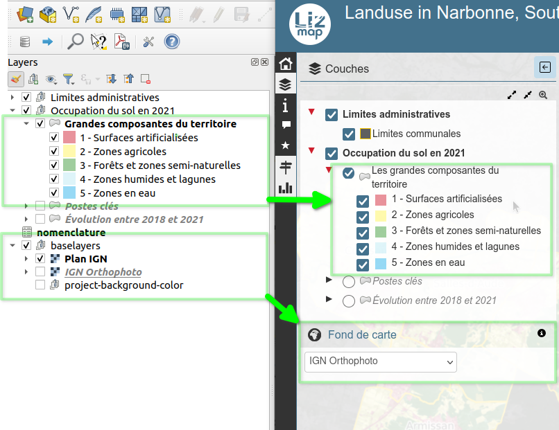

# Lizmap 3.7 : Printing layouts

- Allow to choose which layouts are **published**
- Add **rights** management per layout
- Configure default values for options: output format, resolution
- Allow to use a **user-defined icon** for each layout
- Atlas is of course supported

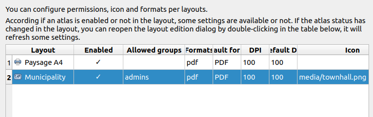

# Lizmap 3.7 : relations management improvements

Very useful when you have a **relation between a parent layer** (ex: roads) and a **child layer** (ex: road works)
- You can now easily **create a new child feature** from the parent information panel
- The parent editing form respects the **QGIS Drag&drop form layout**

 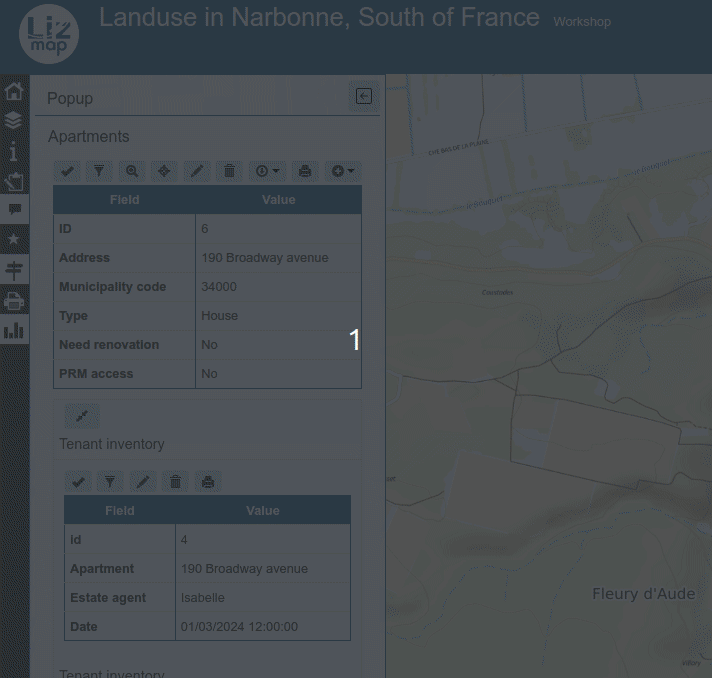

# Lizmap 3.7 : Drawing improvements

- New **text labels** items
- Display **measurements**: length, area, perimeter
- Toggle **drawing constraints** by angle/length from the previous node

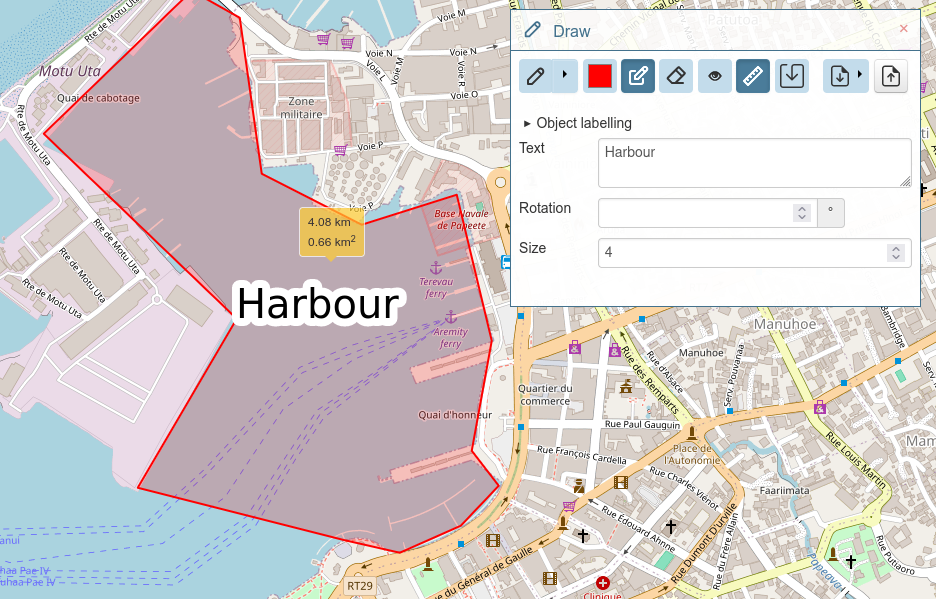 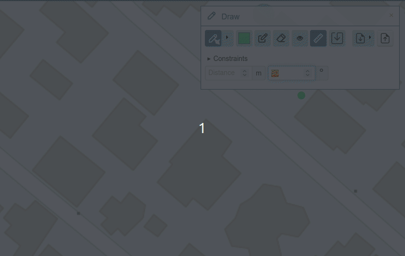

# Lizmap 3.7 : Improve PostgreSQL actions

**Lizmap actions**: run specific PostgreSQL queries and display results ->new **project** and **layer** contexts / Run an action **programmatically** with JavaScript

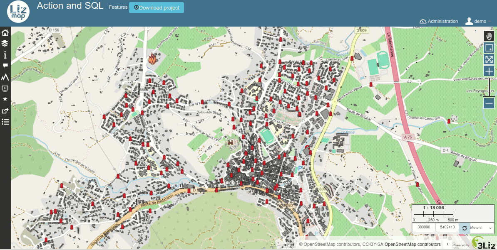

# 2024 - Lizmap 3.8 features

### Released last week

<!-- _class: lead gaia-->

# Lizmap 3.8 - new features

- Render all the checked layers as a **single image**
- New management of the **N to M relations data editor**
- Ability to display specific **layer features** at startup when set in URL
- Improvement on the **landing page** content (logged and not logged user)
- **Tooltip feature** when hovering the map: allow to build rich content with QGIS expressions
- **Popup**: add toolbar for child features in the compact table view
- **Data editing** - Improve **snapping** functionalities
- New web component `lizmap-features-table` to display a **compact list of features** as a table
- *A big thank to **Faunalia** for your contributions to this version*

# The new compact list of features

- a **reusable component** which shows a **compact list of layer features**
- **3.8**: available only for user-defined HTML popup
- will be used by default in **editing form** and **identify results** (popup) in 3.9

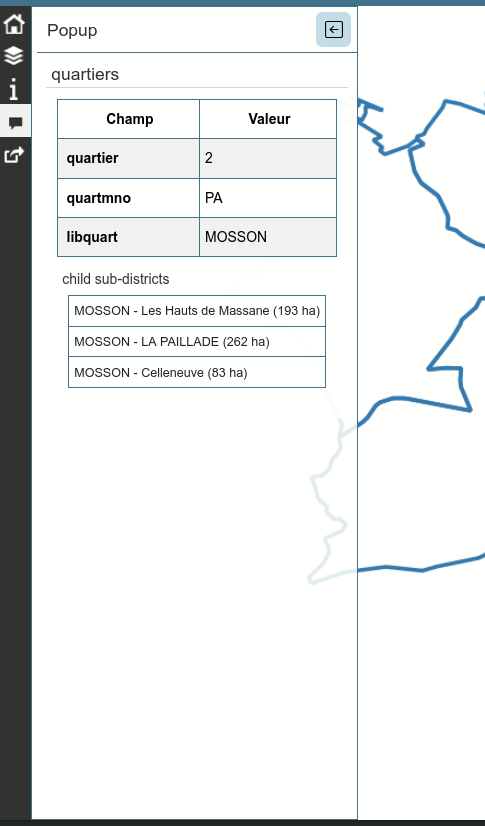

# A focus on Lizmap modules

Lizmap features can be extended with modules for dedicated use cases

<!-- _class: lead gaia-->

# Presentation module - Tell a story with Lizmap

- Create **one or more presentation** inside your maps
- Create slides with **rich text and medias** (images or video)
- Each slide can **zoom to a specific area** with a set of **active layers**

# PgRouting - Find your way

- Based on the amazing **PgRouting extension** for PostgreSQL
- The module adds **routing tools** which help the user to find its way
- The routing graph is **based on your data**, not on a online API

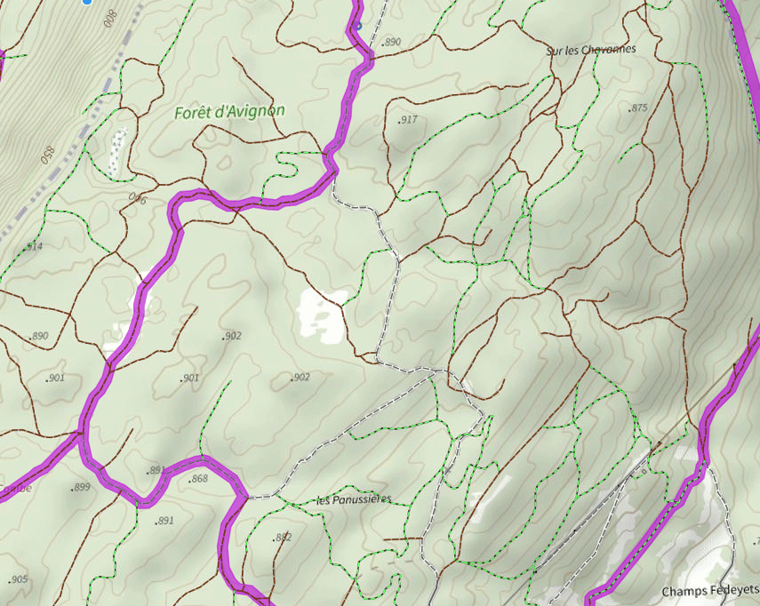

# WPS module - Run processing algorithms

- The power of **QGIS processing toolbox** inside Lizmap
- Each map has its set of **allowed algorithms or models**
- **Run the algorithm**: choose input values (buffer size, area code, etc.)
- **Results** are displayed whenever the algs ends (asynchronous run)
- **Download** produced outputs (layers, reports, etc.)

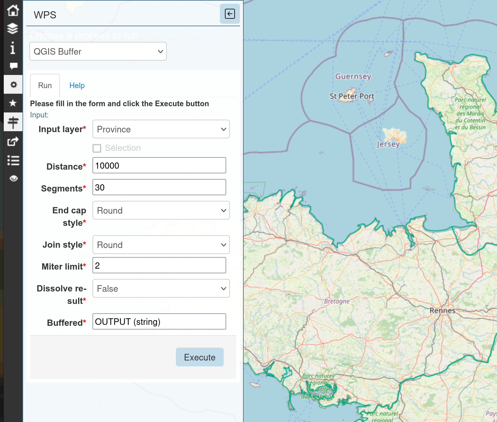

# The Future of Lizmap

<!-- _class: lead gaia-->

# The future of Lizmap

**Version 3.9**:

- Generalize the use of the **compact list of features**
- Catch up with QGIS **editing form capabilities**
- **Copy-paste geometries** between tools (drawing, selection, identified feature)
- Integrate the **presentation module** inside Lizmap Web Client

**Connect with our community !**

- Organize **online events** to meet users and developers
- Gather user needs and maintain **a roadmap** with priorities
- **Communicate more**: transition from twitter to **Mastodon** & Linkedin, etc.

# Thank you for your attention !

- Demos: https://demo.3liz.com
- Email: info@3liz.com / Mastodon: @LizmapForQgis - Coming soon
- Source code: https://github.com/3liz/
- Hosting: https://www.lizmap.com/en/plans.html

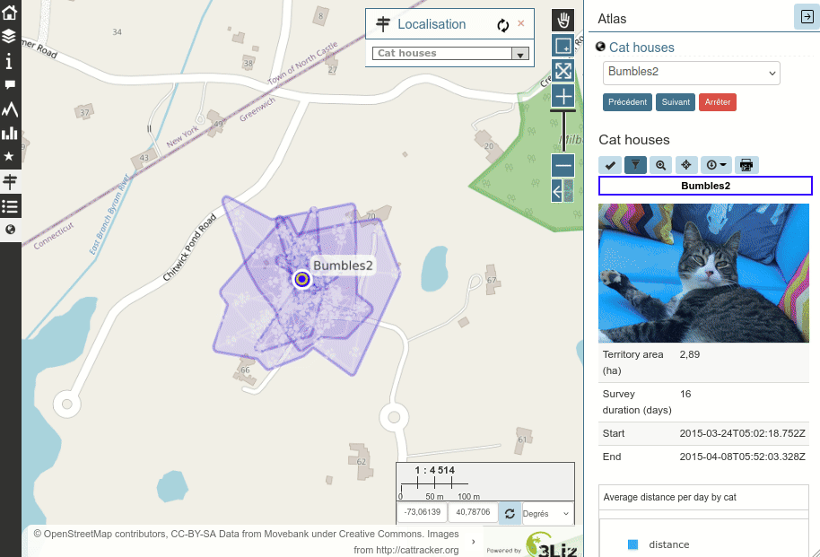

<!--
TODO

- Capture WPS
- Taille de la police (pour tout voir)
- Enlever la partie historique (trop long) -> DONE
- Ajouter des slides avec images sur 3.8 -> trop de puces
- Parler de notre offre d'hosting ?
- Ajouter slide avec traductions ?
-->
