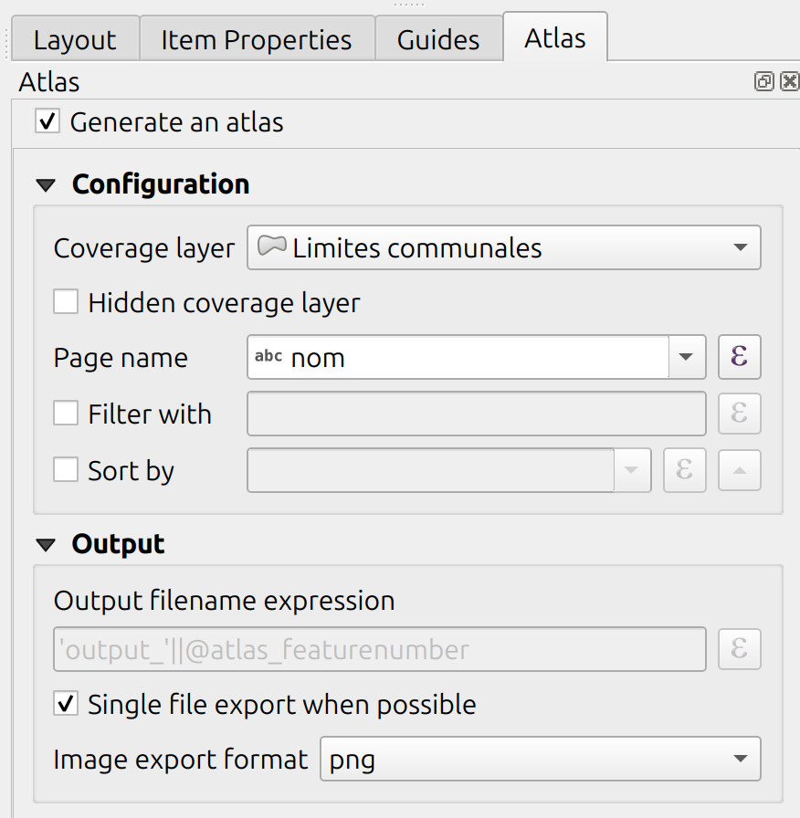
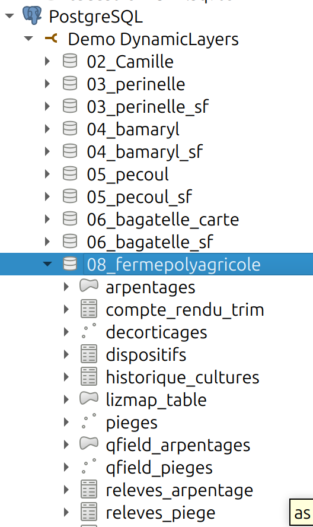
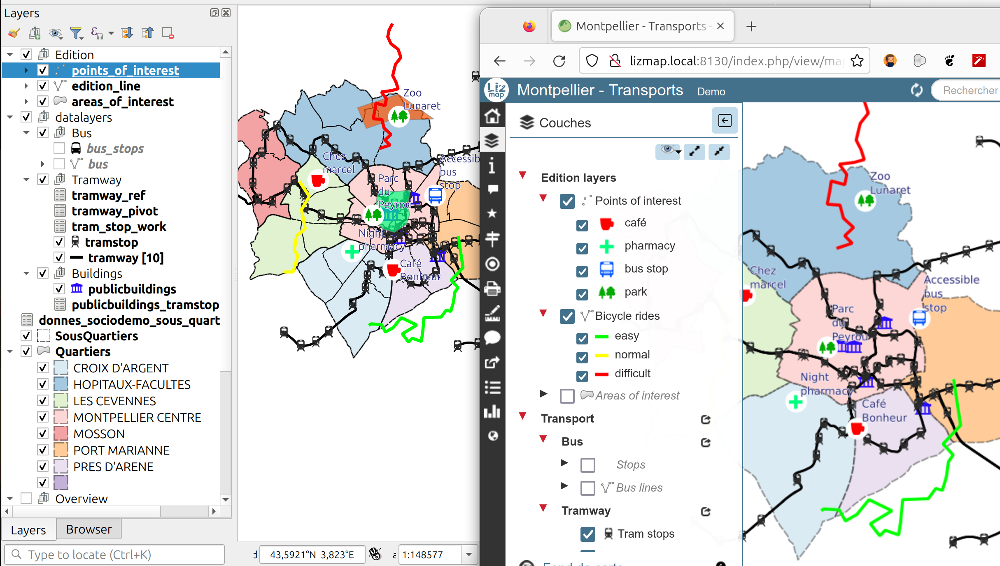
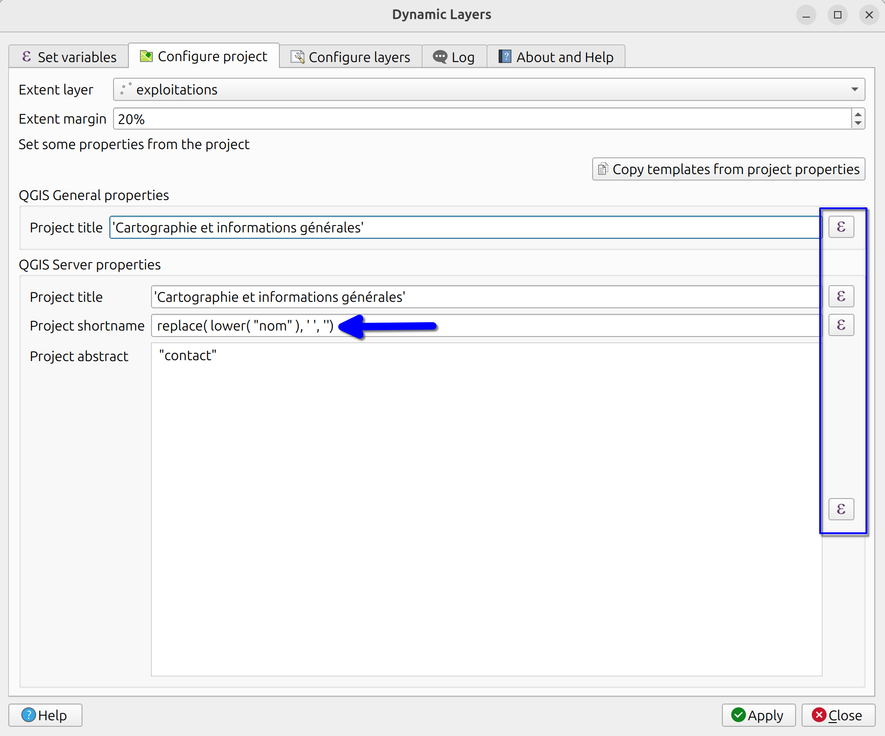

# Dynamic Layers plugin

### A single project to rule them all

Etienne TRIMAILLE

<!-- _class: lead gaia-->

#  GIS Atlas

<!-- _class: lead gaia-->

 Many of you know the atlas in a layout

 Based on a vector layer, iterate over every features

 - Labels
 - Map extent
 - Attribute table

 

# Initial state

- Our customer Cartophyl / Presta'SCIC, based in French carribean islands Guadeloupe and Martinique
- Land surveying about pesticids in farms, pest control

QGIS project for a given farm :

# Initial state

- Each "farm" has its own "datastore" :
  - **Postgresql schema** for table, fields
  - **folder** on the filesystem for linked files
- Therefore, the structure for the QGIS project is the **same**, except the datasource : legend, graduated rendering

# Initial state

- Use of **Lizmap Web Client** to publish their QGIS projects on the web, thanks to QGIS Server
  - opensource
  - same symbology, QGIS layouts, QGIS forms... are published, to their own customers, with login and password
  - https://lizmap.com
  - https://github.com/3liz/lizmap-web-client 

# Initial state

<!-- _class: lead gaia-->

1. How to manage these "hundreds" of QGIS projects, to give to **their** own customers, linked to the data of **their** farm ?
2. How to report one change in the "main" QGIS project and to distribute a new version ?
3. Pan and zoom the map in these different projects

_In a street of Norrköping_

# Dynamic Layers plugin

<!-- _class: lead gaia-->

# Coverage layer/variables

# Extent and project properties

# Layer properties

# And run 🪄

- The original layer properties/expressions are saved in the background (_in the custom layer properties for PyQGIS geeks here_)
- It means that we can **always** navigate to a different feature (and therefore, re-evaluate all QGIS expressions)
- It changes layer datasources, with **your current opened project** (similar to atlas preview in a QGIS layout)

# Bulk generations of projects

- A dynamic output path for the project can be written
- Sub folder is supported

# Bulk generations of projects

_After a few cups of coffee ☕☕_

# Another example

- Use a QGIS expression for the provider filter

# Another example

- Use a QGIS expression for the provider filter

# Another example

- Use a QGIS expression for the provider filter

# Actual version

- Published on https://plugins.qgis.org
- New version is coming soon with some small improvments
- QGIS Processing limitations
- Some "new" project properties and/or layer properties can be added
- Keen to have your feedbacks
- Open to new ideas, like maybe temporal data ?

# Lizmap Web Client

* Tight integration, with the Lizmap configuration file 
* If the Lizmap configuration file is found on the "main" project,
the file is copied and adapted

# Thank you for your attention !

- Source code : https://github.com/3liz/QgisDynamicLayersPlugin/
- Thanks Cartophyl and Presta'SCIC for this work
- Demos: https://demo.3liz.com
- Email: info@3liz.com / Mastodon: @LizmapForQgis - Coming soon
- Lizmap source code: https://github.com/3liz/lizmap-web-client/
- Watch the replay of the conference yesterday about **Lizmap**
