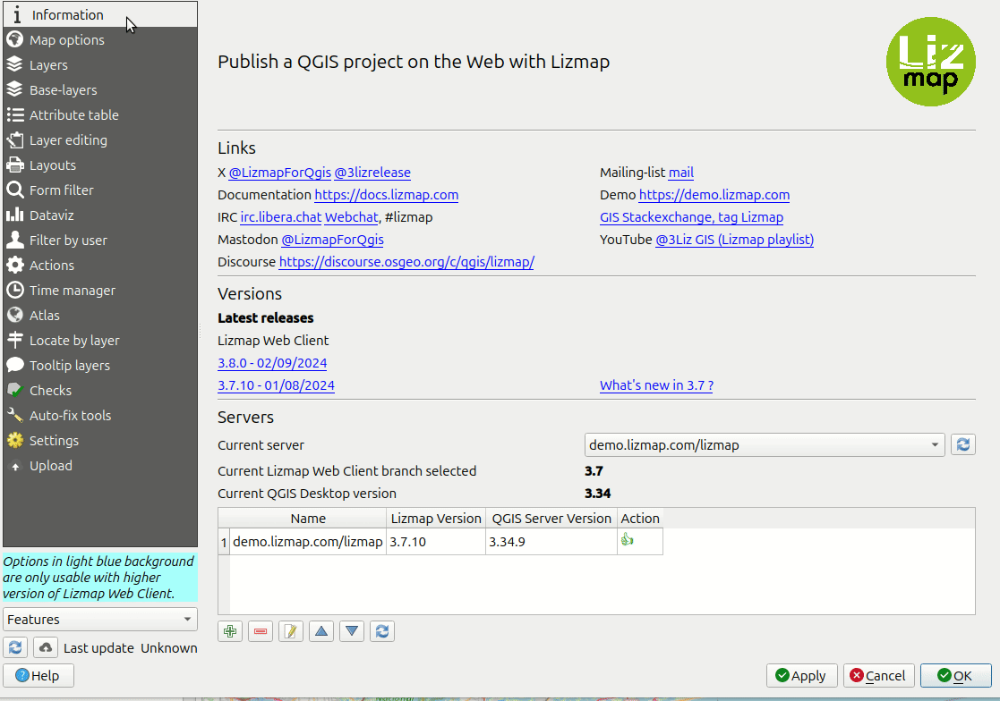
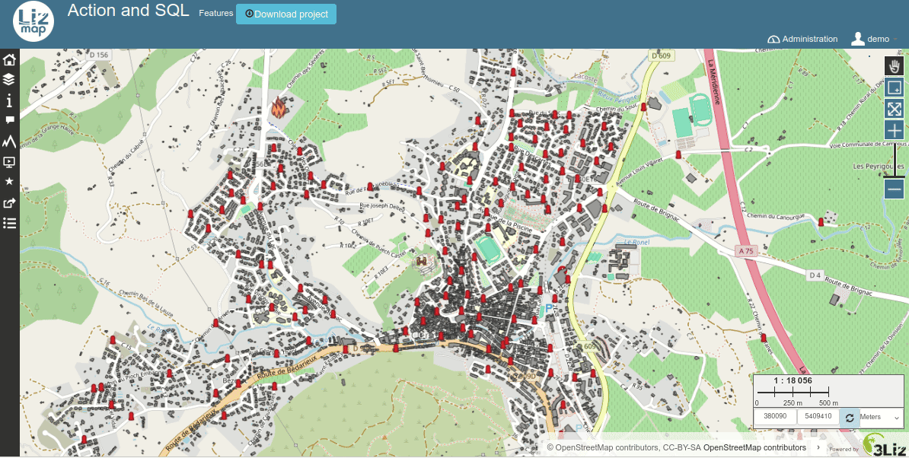
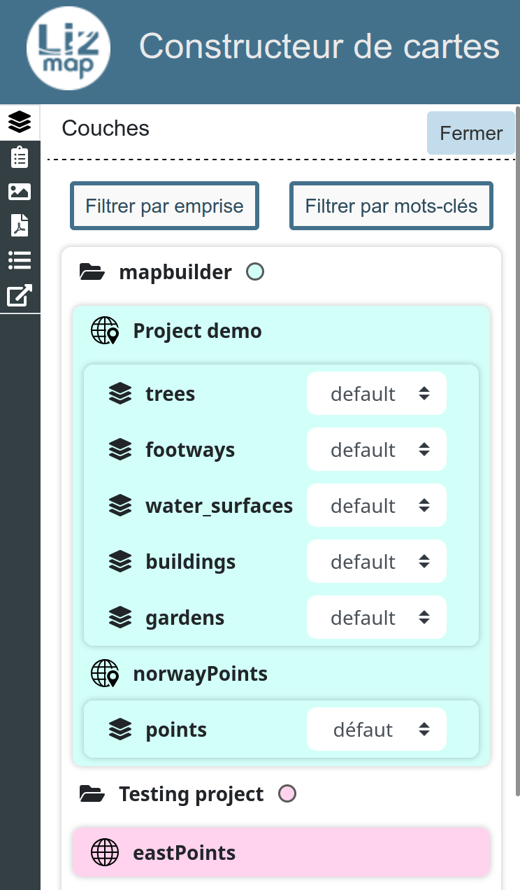
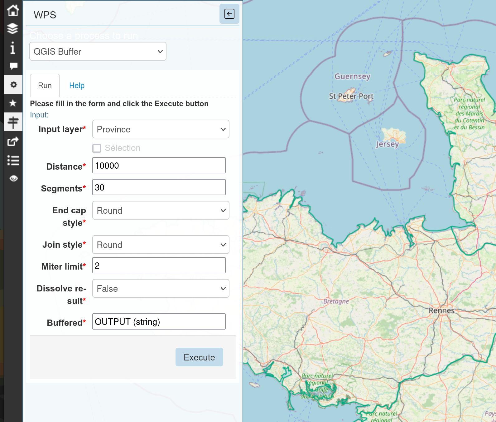

# LIZMAP WEB CLIENT

### Past, present & future

Etienne TRIMAILLE

<!-- _class: lead gaia-->

#  GIS ecosystem

The QGIS ecosystem gathers:

- 📱 Mobile applications >  **QField** & **Mergin**
- ⚙ A processing engine  to run algs > **QGIS Processing**
- 🚀 A GIS Server  > **QGIS Server**

QGIS Server
- **Extensible** with Python plugins
- **Additional requests**: GetPrint, GetLegendGraphics as JSON, etc

**Lizmap Web Client uses the power of QGIS Server to bring maps in your browser**

#  Lizmap Web Client

**Prepare your projects on QGIS desktop / publish them with Lizmap**
- **FREE**: opensource > Mozilla Public Licence (MPL 2.0)
- **SIMPLE**: Generates **web maps** for any QGIS project - **No Code** web app publication
- **SECURE**:
  - acts as a **Proxy** to **QGIS Server**
  - has a **Web admin panel** to manage users, rights, configurations
- **POWERFUL**:
  - **many features and tools** are available: editing, printing, attribute table, search, spatial filter, etc.
  - **extensible** with **JavaScript** or **Modules**
- **MATURE** 13 years of active development in QGIS Server & Lizmap Web Client

# QGIS & Lizmap Web Client

# Lizmap Web Client - some key features

- 👥 **Manage rights** on repositories, projects, layers, features, tools
- ✏️ **Rich editing forms** for PostgreSQL layers / expressions for constraints
- 🖨️ **Printing**: QGIS print layout / Feature-based atlas PDF export
- 📊 **Dataviz** - show charts based on your data (pie, bar charts)
- 🟰 **QGIS relations**: parent & child features / **cascading filter**

# QGIS Lizmap extension - An overview

The **Lizmap extension** allows:
- ✅ to easily configure the **QGIS project** to publish,
- 🛠️ to choose **which tools** must be activated in your published map:

# QGIS Lizmap extension - project validation

A growing set of **validity rules**
- 🔒 **security**: PostgreSQL SSL connection, services
- 🚀 **performance**: trusted project, estimated metadata, provider geometry, simplification, raster pyramids
- ✅ **good practices**: primary keys, needed indexes
- 🐞 **issues prevention**: duplicated layers, proprietary format (ECW)

_Thanks to PyQGIS, which allow a fine control of the workflow, close to the data_

# Current roadmap

- **Branch 3.8**
  - 3.8.0, September 2024 for QGIS UC 2024 in Brastislava
  - 3.8.10 May 2025, **latest** release
- **Branch 3.9**
  - 3.9.0-RC3 **Feature freeze** in May 2025
  - 3.9.0 June 2025 for this QGIS UC 🪄
- **Branch 3.10**
  - 3.10.0 started for **new** features

Similar to **QGIS.org** release schedule, **monthly** releases with bugfix :
- Compared to one year ago, **less overlap** between branches now
- https://github.com/3liz/lizmap-web-client/tags
- https://www.qgis.org/resources/roadmap/#release-schedule

⚠️ Please, do not stay on .0 version (or low number of bugfix), for any software ! ⚠️
_and for plugins as well, the user must do them from time to time_

# 2024 - Lizmap 3.8 key features

<!-- _class: lead gaia-->

# 2024 - Lizmap 3.8 features

- Render all the checked layers as a **single image**
- New management of the **N to M relations data editor**
- Ability to display specific **layer features** at startup when set in URL
- Improvement on the **landing page** content (logged and not logged user)
- **Tooltip feature** when hovering the map: allow to build rich content with QGIS expressions
- **Popup**: add toolbar for child features in the compact table view
- **Data editing** - Improve **snapping** functionalities
- New web component `lizmap-features-table` to display a **compact list of features** as a table
- *A big thank to **Faunalia** for your contributions to this version*

# The new compact list of features

- a **reusable component** which shows a **compact list of layer features**
- **3.8**: available only for user-defined HTML popup
- will be used by default in **identify results** (popup) in **3.9**

# The new compact list of features

- QGIS **Display expression** is used by default for line heading

New in **3.9**:

- QGIS Expressions can be added to create multiple "virtual" columns.
- Due to the powerness of QGIS Expressions written on the "client side", a allowed list of expressions can be set, or the `not allowed` is returned (new in 3.9)

# Lizmap 3.8 : relations management improvements

Very useful when you have a **relation between a parent layer** (ex: roads) and a **child layer** (ex: road works)
- You can now easily **create a new child feature** from the parent information panel
- The parent editing form respects the **QGIS Drag&drop form layout**

 

# Lizmap 3.8 : Improve PostgreSQL actions

**Lizmap actions**: run specific PostgreSQL queries and display results : 
  - new **project** and **layer** contexts / Run an action **programmatically** with JavaScript

**In 3.9, an input geometry drawn by the user** can be added

# Quick overview Lizmap 3.9

- Drawing : Circular geometry measurement on draw, contribution Faunalia
- Import and export drawing with FlatGeobuf
- Under the hood
  - reading of the QGIS project under the hood
  - Eslint, Styleline, Rector : code analysis and linting tools
  - Ongoing work to improve JavaScript documentation with OpenLayers etc
  - API documentation https://docs.3liz.org/lizmap-web-client/

# REST API

* Latest releases from May, June 2025
* Perform some HTTP GET, PUT or DELETE requests
* Manage Lizmap repositories and their rights
* Metadata information from QGIS requests
* More tight integration from the QGIS Desktop plugin to come, step by step ! 🥳

_Contributions from Néo Garaix_

# A focus on Lizmap modules

Lizmap features can be extended with modules for dedicated use cases

The wish is to integrate these modules into core, to ease the maintenance and make them more discoverable.

<!-- _class: lead gaia-->

# Presentation module - Tell a story with Lizmap

- Create **one or more presentation** inside your maps
- Create slides with **rich text and medias** (images or video)
- Each slide can **zoom to a specific area** with a set of **active layers**

# MapBuilder

* Be able to combine layers from different QGIS projects, on the web browser **only**, without being a GIS technicians with QGIS and the need to publish a "new" QGIS project project
* A lot of work done recently : 
  * filter by extent
  * filter by keywords
  * icon for the geometry type...
  * CSS overhaul...

# PgRouting - Find your way

- Based on the amazing **PgRouting extension** for PostgreSQL
- The module adds **routing tools** which help the user to find its way
- The routing graph is **based on your data**, not on a online API

# WPS module - Run processing algorithms

- The power of **QGIS processing toolbox** inside Lizmap
- Each map has its set of **allowed algorithms or models**
- **Run the algorithm**: choose input values (buffer size, area code, etc.)
- **Results** are displayed whenever the algs ends (asynchronous run)
- **Download** produced outputs (layers, reports, etc.)
- A lot of work is going to be done with the coming weeks, stay tuned ! 🙊
  - UI Overhaul, CSS, move to OGC Processes...

# Some side projects, under the hood of Lizmap

* Proj4Js will be replaced by Proj4Rs
  * Written in Rust Web Assembly
  * https://github.com/3liz/proj4rs
* Py-QGIS-Server
  * Better management of QGIS server processes (without Apache/Nginx)
  * https://docs.3liz.org/py-qgis-server/
  * It will be replaced by a total new project
  * QJazz, QGIS as a service
  * https://docs.3liz.org/qjazz/qjazz-server/

# The Future of Lizmap

<!-- _class: lead gaia-->

# 3.9 is in feature freeze, 3.10 started

<!-- _class: lead gaia-->

- Attribute table managed on the server side
  - Better performance, the customer request is to manage millions of lines with pagination
- Point vector layer from QGIS translated to a vector point layer into OpenLayers 10, with the QGIS symbology.
  **New ways** of interactions with the user can be foreseen : point clustering client side...
- Layouts portofolio, work funded by Mirandela city in Portugal (throuwg NaturalGIS Pt)

# The future of Lizmap

- Generalize the use of the **compact list of features**
- Catch up with QGIS **editing form capabilities**
- **Copy-paste geometries** between tools (drawing, selection, identified feature)
- Always some work under the hood :
  - Bootstrap 5 migration
  - OpenLayers : 
    - Remove the last part of OpenLayers 2
    - Since version 3.8, the OpenLayers 10 map is now on top
    - OpenLayers 2 : **only** editing, measure, geolocalisation
    - OpenLayers 10 : drawing, print, layers, baselayers, maptip...

# The future of Lizmap

- Integrate some **external modules** into **core** ?
  - Presentations
  - PGrouting
  - Altiprofil, with **COG** support
- QGIS Authentication database, or other backend

# The future of Lizmap

Routing specific requests to specific QGIS Server backend : 
  - PDF print requests → dedicated QGIS Server processess
  - Sloweness of queries
  - Manage cache per processus
  - Readonly
  - Not loading QGIS layouts if not needed
  - Move attribute table export of layer to a QGIS processes API, asynchrone

# Connect with our community !

- Organize **online events** to meet users and developers
- Gather user needs and maintain **a roadmap** with priorities
- **Communicate more**: transition from twitter to **Mastodon** & Linkedin, etc.

# Translations

- Quick updates about the state of translation, as of begining of May 2025
- Top 10 (with English, of course)

# Thank you for your attention !

- Demos: https://demo.3liz.com
- Email: info@3liz.com / Mastodon: @LizmapForQgis - Coming soon
- Source code: https://github.com/3liz/
- Hosting: https://www.lizmap.com/en/plans.html

