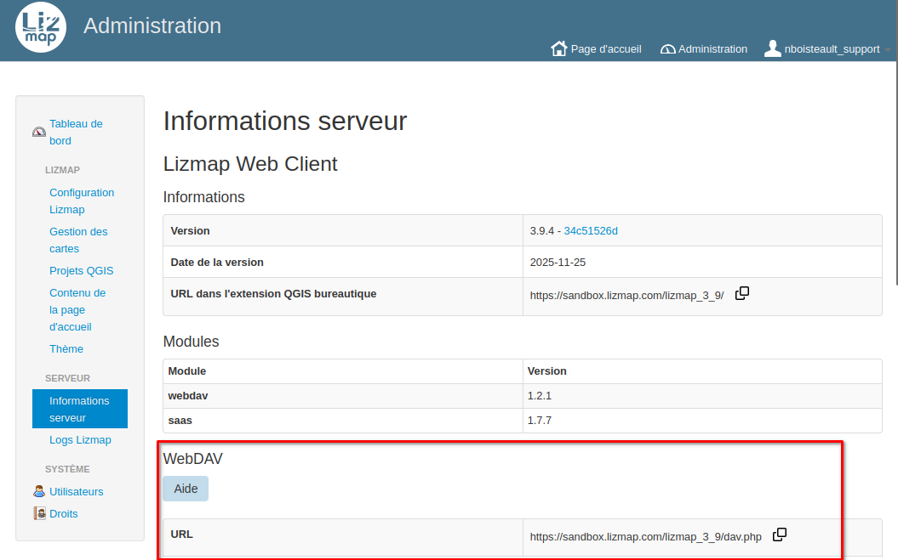
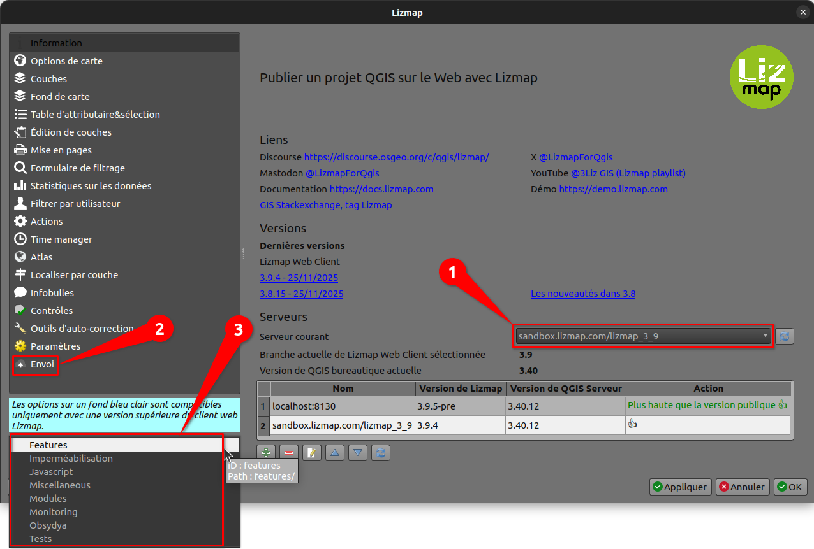
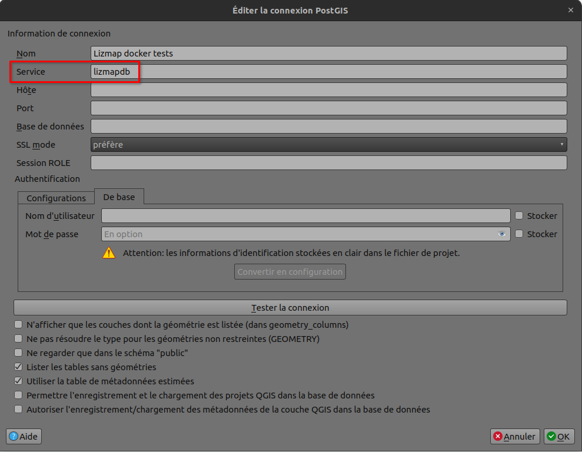
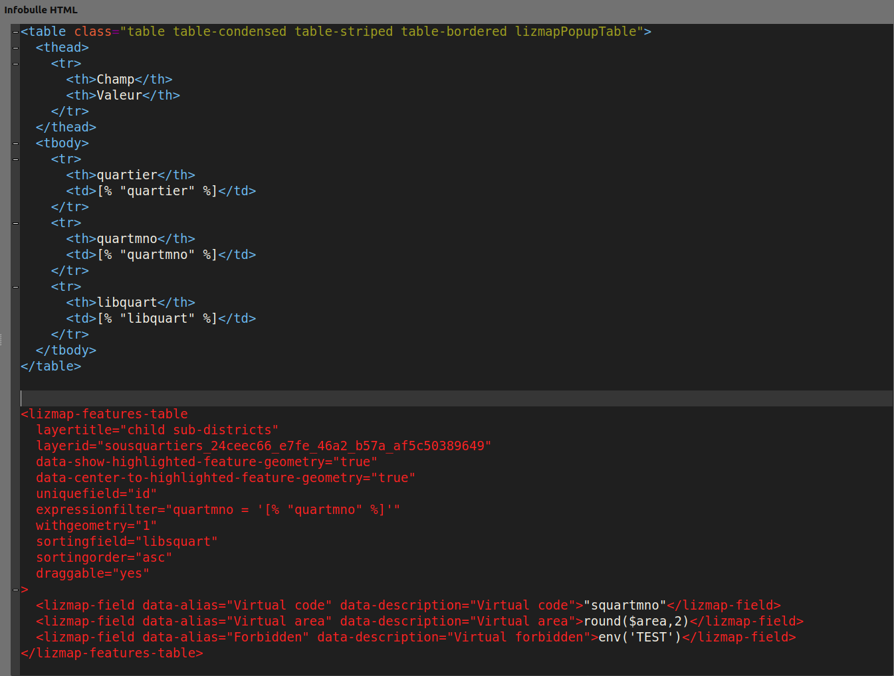
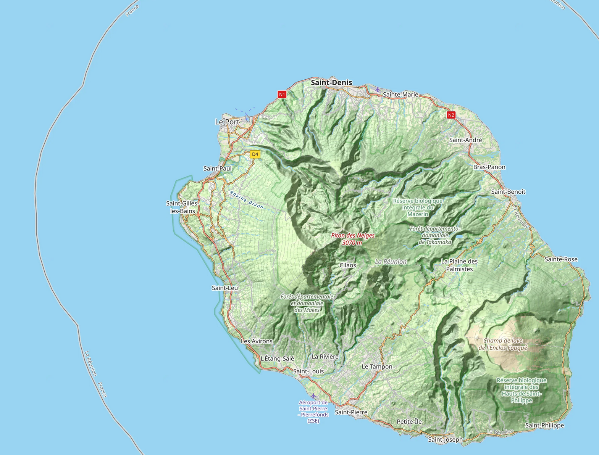

# LIZMAP

### Nouveautés et bonnes pratiques

Nicolas Boisteault

<!-- _class: lead gaia-->

# WebDAV

- Protocole non bloqué par les pare-feux (port 443, HTTPS)
- Connexion via un lecteur réseau ou un client (p.ex. WinSCP)

# WebDAV

- Module Lizmap WebDAV : https://github.com/3liz/lizmap-webdav-module

# Fichier de service de connexion PostgreSQL

Meilleur sécurité

Documentation : 
- https://docs.lizmap.cloud/fr/postgresql.html#fichier-de-service-de-connexion-postgresql
- https://docs.lizmap.cloud/fr/postgresql.html#configurer-l-acces-dans-qgis

# Fichier de service de connexion PostgreSQL

# Lizmap features table

Affichage compact des objets enfants

# Lizmap features table

https://demo.snap.lizmap.com/lizmap_3_9/index.php/view/map?repository=tests&project=lizmap_features_table

Syntaxe :
https://github.com/3liz/lizmap-web-client/pull/4502

# Attribute table

<video src="media/foss4gbe2025/attribute_table.mp4" controls width="70%"></video>

# Autres nouveautés

## Github

https://github.com/3liz/lizmap-web-client/releases

## 3liz.com

https://www.3liz.com/news/lizmap-web-client-3-7.html
https://www.3liz.com/news/lizmap-web-client-3-8.html
À venir pour la 3.9

# Vous souhaitez essayer Lizmap ?

Essayer Lizmap Cloud pendant un mois gratuitement.

## 👇

### info@3liz.com

# Questions

Merci pour votre attention.

