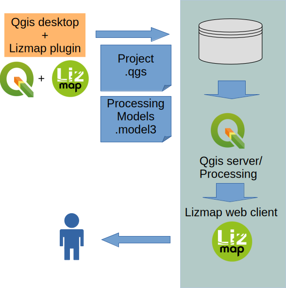
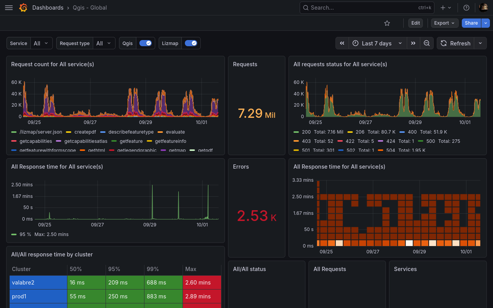
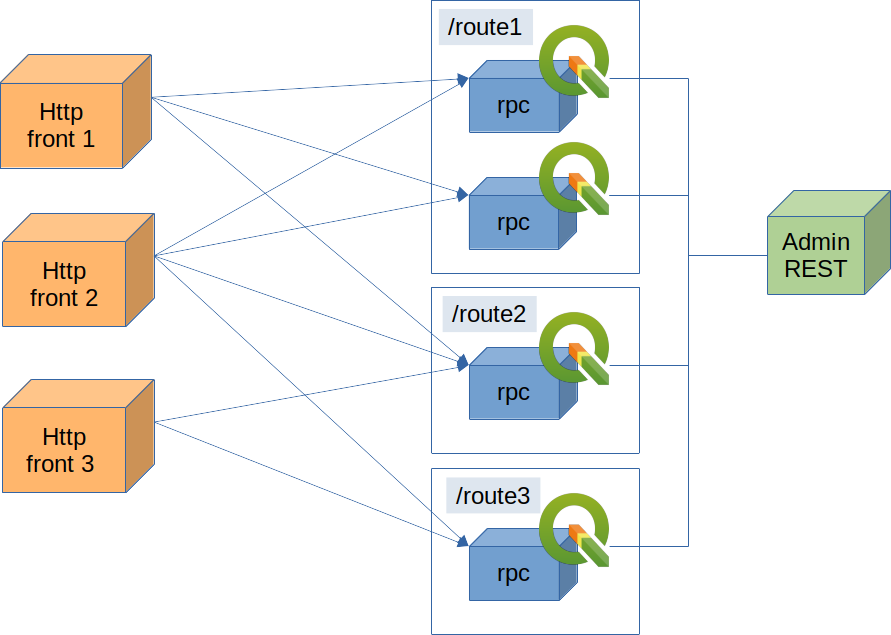
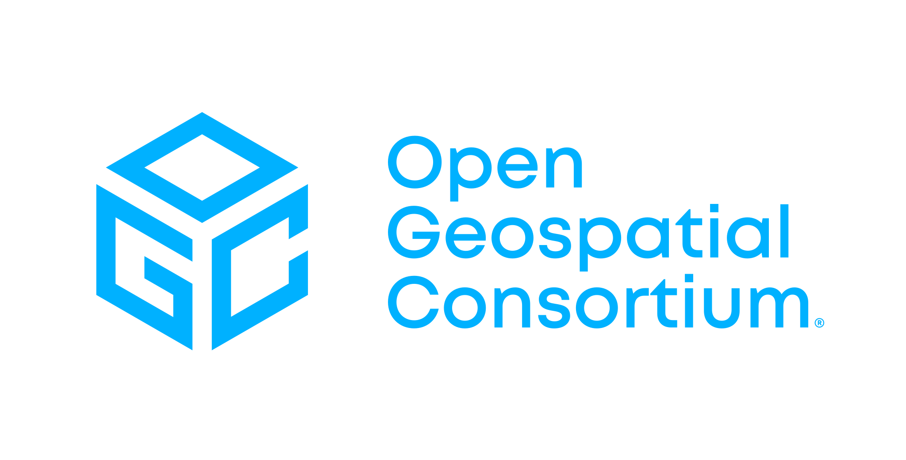
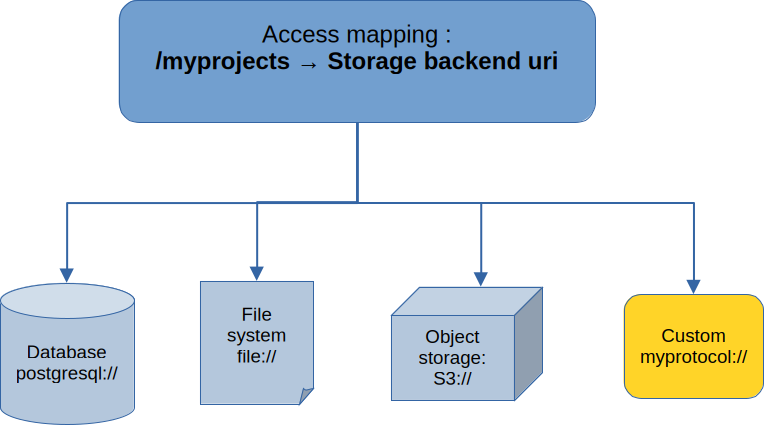

# QJazz

## QGIS server solution for the cloud

### Return of experience from GIS hosting services with Lizmap and QGIS server

https://github.com/3liz/qjazz

---
# GIS hosting services with Lizmap and QGIS server

---
# GIS hosting services with Lizmap and QGIS server

## Numbers:

- 54 physical servers
- 529 PosgreSQL databases
- 472 lizmap instances
- 140 Services QGIS server ~ 1200 QGIS server workers
- 1870 QGIS projects

<!--
Don't focus to much on these numbers.
What's interesting in those numbers in the opportunity
to have a relativily large samples of usecases.
And different usecase bring their own set of issues.

Problems are interestig because you have to solve them.
This is precisely what I want to talk about.
-->

---
## Problems to solve:

- Scalability
- Distributed architecture
- Monitoring
- Zeroconf (ideally !)
- Security

## Dealing with issues

<!--
We do not impose strong constraints on uploaded
projects
So we can have many differents situations
-->

- Projects with many layers: up to 200 layers per project
- Loading times of several minutes
- Memory issues
- High latency requests (mainly remote services)
- Stuck server instances

<!--
In order to scale you will need to replicate your environment
That mean replicating all projects in memory
Also Problems of synchronization of loaded projects in the different
units
-->

---
<!-- _class: invert centertitle -->

# When things go wrong

---
# QJazz

##  Microservices with gRPC protocol:

<!-- Address the problem of sacalabiliy and deployemnt
-->

https://github.com/3liz/qjazz

- Built-in Load balancing
- Built-in healtcheck support
- Dedicated administration service
- Bi-directional streaming support
- Independent from HTTP front-end

---

# QJazz overview

---
# QJazz services

- OCG OWS services (WMS, WFS, ...) - OGIS server native services
- STAC catalogs view of Projects and layers
- OGC API Maps - https://ogcapi.ogc.org/maps/
- OGC API Processes - QGIS Processing as a service
- Support for S3 backend (Projects and data)

  

---
# QGIS Projects managment in QJazz

<!--
Need change our point of view about projects.
-->

## From a 'project as resource' perspective

- Consider Project as an application
- Corollary: QGIS server is an application server
- Control what is published (from a customer perspective)
- Keep some level of flexibility (dynamic caching)

## From a deployement perspective

- Projects partionning (routes)
- Handle access controls to backend Apis
- Easy to scale

<!--
Adapt your services to the project's execution context
-->
---

## Qjazz project's storage

 

---
# Performances considerations

<!--
Projects may be very differents
They cannot be managed the same way
-->

## Horizontal scalability governance
- What is the expected request rate  ?
- How request distribute on projects ?
- How many different projects I have to handle ?

## Impact on request processing
- How many layers in my project ?
- Data volumetry ?
- Accesses to database backends/external services ?

       + 

---
## There is no single strategy to rule all your projects

<!--
We deal with large typology projects
there is obviously no a single strategy
-->

    

---
<!-- _class: invert centertitle -->

# Conclusion

- Revisiting QGIS server as an application server
- Cloud friendly integration (QGIS servers as micro-services)
- Address the problem of serving multiple use cases
  with many different kind of QGIS projects.

 

 

 

  +  + 

---
# Thank you

  

## Questions ?

