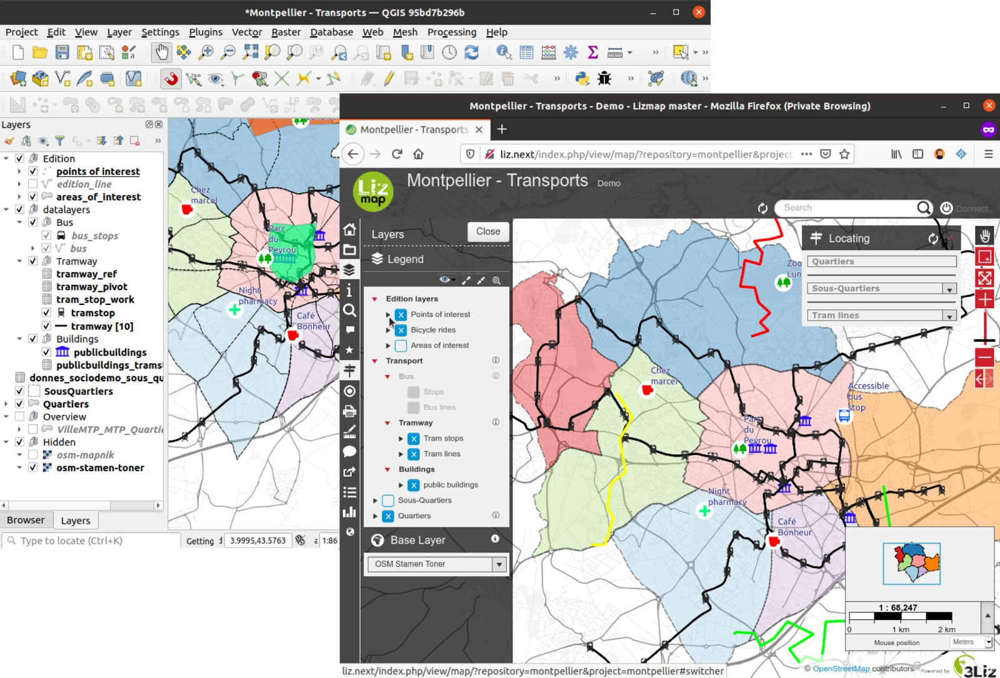
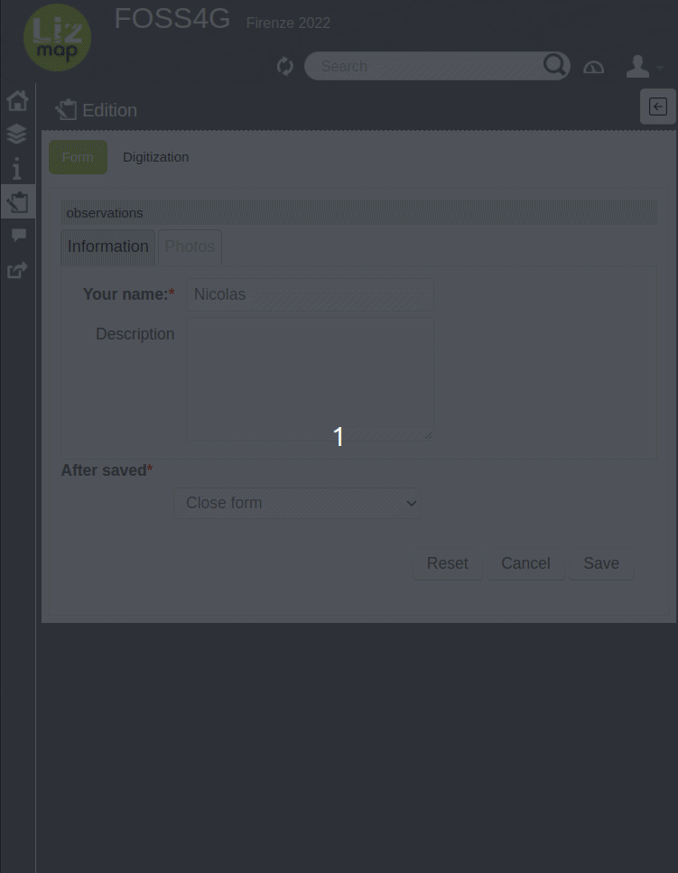
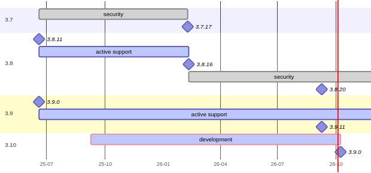
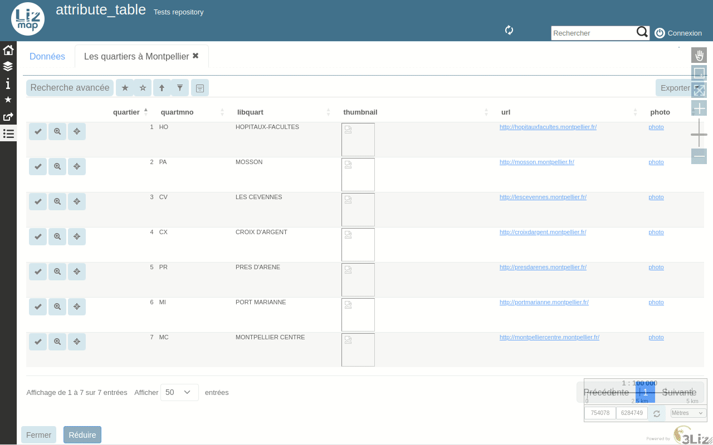
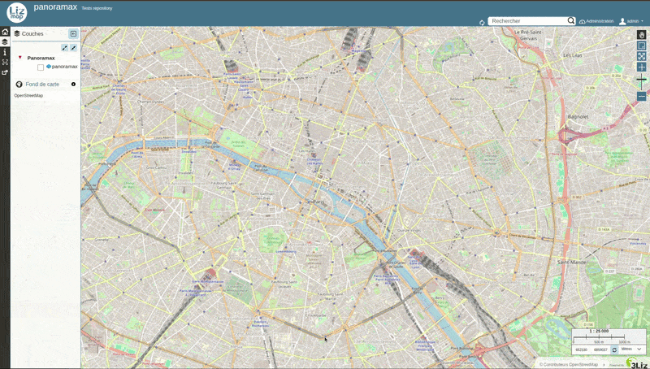
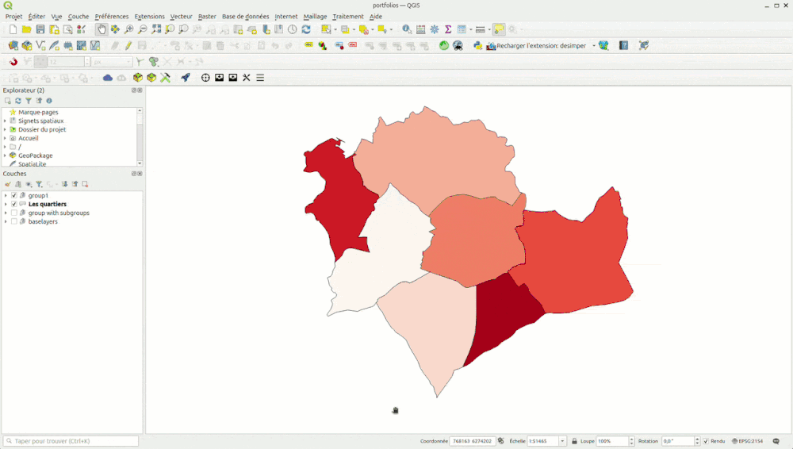
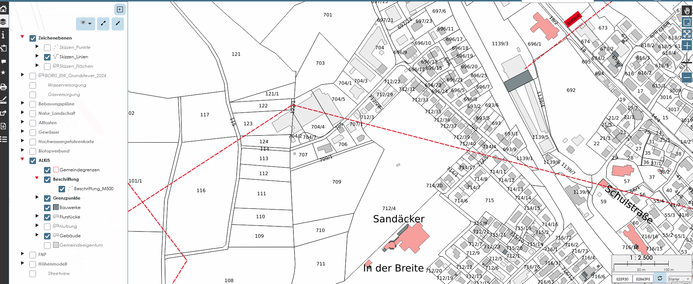
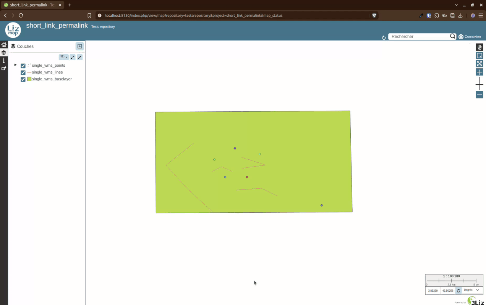
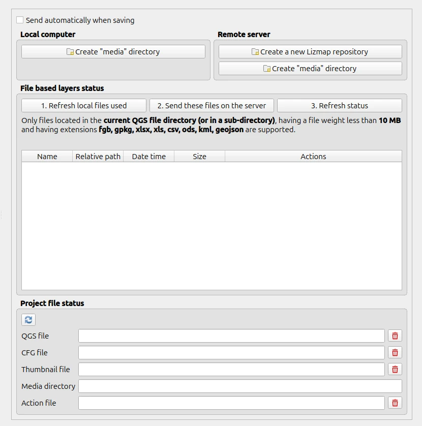
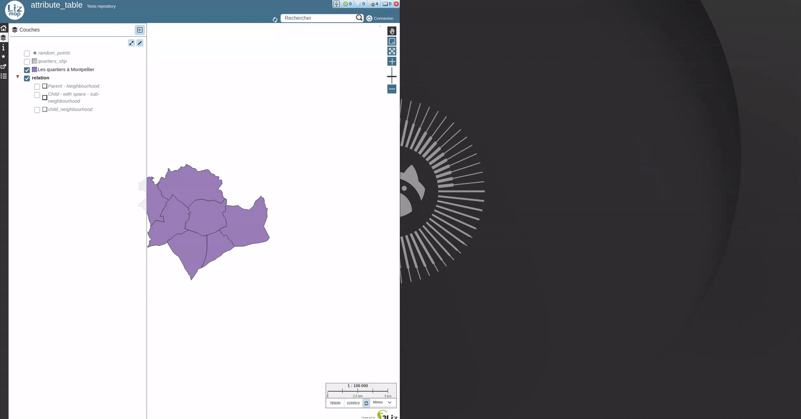

# Lizmap Web Client: next steps

<!-- _class: lead gaia-->

### From 15 years of development to the futur

---
# What is Lizmap Web Client ?

### Web Geoportal for QGIS

- To share your works on QGIS
- To publish full-featured map applications to the web

### On top of QGIS Server

- Prepare on QGIS desktop, deploy on Lizmap
- Web administration panel is **mainly** for authentication and authorization management (users and groups)
- All other configurations are done **within QGIS desktop**

---
# How to

* Create a project with some layers
* Use the Lizmap plugin to configure some options specific for the web (extent, scales, tools available etc.)
* And upload on the Lizmap server
* You've got a web map based on the QGIS project

---
# Full featured ?

- **Layers**: visibility, opacity, metadata, export, filter, selection, etc.
- **Tools**: measure, print, locate, geolocation, attribute table, etc.
- **Editing layer**: create, modify, delete features, with QGIS form, snapping, expressions, etc.

---
# Lizmap Web Client maintained versions

- **3.8** as security release since 2026.02
- **3.9** as active release since 2025.06
- **3.10** as release candidate since 2026.05

---
# Next Lizmap Web Client

<!-- _class: lead gaia-->

### 3.10 in dev since 2025.09
### 3.10 in RC since 2026.05
### 3.10.0 in 2026.10

---
# Lizmap Web Client 3.10 - Attribute Table

Funded by digi-studio, Etra & Faunalia - Developed by Nicolas Boisteault, René-Luc D'Hont & Riccardo Beltrami

---
# Lizmap Web Client 3.10 - Geolocation heading

Funded by Terre de Provence Agglomération - Developed by René-Luc D'Hont & Nicolas Boisteault

---
# Lizmap Web Client 3.10 - Panoramax

Funded by Terre de Provence Agglomération - Developed by Nicolas Boisteault

---
# Lizmap Web Client 3.10 - Portfolio

Funded by the Municipality of Mirandela - Developed by René-Luc D'Hont

---
# Lizmap Web Client 3.10 - DXF Export

Developed by Lorenz Meyer

---
# Lizmap Web Client 3.10 - Shortlink

Funded by Etra - Developed by Riccardo Beltrami

---
# Lizmap Web Client 3.10 - Copy/Paste in editing

Developed by Lorenz Meyer

---
# Lizmap Web Client 3.10 - Many others enhancements

- Editing
  - Apply default value on update
  - Automatically enable snapping
  - Background color defined in QGIS for form tabs
  - For attachments and images, file names now follow the default value: expression
  - Support for many-to-many relations in the form
- Printing
  - Users can print at a custom scale
  - Single atlas feature now respects the configuration: expression
  - Export a PDF with several atlas features
- Popup
  - child layers are now correctly placed in the chosen group or tab
  - group all popups by layer, in a tabular view
- Tooltip - QGIS symbology can now be displayed, on hover, the icon is enlarged

---
# Lizmap Web Client 3.10 - Thanks

- To funders
  - Etra
  - Faunalia
  - Terre de Provence Agglomération
  - Municipality of Mirandela
  - Conseil départemental du Gard
  - digi-studio
  - CC Parthenay-Gâtine
  - CC Bièvre Est
- To developers
  - Lorenz Meyer
  - Riccardo Beltrami

---
# What's next for Lizmap Web Client ?

<!-- _class: lead gaia-->

---
# Ordered features

- Open the attribute table in a new browser tab / window
- Light offline mode
- REST APIs to manage Lizmap config
  - Create repositories
  - Push QGIS Projects

---
# New open attribute table

---
# Lizmap Web Client 4

- Dropped OpenLayers 2
- Filter Manager
- Better QJazz integration:
  - Async printing
  - Async vector export
  - Managing loaded projects
- Better QGIS Desktop integration
  - Use REST APIs to manage Lizmap config
- Use other QGIS Project storages: PostgreSQL, S3, etc.
- Some other cool things

---
#  Thanks for your attention 

<!-- _class: lead gaia-->

Any questions ?
