#  RoadNetwork 

<!-- _class: lead gaia-->

Managing a **topological county road network**
Linear referencing with **QGIS** & **PostGIS**

*Michaël Douchin*   - 

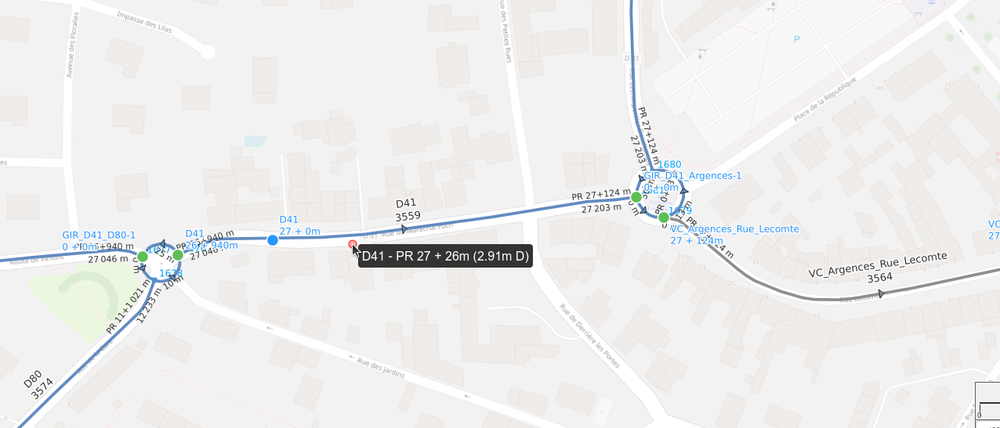

# Road **network**

Each **road**
- has an **identification** e.g. `D907`
- is composed by a **series of ordered edges**  (simple linestrings)

**Markers** are positioned along the roads e.g. Their position is often measured with a **GPS** `(X,Y)`

  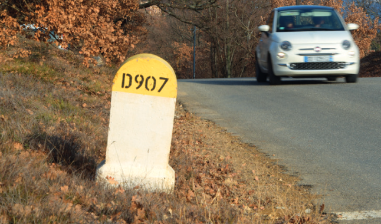

# Topology

The road network is a **GRAPH** built with **edges** and **nodes**

- each edge has
  a **start and end node**
- an edge can have
  - a **previous** edge
  - a **next** edge
- **intersecting edges** are cut by a **node** (if they are on the same level)

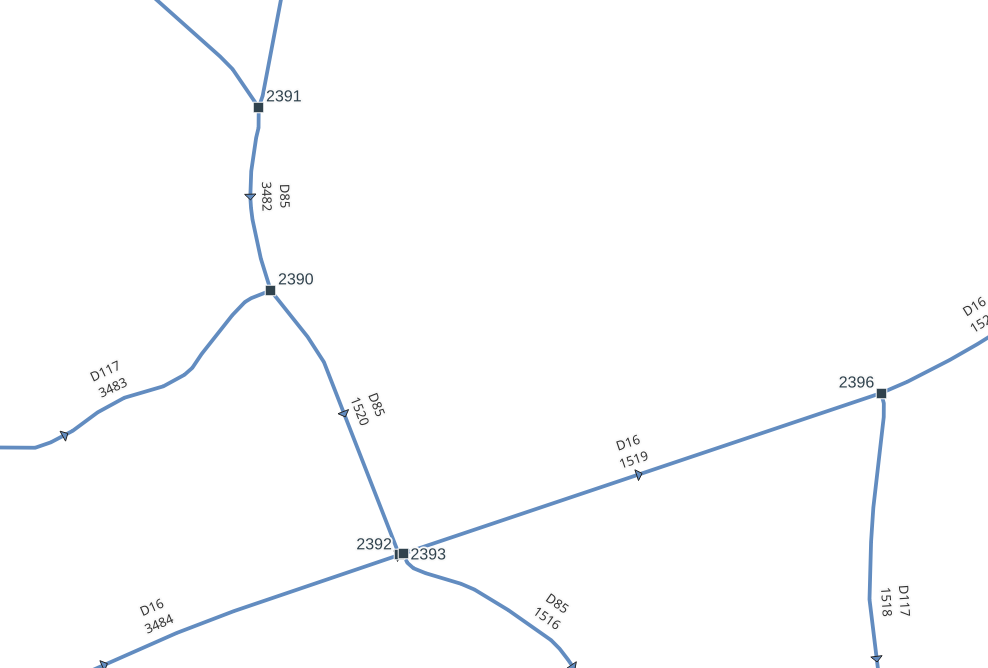

# Position & **references**

This simple organization of **roads, edges and markers** allows to determine a position of any object based on:

- a **road code**: `D902`
- a **marker code**: `1`
- an **abscissa**: `500m`

You can also provide an optional
**offset**: `3m` and **side**: `left`

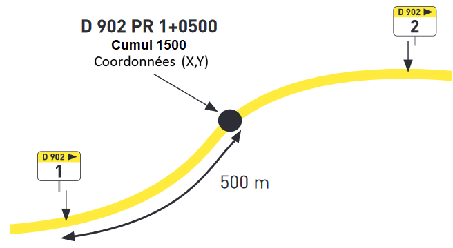

Any point within a distance of **50m** of any road will have its **references**: `D902 PR 1 + 500m (3m left)`

# Linear **referencing**

Each data object, **point** or **(multi)linestring**, is defined by its **references** calculated from the road network:
- **Points**: trees, street lights, car accidents, etc.
- **Linestrings**: paintings, safety barriers, roadworks, etc.

We must be able to:
- **calculate the references** from the object geometry
- **create a geometry** based on given references
  - a **point**
  - a **multi-linestring** between 2 references

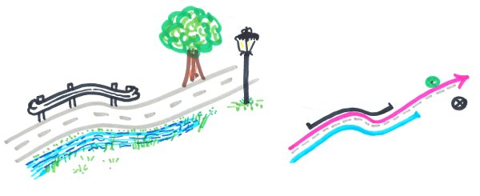

# Corner **cases**

**Discontinuity**: edges could have been deleted (or have changed status)

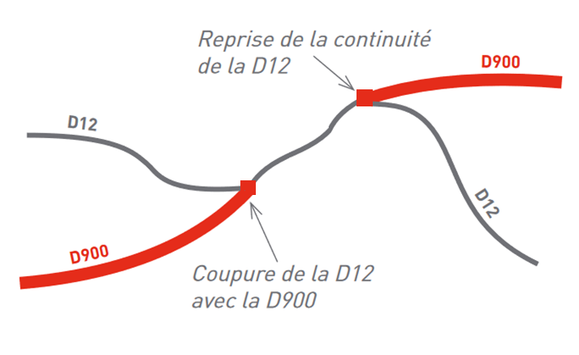

**Roundabouts** have their own road code `GIR D35-D80` and cut the other roads

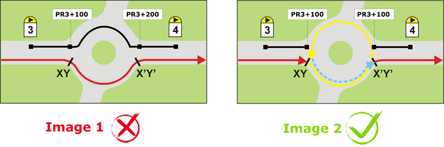

# Context

Funded by the **Département du Calvados** (French department)

  

**Objectives**
- They would like to **get rid of a proprietary software** & **use only FOSS4G** tools
- The data must be stored in a **PostgreSQL database** 
- **Visualization & Editing** must be done **inside QGIS** , with the help of a **plugin**
- **Calculations** (references, geometry editing) must be made available for **Lizmap Web Client** 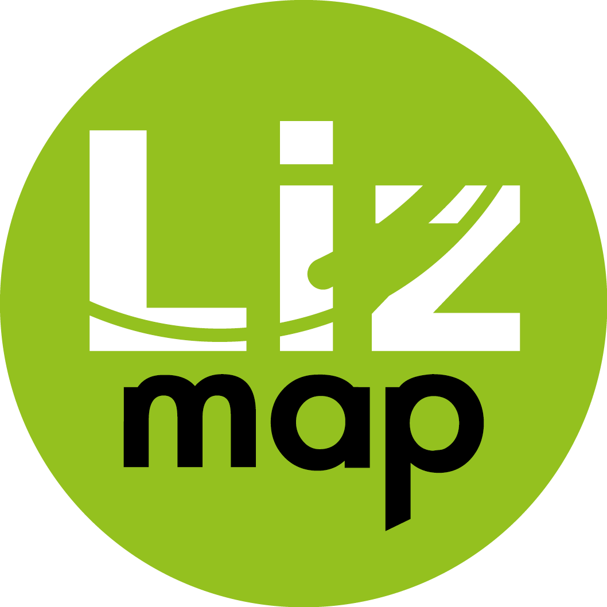

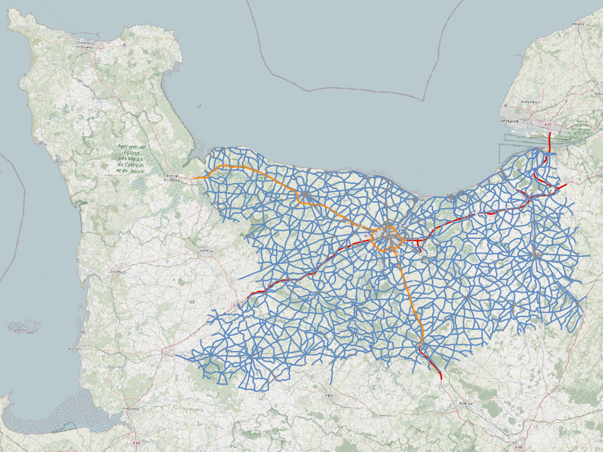

# RoadNetwok

## A **QGIS** plugin
<!-- _class: lead gaia-->

### With the power of **PostgreSQL & PostGIS**

 

# Database **model**

 All the logic is stored inside a **PostgreSQL database**

A simple set of **tables**: `roads`, `edges`, `nodes`, `markers`, `glossary`, `managed_objects` + **views**

Many **functions** to calculate references, geometries, among:
`get_road_point_from_reference`
`get_road_substring_from_references`
`update_table_references_from_geometries`
`update_table_geometry_from_references`

**Trigger functions** in charge of maintaining the road network **topology** (automatic node creation, split intersected edges, etc.)

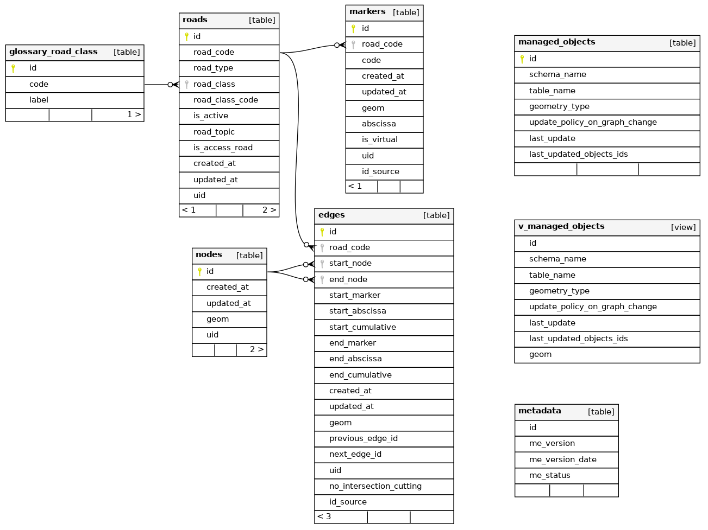

# **Administration** tools

QGIS **Processing algorithms** which allow to:

- **Create the database structure** with all the tables/functions, etc.
- **Upgrade the structure** automatically (if upgrading your plugin)
- **Create a QGIS administration project** with all the layers, styles, labels, actions, etc.
- **Import data** from template **edges** and **markers** tables

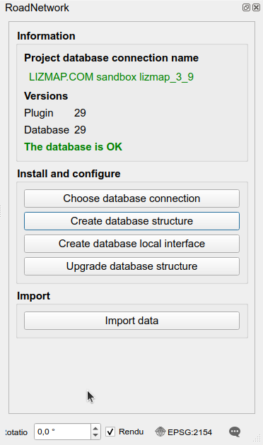

# QGIS administration **project**

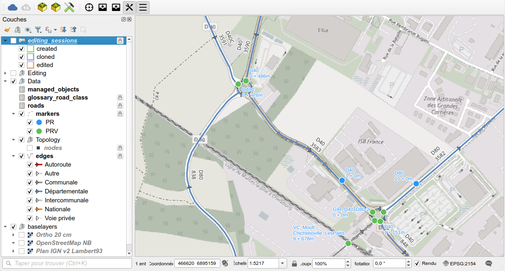

# **Tools** - Quick search (CTRL+K)

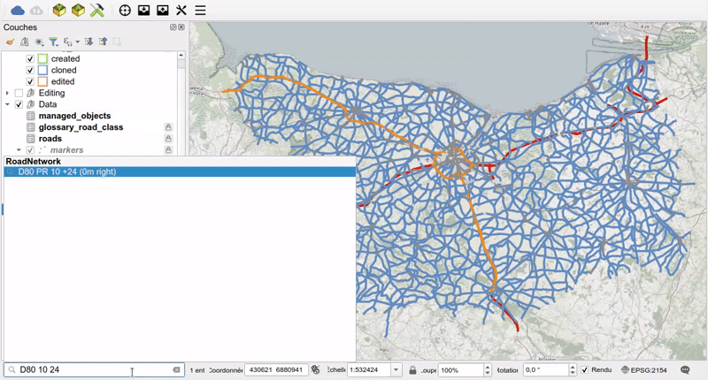

# **Tools** - Get references on map click (hover supported)

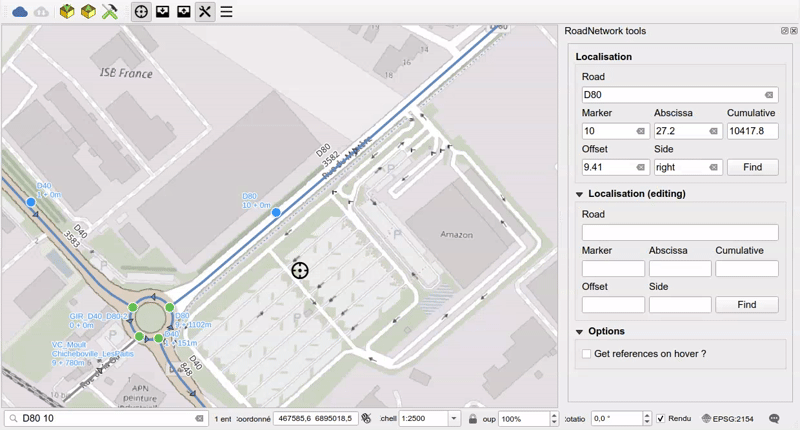

# Editing **rules**

Data are not edited in the production schema `road_graph` but in a **dedicated editing sessions schema**
- The user creates a **polygon** and **clones an extract of the production data** in a sanbox
- **Editing** is made with **QGIS tools**: forms, topology
- QGIS **automatic transaction grouping** has been activated in the project: changes made with triggers are visible **live**
- A map tool helps to **create roundabouts**
- Modifications are then **merged back** into the `road_graph` schema

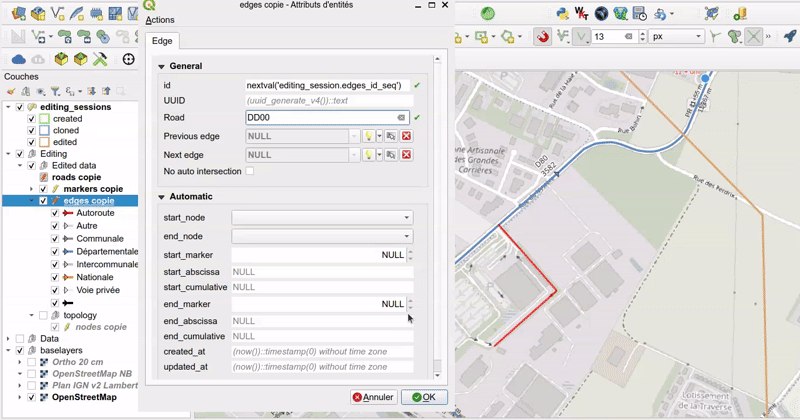

# Managed **objects**

The **local authorities** manages a lot of data based on the road network : `roadworks`, `asphalt rehabilitation`, `road signs`, `hedge pruning`.

The `managed_objects` layer lists **all the PostgreSQL tables** impacted by any **graph modification**
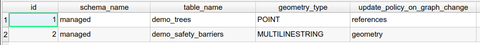

When the user **merges the data from the editing session**, every impacted object is
**automatically updated based on the rule** chosen by the admin user.

- **Point objects** are often not moved but their **references must be updated** Ex: `a road sign`
- **(Multi)Linestring objects** must often follow the changes, but we keep the start & point and only edit the nodes between. Ex: `a painting roadwork`

# **Conclusion**

The **QGIS plugin** is here to
- create/ugprade the **database structure**
- **visualize** the road network
- **position** with references & get references from position
- **edit data safely** in a sandbox and use algorithm to copy/merge the data
- **import** data

The main business logic really lies **inside the PostgreSQL database**
- **schemas** and **tables**, functions, triggers

#  Thanks for your attention 

<!-- _class: lead gaia-->

Any questions ?

- **Contact**: info@3liz.com
- **Source code**:
  https://github.com/3liz/qgis-road-network-plugin/
  
- **This presentation**
  https://docs.3liz.org/presentations/2026-10-06_RoadNetwork-Plugin_QGIS_UC_Laax.html
  
